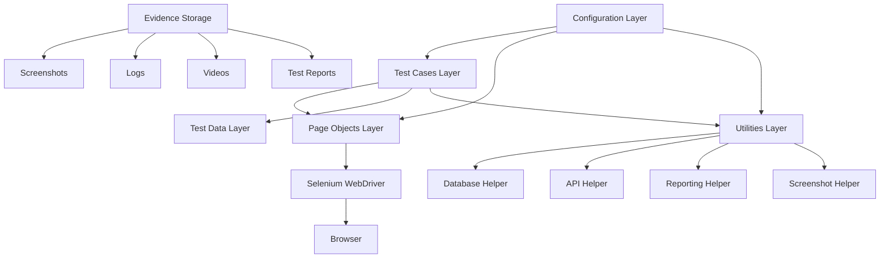

# GxP Testing & Test Automation Guide - Part 2

## Complete Selenium Framework for Computer System Validation

**Part 2 of 6: Selenium WebDriver Implementation with 20+ Test Examples**

---

## Table of Contents

- [1. Selenium Framework Architecture](#1-selenium-framework-architecture)
- [2. Project Setup & Configuration](#2-project-setup--configuration)
- [3. Core Framework Components](#3-core-framework-components)
- [4. Page Object Model Implementation](#4-page-object-model-implementation)
- [5. 20+ Complete Test Examples](#5-complete-test-examples)
- [6. Data-Driven Testing](#6-data-driven-testing)
- [7. Database Integration](#7-database-integration)
- [8. API Testing Integration](#8-api-testing-integration)
- [9. Evidence Collection & Screenshots](#9-evidence-collection--screenshots)
- [10. Parallel Execution](#10-parallel-execution)

---

## 1. Selenium Framework Architecture

### 1.1 Framework Design Philosophy

**Goals:**
- ✅ Maintainable (easy to update when UI changes)
- ✅ Scalable (add new tests without major refactoring)
- ✅ Reusable (common functions shared across tests)
- ✅ GxP Compliant (evidence, traceability, audit trail)
- ✅ Debuggable (clear logs, screenshots, error messages)

**Architecture Pattern: Page Object Model (POM)**



### 1.2 Complete Directory Structure

```
pharma-selenium-framework/
│
├── .github/
│   └── workflows/
│       ├── smoke-tests.yml              # Run on every commit
│       ├── regression-tests.yml         # Nightly full regression
│       └── release-validation.yml       # Pre-release PQ tests
│
├── config/
│   ├── __init__.py
│   ├── config.py                        # Configuration manager
│   ├── dev_config.json                  # Development environment
│   ├── val_config.json                  # Validation environment
│   └── prod_config.json                 # Production (read-only)
│
├── pages/
│   ├── __init__.py
│   ├── base_page.py                     # Base class for all pages
│   ├── login_page.py                    # Login functionality
│   ├── dashboard_page.py                # Home/Dashboard
│   ├── sample_management/
│   │   ├── __init__.py
│   │   ├── sample_list_page.py
│   │   ├── sample_create_page.py
│   │   ├── sample_details_page.py
│   │   └── sample_search_page.py
│   ├── results_management/
│   │   ├── __init__.py
│   │   ├── results_entry_page.py
│   │   ├── results_review_page.py
│   │   └── results_approval_page.py
│   ├── administration/
│   │   ├── __init__.py
│   │   ├── user_management_page.py
│   │   └── system_config_page.py
│   └── reports/
│       ├── __init__.py
│       └── report_generation_page.py
│
├── tests/
│   ├── __init__.py
│   ├── conftest.py                      # Pytest fixtures & hooks
│   ├── test_smoke.py                    # Smoke tests
│   ├── authentication/
│   │   ├── __init__.py
│   │   ├── test_login.py
│   │   ├── test_logout.py
│   │   ├── test_password_reset.py
│   │   └── test_session_timeout.py
│   ├── sample_management/
│   │   ├── __init__.py
│   │   ├── test_sample_creation.py
│   │   ├── test_sample_search.py
│   │   ├── test_sample_workflow.py
│   │   └── test_sample_validation.py
│   ├── results_management/
│   │   ├── __init__.py
│   │   ├── test_results_entry.py
│   │   ├── test_calculations.py
│   │   ├── test_spec_checking.py
│   │   └── test_results_approval.py
│   ├── security/
│   │   ├── __init__.py
│   │   ├── test_rbac.py
│   │   ├── test_audit_trail.py
│   │   └── test_electronic_signatures.py
│   ├── integration/
│   │   ├── __init__.py
│   │   ├── test_sap_interface.py
│   │   └── test_api_endpoints.py
│   └── e2e/
│       ├── __init__.py
│       └── test_complete_workflow.py
│
├── utils/
│   ├── __init__.py
│   ├── driver_factory.py                # WebDriver initialization
│   ├── database_helper.py               # DB connection & queries
│   ├── api_helper.py                    # REST API testing
│   ├── screenshot_helper.py             # Screenshot management
│   ├── logger.py                        # Custom logging
│   ├── date_time_helper.py              # Date/time utilities
│   ├── report_generator.py              # Custom reports
│   ├── traceability_matrix.py           # REQ → Test mapping
│   ├── test_data_generator.py           # Generate test data
│   └── email_helper.py                  # Email notifications
│
├── data/
│   ├── test_users.json                  # Test user credentials
│   ├── test_samples.json                # Sample test data
│   ├── test_materials.json              # Material master data
│   ├── requirements_mapping.json        # Traceability mapping
│   ├── calculations_testdata.xlsx       # Excel-based test data
│   └── sql/
│       ├── setup_testdata.sql
│       └── cleanup_testdata.sql
│
├── reports/
│   ├── html/                            # HTML test reports
│   ├── pdf/                             # PDF exports for validation
│   ├── allure/                          # Allure report data
│   ├── screenshots/                     # Test failure screenshots
│   ├── videos/                          # Test execution videos
│   └── logs/                            # Execution logs
│
├── docs/
│   ├── framework_validation.md          # Framework validation doc
│   ├── user_guide.md                    # How to write tests
│   ├── coding_standards.md              # Naming conventions
│   ├── troubleshooting.md               # Common issues
│   └── api/
│       └── README.md                    # API documentation
│
├── requirements.txt                     # Python dependencies
├── pytest.ini                           # Pytest configuration
├── setup.py                             # Package setup
├── .gitignore                           # Git ignore patterns
├── README.md                            # Project overview
└── CHANGELOG.md                         # Version history
```

---

## 2. Project Setup & Configuration

### 2.1 requirements.txt

```txt
# Core Testing Framework
selenium==4.15.2
pytest==7.4.3
pytest-html==4.1.1
pytest-xdist==3.5.0              # Parallel execution
pytest-timeout==2.2.0            # Test timeout handling
pytest-rerunfailures==12.0       # Retry flaky tests

# Reporting
allure-pytest==2.13.2
pytest-json-report==1.5.0

# WebDriver Management
webdriver-manager==4.0.1

# Database Connectivity
psycopg2-binary==2.9.9          # PostgreSQL
pymysql==1.1.0                  # MySQL
cx-Oracle==8.3.0                # Oracle
pyodbc==5.0.1                   # ODBC (for SQL Server)

# API Testing
requests==2.31.0
requests-toolbelt==1.0.0

# Data Handling
pandas==2.1.4
openpyxl==3.1.2                 # Excel files
jsonschema==4.20.0              # JSON validation
faker==20.1.0                   # Test data generation

# Utilities
python-dotenv==1.0.0            # Environment variables
pyyaml==6.0.1                   # YAML config files
Pillow==10.1.0                  # Image processing
python-dateutil==2.8.2

# Logging & Monitoring
colorlog==6.8.0
loguru==0.7.2

# Code Quality (optional but recommended)
pylint==3.0.3
black==23.12.1
pytest-cov==4.1.0               # Code coverage
```

### 2.2 pytest.ini

```ini
[pytest]
# Test discovery
python_files = test_*.py
python_classes = Test*
python_functions = test_*
testpaths = tests

# Markers for test categorization
markers =
    smoke: Smoke tests (run after every deployment)
    regression: Full regression suite
    critical: GxP critical tests (must pass)
    high: High priority tests
    medium: Medium priority tests
    low: Low priority tests
    wip: Work in progress (skip in CI)
    slow: Tests that take >30 seconds
    integration: Integration tests
    e2e: End-to-end tests
    security: Security testing
    performance: Performance tests
    
    # Functional areas
    login: Login functionality
    sample: Sample management
    results: Results management
    reports: Report generation
    admin: Administration functions

# Command line options
addopts =
    --verbose
    --strict-markers
    --tb=short
    --disable-warnings
    # --html=reports/html/report.html
    # --self-contained-html
    
# Logging
log_cli = true
log_cli_level = INFO
log_cli_format = %(asctime)s [%(levelname)s] %(message)s
log_cli_date_format = %Y-%m-%d %H:%M:%S

log_file = reports/logs/pytest.log
log_file_level = DEBUG
log_file_format = %(asctime)s [%(levelname)8s] [%(filename)s:%(lineno)s] %(message)s
log_file_date_format = %Y-%m-%d %H:%M:%S

# Timeouts
timeout = 300                    # 5 minutes per test max
timeout_method = thread

# Parallel execution
# Run with: pytest -n auto
# Or specify number: pytest -n 4
```

### 2.3 Configuration Manager (config/config.py)

```python
"""
Configuration Manager for Test Framework
Loads environment-specific configurations
"""

import json
import os
from pathlib import Path
from typing import Dict, Any

class Config:
    """Configuration management class"""
    
    _instance = None
    _config_data = None
    
    def __new__(cls):
        """Singleton pattern - only one config instance"""
        if cls._instance is None:
            cls._instance = super(Config, cls).__new__(cls)
        return cls._instance
    
    def __init__(self):
        """Initialize configuration"""
        if self._config_data is None:
            self.load_config()
    
    def load_config(self, environment: str = None):
        """
        Load configuration for specified environment
        
        Args:
            environment: dev, val, or prod (defaults to ENV var or 'val')
        """
        if environment is None:
            environment = os.getenv('TEST_ENV', 'val')
        
        config_file = Path(__file__).parent / f"{environment}_config.json"
        
        if not config_file.exists():
            raise FileNotFoundError(f"Config file not found: {config_file}")
        
        with open(config_file, 'r') as f:
            self._config_data = json.load(f)
        
        self._config_data['environment'] = environment
        
        # Load sensitive data from environment variables
        self._config_data['db_password'] = os.getenv('DB_PASSWORD', '')
        self._config_data['api_key'] = os.getenv('API_KEY', '')
    
    def get(self, key: str, default: Any = None) -> Any:
        """Get configuration value"""
        return self._config_data.get(key, default)
    
    @property
    def app_url(self) -> str:
        """Application URL"""
        return self._config_data.get('app_url')
    
    @property
    def db_config(self) -> Dict:
        """Database configuration"""
        return self._config_data.get('database', {})
    
    @property
    def api_base_url(self) -> str:
        """API base URL"""
        return self._config_data.get('api_base_url')
    
    @property
    def timeout(self) -> int:
        """Default timeout in seconds"""
        return self._config_data.get('timeout', 10)
    
    @property
    def screenshot_on_failure(self) -> bool:
        """Whether to capture screenshots on failure"""
        return self._config_data.get('screenshot_on_failure', True)
    
    def __repr__(self):
        return f"Config(environment={self._config_data.get('environment')})"

# Singleton instance
config = Config()
```

### 2.4 Sample Configuration Files

**config/val_config.json:**

```json
{
  "environment_name": "Validation",
  "app_url": "https://lims-val.pharma.com",
  "api_base_url": "https://lims-val.pharma.com/api/v1",
  
  "database": {
    "host": "lims-val-db.pharma.com",
    "port": 5432,
    "database": "lims_validation",
    "username": "lims_test_user",
    "password": "USE_ENV_VAR"
  },
  
  "browser": {
    "default": "chrome",
    "headless": false,
    "window_size": [1920, 1080],
    "implicit_wait": 10,
    "page_load_timeout": 30,
    "accept_insecure_certs": false
  },
  
  "timeouts": {
    "element_wait": 10,
    "ajax_wait": 15,
    "page_load": 30
  },
  
  "test_data": {
    "users_file": "data/test_users.json",
    "samples_file": "data/test_samples.json"
  },
  
  "reporting": {
    "screenshot_on_failure": true,
    "video_recording": false,
    "html_report": true,
    "allure_report": true,
    "pdf_export": true
  },
  
  "integrations": {
    "sap_api": "https://sap-dev.pharma.com/api",
    "email_server": "smtp-val.pharma.com",
    "slack_webhook": "USE_ENV_VAR"
  },
  
  "retry": {
    "max_retries": 2,
    "retry_delay": 1
  },
  
  "parallel": {
    "enabled": true,
    "max_workers": 3
  }
}
```

---

## 3. Core Framework Components

### 3.1 Base Page Class (pages/base_page.py)

```python
"""
Base Page Class
Contains common methods used by all page objects
GxP Compliant: Includes logging, screenshot capture, and evidence collection
"""

from selenium import webdriver
from selenium.webdriver.support.ui import WebDriverWait
from selenium.webdriver.support import expected_conditions as EC
from selenium.common.exceptions import (
    TimeoutException, 
    NoSuchElementException,
    StaleElementReferenceException
)
from selenium.webdriver.common.action_chains import ActionChains
from selenium.webdriver.common.keys import Keys
from datetime import datetime
from pathlib import Path
import logging
import time

logger = logging.getLogger(__name__)

class BasePage:
    """Base class for all page objects"""
    
    def __init__(self, driver: webdriver, config):
        """
        Initialize base page
        
        Args:
            driver: Selenium WebDriver instance
            config: Configuration object
        """
        self.driver = driver
        self.config = config
        self.wait = WebDriverWait(driver, config.timeout)
        self.logger = logger
        
    # ============= ELEMENT INTERACTION METHODS =============
    
    def find_element(self, locator, timeout=None):
        """
        Find element with explicit wait and error handling
        
        Args:
            locator: Tuple (By.ID, "element_id")
            timeout: Optional custom timeout
            
        Returns:
            WebElement
            
        Raises:
            TimeoutException if element not found
        """
        if timeout is None:
            timeout = self.config.timeout
            
        try:
            self.logger.info(f"Finding element: {locator}")
            wait = WebDriverWait(self.driver, timeout)
            element = wait.until(EC.presence_of_element_located(locator))
            return element
        except TimeoutException:
            self.logger.error(f"Element not found: {locator}")
            self.capture_screenshot(f"element_not_found_{locator[1]}")
            raise
    
    def find_elements(self, locator, timeout=None):
        """Find multiple elements"""
        if timeout is None:
            timeout = self.config.timeout
            
        try:
            wait = WebDriverWait(self.driver, timeout)
            elements = wait.until(EC.presence_of_all_elements_located(locator))
            self.logger.info(f"Found {len(elements)} elements: {locator}")
            return elements
        except TimeoutException:
            self.logger.warning(f"No elements found: {locator}")
            return []
    
    def click_element(self, locator, timeout=None):
        """
        Click element with retry logic for stale elements
        
        Args:
            locator: Element locator
            timeout: Optional timeout
        """
        max_attempts = 3
        for attempt in range(max_attempts):
            try:
                self.logger.info(f"Clicking element (attempt {attempt + 1}): {locator}")
                element = self.wait_for_clickable(locator, timeout)
                element.click()
                self.logger.info(f"Clicked successfully: {locator}")
                return
            except StaleElementReferenceException:
                if attempt == max_attempts - 1:
                    self.logger.error(f"Element became stale: {locator}")
                    self.capture_screenshot(f"stale_element_{locator[1]}")
                    raise
                time.sleep(0.5)
            except Exception as e:
                self.logger.error(f"Click failed: {locator} - {str(e)}")
                self.capture_screenshot(f"click_failed_{locator[1]}")
                raise
    
    def enter_text(self, locator, text, clear_first=True, mask_log=False):
        """
        Enter text into element
        
        Args:
            locator: Element locator
            text: Text to enter
            clear_first: Clear field before entering text
            mask_log: Mask text in logs (for passwords)
        """
        try:
            log_text = "********" if mask_log else text
            self.logger.info(f"Entering text into {locator}: {log_text}")
            
            element = self.find_element(locator)
            if clear_first:
                element.clear()
            element.send_keys(text)
            
            self.logger.info(f"Text entered successfully into {locator}")
        except Exception as e:
            self.logger.error(f"Failed to enter text: {locator} - {str(e)}")
            self.capture_screenshot(f"text_entry_failed_{locator[1]}")
            raise
    
    def get_text(self, locator):
        """Get text from element"""
        self.logger.info(f"Getting text from: {locator}")
        element = self.find_element(locator)
        text = element.text
        self.logger.info(f"Retrieved text: '{text}'")
        return text
    
    def get_attribute(self, locator, attribute):
        """Get attribute value from element"""
        element = self.find_element(locator)
        value = element.get_attribute(attribute)
        self.logger.info(f"Got attribute '{attribute}' from {locator}: {value}")
        return value
    
    # ============= WAIT METHODS =============
    
    def wait_for_visible(self, locator, timeout=None):
        """Wait for element to be visible"""
        if timeout is None:
            timeout = self.config.timeout
            
        self.logger.info(f"Waiting for element to be visible: {locator}")
        wait = WebDriverWait(self.driver, timeout)
        return wait.until(EC.visibility_of_element_located(locator))
    
    def wait_for_clickable(self, locator, timeout=None):
        """Wait for element to be clickable"""
        if timeout is None:
            timeout = self.config.timeout
            
        self.logger.info(f"Waiting for element to be clickable: {locator}")
        wait = WebDriverWait(self.driver, timeout)
        return wait.until(EC.element_to_be_clickable(locator))
    
    def wait_for_invisible(self, locator, timeout=None):
        """Wait for element to become invisible (useful for loading spinners)"""
        if timeout is None:
            timeout = self.config.timeout
            
        self.logger.info(f"Waiting for element to disappear: {locator}")
        wait = WebDriverWait(self.driver, timeout)
        wait.until(EC.invisibility_of_element_located(locator))
        self.logger.info(f"Element disappeared: {locator}")
    
    def wait_for_ajax(self, timeout=None):
        """Wait for AJAX requests to complete (jQuery)"""
        if timeout is None:
            timeout = self.config.get('timeouts', {}).get('ajax_wait', 15)
            
        self.logger.info("Waiting for AJAX to complete")
        wait = WebDriverWait(self.driver, timeout)
        wait.until(lambda driver: driver.execute_script("return jQuery.active == 0"))
        self.logger.info("AJAX complete")
    
    # ============= ELEMENT STATE CHECKS =============
    
    def is_element_visible(self, locator, timeout=2):
        """Check if element is visible"""
        try:
            wait = WebDriverWait(self.driver, timeout)
            wait.until(EC.visibility_of_element_located(locator))
            return True
        except TimeoutException:
            return False
    
    def is_element_present(self, locator):
        """Check if element exists in DOM"""
        try:
            self.driver.find_element(*locator)
            return True
        except NoSuchElementException:
            return False
    
    def is_element_enabled(self, locator):
        """Check if element is enabled"""
        element = self.find_element(locator)
        return element.is_enabled()
    
    def is_element_selected(self, locator):
        """Check if element is selected (checkbox/radio)"""
        element = self.find_element(locator)
        return element.is_selected()
    
    # ============= DROPDOWN/SELECT METHODS =============
    
    def select_dropdown_by_text(self, locator, text):
        """Select dropdown option by visible text"""
        from selenium.webdriver.support.select import Select
        
        self.logger.info(f"Selecting dropdown option '{text}' from {locator}")
        element = self.find_element(locator)
        select = Select(element)
        select.select_by_visible_text(text)
    
    def select_dropdown_by_value(self, locator, value):
        """Select dropdown option by value attribute"""
        from selenium.webdriver.support.select import Select
        
        self.logger.info(f"Selecting dropdown value '{value}' from {locator}")
        element = self.find_element(locator)
        select = Select(element)
        select.select_by_value(value)
    
    def get_selected_dropdown_text(self, locator):
        """Get currently selected dropdown option text"""
        from selenium.webdriver.support.select import Select
        
        element = self.find_element(locator)
        select = Select(element)
        selected = select.first_selected_option
        return selected.text
    
    # ============= JAVASCRIPT EXECUTION =============
    
    def execute_script(self, script, *args):
        """Execute JavaScript"""
        self.logger.info(f"Executing JavaScript: {script[:50]}...")
        return self.driver.execute_script(script, *args)
    
    def scroll_to_element(self, locator):
        """Scroll element into view"""
        element = self.find_element(locator)
        self.driver.execute_script("arguments[0].scrollIntoView(true);", element)
        time.sleep(0.3)  # Allow scroll to complete
    
    def click_with_javascript(self, locator):
        """Click element using JavaScript (when normal click fails)"""
        self.logger.info(f"Clicking with JavaScript: {locator}")
        element = self.find_element(locator)
        self.driver.execute_script("arguments[0].click();", element)
    
    # ============= ADVANCED INTERACTIONS =============
    
    def hover_over_element(self, locator):
        """Hover mouse over element"""
        self.logger.info(f"Hovering over element: {locator}")
        element = self.find_element(locator)
        actions = ActionChains(self.driver)
        actions.move_to_element(element).perform()
    
    def double_click_element(self, locator):
        """Double click element"""
        self.logger.info(f"Double clicking element: {locator}")
        element = self.find_element(locator)
        actions = ActionChains(self.driver)
        actions.double_click(element).perform()
    
    def drag_and_drop(self, source_locator, target_locator):
        """Drag and drop element"""
        self.logger.info(f"Drag from {source_locator} to {target_locator}")
        source = self.find_element(source_locator)
        target = self.find_element(target_locator)
        actions = ActionChains(self.driver)
        actions.drag_and_drop(source, target).perform()
    
    def send_keys(self, locator, keys):
        """Send keyboard keys (e.g., Keys.ENTER)"""
        element = self.find_element(locator)
        element.send_keys(keys)
    
    # ============= ALERT HANDLING =============
    
    def accept_alert(self):
        """Accept JavaScript alert"""
        self.logger.info("Accepting alert")
        alert = self.driver.switch_to.alert
        alert.accept()
    
    def dismiss_alert(self):
        """Dismiss JavaScript alert"""
        self.logger.info("Dismissing alert")
        alert = self.driver.switch_to.alert
        alert.dismiss()
    
    def get_alert_text(self):
        """Get alert message text"""
        alert = self.driver.switch_to.alert
        text = alert.text
        self.logger.info(f"Alert text: {text}")
        return text
    
    # ============= FRAME/IFRAME HANDLING =============
    
    def switch_to_frame(self, frame_locator):
        """Switch to iframe"""
        self.logger.info(f"Switching to frame: {frame_locator}")
        frame = self.find_element(frame_locator)
        self.driver.switch_to.frame(frame)
    
    def switch_to_default_content(self):
        """Switch back to main content"""
        self.logger.info("Switching to default content")
        self.driver.switch_to.default_content()
    
    # ============= WINDOW HANDLING =============
    
    def switch_to_window(self, window_handle):
        """Switch to specific window"""
        self.logger.info(f"Switching to window: {window_handle}")
        self.driver.switch_to.window(window_handle)
    
    def get_window_handles(self):
        """Get all window handles"""
        return self.driver.window_handles
    
    def close_current_window(self):
        """Close current browser window"""
        self.logger.info("Closing current window")
        self.driver.close()
    
    # ============= PAGE INFORMATION =============
    
    def get_page_title(self):
        """Get current page title"""
        title = self.driver.title
        self.logger.info(f"Page title: {title}")
        return title
    
    def get_current_url(self):
        """Get current URL"""
        url = self.driver.current_url
        self.logger.info(f"Current URL: {url}")
        return url
    
    def navigate_to(self, url):
        """Navigate to URL"""
        self.logger.info(f"Navigating to: {url}")
        self.driver.get(url)
    
    def refresh_page(self):
        """Refresh current page"""
        self.logger.info("Refreshing page")
        self.driver.refresh()
    
    def go_back(self):
        """Navigate back"""
        self.logger.info("Navigating back")
        self.driver.back()
    
    # ============= SCREENSHOT & EVIDENCE =============
    
    def capture_screenshot(self, name):
        """
        Capture screenshot for GxP evidence
        
        Args:
            name: Screenshot filename (without extension)
            
        Returns:
            Path to screenshot file
        """
        timestamp = datetime.now().strftime("%Y%m%d_%H%M%S")
        screenshot_dir = Path("reports/screenshots")
        screenshot_dir.mkdir(parents=True, exist_ok=True)
        
        # Clean filename (remove special characters)
        clean_name = "".join(c for c in name if c.isalnum() or c in ('-', '_'))
        filename = f"{clean_name}_{timestamp}.png"
        filepath = screenshot_dir / filename
        
        try:
            self.driver.save_screenshot(str(filepath))
            self.logger.info(f"Screenshot saved: {filepath}")
            return str(filepath)
        except Exception as e:
            self.logger.error(f"Failed to capture screenshot: {str(e)}")
            return None
    
    def get_page_source(self):
        """Get HTML source of current page"""
        return self.driver.page_source
    
    # ============= WAIT UTILITIES =============
    
    def wait(self, seconds):
        """Explicit wait (use sparingly, prefer explicit waits)"""
        self.logger.info(f"Waiting {seconds} seconds")
        time.sleep(seconds)
```

---

## 4. Page Object Model Implementation

### 4.1 Login Page Object (pages/login_page.py)

**Interview Scenario**: "Walk me through how you implement Page Object Model for a login page"

```python
"""
Login Page Object - Interview Example
Demonstrates POM pattern for GxP system authentication
"""

from selenium.webdriver.common.by import By
from pages.base_page import BasePage

class LoginPage(BasePage):
    """Page Object for Login functionality"""
    
    # LOCATORS - Centralized element identification
    USERNAME_FIELD = (By.ID, "username")
    PASSWORD_FIELD = (By.ID, "password")
    LOGIN_BUTTON = (By.ID, "btnLogin")
    ERROR_MESSAGE = (By.CSS_SELECTOR, ".error-message")
    LOGOUT_BUTTON = (By.ID, "btnLogout")
    USER_MENU = (By.CSS_SELECTOR, ".user-menu")
    
    def __init__(self, driver, config):
        super().__init__(driver, config)
        self.url = f"{config.app_url}/login"
    
    # PAGE ACTIONS - Business logic methods
    def navigate_to_login(self):
        """Navigate to login page"""
        self.navigate_to(self.url)
        self.logger.info("Navigated to login page")
    
    def enter_username(self, username):
        """Enter username"""
        self.enter_text(self.USERNAME_FIELD, username)
    
    def enter_password(self, password):
        """Enter password"""
        self.enter_text(self.PASSWORD_FIELD, password, mask_log=True)
    
    def click_login_button(self):
        """Click login button"""
        self.click_element(self.LOGIN_BUTTON)
        self.wait_for_ajax()  # Wait for authentication
    
    def login(self, username, password):
        """
        Complete login workflow
        This is what tests will call - high-level action
        """
        self.logger.info(f"Logging in as: {username}")
        self.navigate_to_login()
        self.enter_username(username)
        self.enter_password(password)
        self.click_login_button()
        return self  # Return self for method chaining
    
    def get_error_message(self):
        """Get error message text"""
        return self.get_text(self.ERROR_MESSAGE)
    
    def is_login_successful(self):
        """Verify if login was successful"""
        return self.is_element_visible(self.USER_MENU, timeout=5)
    
    def logout(self):
        """Logout from application"""
        self.click_element(self.USER_MENU)
        self.click_element(self.LOGOUT_BUTTON)
        self.logger.info("Logged out successfully")
```

**Key Interview Points**:
- **Locators separated** from methods (easy to update when UI changes)
- **Business methods** (login) vs. **technical methods** (click_element)
- **Returns self** for method chaining
- **Logging** for audit trail
- **Waits built-in** (wait_for_ajax) for stability

---

## 5. Complete Test Examples (20+ Scenarios)

### 5.1 Authentication Tests (tests/authentication/test_login.py)

**Interview Question**: "How do you test login functionality for a GxP system?"

```python
"""
Login Test Suite - GxP Critical
Maps to: REQ-SEC-001 through REQ-SEC-010
"""

import pytest
from pages.login_page import LoginPage
from pages.dashboard_page import DashboardPage

@pytest.mark.critical
@pytest.mark.smoke
class TestLogin:
    """Login functionality tests"""
    
    def test_valid_login_qc_analyst(self, driver, config, test_users):
        """
        TEST: OQ-SEC-001 - Valid login for QC Analyst role
        Requirement: REQ-SEC-001
        Priority: Critical (GxP)
        
        Scenario:
        GIVEN I am on the login page
        WHEN I enter valid QC Analyst credentials
        THEN I should be logged in successfully
        AND see the QC Dashboard
        """
        # Arrange
        login_page = LoginPage(driver, config)
        user = test_users['qc_analyst']
        
        # Act
        login_page.login(user['username'], user['password'])
        
        # Assert
        assert login_page.is_login_successful(), "Login failed"
        
        dashboard = DashboardPage(driver, config)
        assert dashboard.get_welcome_message() == f"Welcome, {user['name']}"
        
        # GxP Evidence
        login_page.capture_screenshot("successful_login_qc_analyst")
    
    def test_invalid_password(self, driver, config, test_users):
        """
        TEST: OQ-SEC-002 - Invalid password rejected
        Requirement: REQ-SEC-002 (Security control)
        
        Scenario:
        GIVEN I am on the login page
        WHEN I enter valid username but invalid password
        THEN login should be rejected
        AND error message displayed
        AND audit trail logged
        """
        # Arrange
        login_page = LoginPage(driver, config)
        user = test_users['qc_analyst']
        
        # Act
        login_page.login(user['username'], "WrongPassword123!")
        
        # Assert
        assert not login_page.is_login_successful(), "Login succeeded with wrong password!"
        error_msg = login_page.get_error_message()
        assert "Invalid credentials" in error_msg
        
        # Verify audit trail (database check)
        from utils.database_helper import DatabaseHelper
        db = DatabaseHelper(config)
        audit_entry = db.get_latest_audit_entry(
            action="LOGIN_FAILED",
            username=user['username']
        )
        assert audit_entry is not None, "Failed login not logged in audit trail"
        assert audit_entry['reason'] == "Invalid password"
    
    @pytest.mark.parametrize("username,password,expected_error", [
        ("", "password", "Username is required"),
        ("testuser", "", "Password is required"),
        ("", "", "Username and password are required"),
    ])
    def test_empty_credentials(self, driver, config, username, password, expected_error):
        """
        TEST: OQ-SEC-003 - Empty credentials validation
        Data-driven test with multiple scenarios
        """
        login_page = LoginPage(driver, config)
        login_page.navigate_to_login()
        login_page.enter_username(username)
        login_page.enter_password(password)
        login_page.click_login_button()
        
        error_msg = login_page.get_error_message()
        assert expected_error in error_msg
    
    def test_account_lockout_after_failed_attempts(self, driver, config, test_users):
        """
        TEST: OQ-SEC-005 - Account lockout after 5 failed attempts
        Requirement: REQ-SEC-005 (Brute force protection)
        
        Interview Answer:
        "We test security controls like account lockout by attempting
        multiple failed logins and verifying the account gets locked.
        This prevents brute force attacks per 21 CFR Part 11."
        """
        login_page = LoginPage(driver, config)
        user = test_users['qc_analyst']
        
        # Attempt 5 failed logins
        for attempt in range(5):
            login_page.login(user['username'], "WrongPassword")
            assert not login_page.is_login_successful()
        
        # 6th attempt - should show account locked
        login_page.login(user['username'], "WrongPassword")
        error_msg = login_page.get_error_message()
        assert "Account locked" in error_msg
        
        # Verify database shows locked status
        from utils.database_helper import DatabaseHelper
        db = DatabaseHelper(config)
        user_record = db.get_user_by_username(user['username'])
        assert user_record['is_locked'] == True
        assert user_record['failed_login_attempts'] >= 5

    def test_session_timeout(self, driver, config, test_users):
        """
        TEST: OQ-SEC-008 - Session timeout after 15 minutes inactivity
        Requirement: REQ-SEC-008
        
        Interview Discussion:
        "For session timeout, we can't wait 15 real minutes in automation.
        Instead, we manipulate the session timestamp in the database or
        use API calls to expire the session, then verify UI forces re-login."
        """
        # Login successfully
        login_page = LoginPage(driver, config)
        user = test_users['qc_analyst']
        login_page.login(user['username'], user['password'])
        
        # Manually expire session via API or database
        from utils.api_helper import APIHelper
        api = APIHelper(config)
        session_id = driver.get_cookie('session_id')['value']
        api.expire_session(session_id)
        
        # Try to access protected page
        dashboard = DashboardPage(driver, config)
        dashboard.navigate_to_samples()
        
        # Should redirect to login
        assert "login" in driver.current_url.lower()
        assert login_page.is_element_visible(login_page.USERNAME_FIELD)
```

**Interview Talking Points**:
1. **Traceability**: Every test maps to requirement (REQ-SEC-xxx)
2. **GxP Critical**: Marked with @pytest.mark.critical
3. **Evidence**: Screenshots captured automatically
4. **Audit Trail**: Database verification included
5. **Data-Driven**: Parametrized tests for multiple scenarios
6. **Realistic**: Can't wait 15 minutes, so manipulate state

---

### 5.2 Sample Management Tests (tests/sample_management/test_sample_creation.py)

**Interview Question**: "How do you test a complete workflow like sample creation?"

```python
"""
Sample Management Test Suite
Tests the core business function of LIMS
"""

import pytest
from pages.login_page import LoginPage
from pages.sample_management.sample_create_page import SampleCreatePage
from pages.sample_management.sample_list_page import SampleListPage

@pytest.mark.critical
class TestSampleCreation:
    """Sample creation workflow tests"""
    
    def test_create_sample_with_auto_test_assignment(self, driver, config, test_users, test_materials):
        """
        TEST: OQ-SAMP-001 - Create sample with automatic test plan
        Requirement: REQ-SAMP-001, REQ-SAMP-005
        
        Scenario (Interview Answer):
        "When a QC Technician creates a sample for a specific material,
        the system should automatically assign the correct test plan
        based on material specifications in SAP. We verify:
        1. Sample ID generated correctly
        2. Test plan assigned automatically
        3. Worksheets available
        4. Due dates calculated
        5. Audit trail captured"
        """
        # Arrange
        login_page = LoginPage(driver, config)
        user = test_users['qc_technician']
        material = test_materials['aspirin_100mg']
        
        # Act - Login
        login_page.login(user['username'], user['password'])
        
        # Act - Create Sample
        sample_page = SampleCreatePage(driver, config)
        sample_page.navigate_to_sample_creation()
        
        sample_id = sample_page.create_sample(
            material_code=material['code'],
            batch_number="BATCH-2024-12345",
            quantity=10,
            sample_type="Finished Product",
            priority="Routine"
        )
        
        # Assert - Sample Created
        assert sample_id is not None, "Sample ID not generated"
        assert sample_id.startswith("SAM-2024-"), f"Invalid sample ID format: {sample_id}"
        
        # Assert - Test Plan Assigned
        sample_list = SampleListPage(driver, config)
        sample_list.search_sample(sample_id)
        sample_list.open_sample(sample_id)
        
        assigned_tests = sample_page.get_assigned_tests()
        expected_tests = material['test_plan']  # From test data
        
        assert len(assigned_tests) == len(expected_tests), \
            f"Expected {len(expected_tests)} tests, got {len(assigned_tests)}"
        
        for expected_test in expected_tests:
            assert expected_test in assigned_tests, \
                f"Test {expected_test} not assigned"
        
        # Assert - Worksheets Generated
        for test_code in expected_tests:
            worksheet_available = sample_page.is_worksheet_available(test_code)
            assert worksheet_available, f"Worksheet not available for {test_code}"
        
        # Assert - Due Dates Calculated
        due_date = sample_page.get_sample_due_date()
        from datetime import datetime, timedelta
        expected_due = datetime.now() + timedelta(days=3)
        assert due_date.date() == expected_due.date(), "Due date not calculated correctly"
        
        # GxP Evidence
        sample_page.capture_screenshot(f"sample_created_{sample_id}")
        
        # Verify Database
        from utils.database_helper import DatabaseHelper
        db = DatabaseHelper(config)
        db_sample = db.get_sample_by_id(sample_id)
        assert db_sample['material_code'] == material['code']
        assert db_sample['batch_number'] == "BATCH-2024-12345"
        assert db_sample['status'] == "CREATED"
    
    def test_sample_creation_field_validation(self, driver, config, test_users):
        """
        TEST: OQ-SAMP-003 - Field validation on sample creation
        
        Interview Discussion:
        "We test data validation rules to ensure data integrity.
        Invalid data should be rejected before database insertion."
        """
        login_page = LoginPage(driver, config)
        login_page.login(test_users['qc_technician']['username'], 
                        test_users['qc_technician']['password'])
        
        sample_page = SampleCreatePage(driver, config)
        sample_page.navigate_to_sample_creation()
        
        # Test 1: Negative quantity rejected
        sample_page.enter_quantity(-5)
        sample_page.click_save()
        error = sample_page.get_validation_error()
        assert "Quantity must be positive" in error
        
        # Test 2: Future sampling date rejected
        from datetime import datetime, timedelta
        future_date = datetime.now() + timedelta(days=1)
        sample_page.enter_sampling_date(future_date)
        sample_page.click_save()
        error = sample_page.get_validation_error()
        assert "Sampling date cannot be in future" in error
        
        # Test 3: Invalid batch format rejected
        sample_page.enter_batch_number("INVALID")
        sample_page.click_save()
        error = sample_page.get_validation_error()
        assert "Invalid batch number format" in error

    @pytest.mark.integration
    def test_sample_creation_triggers_sap_notification(self, driver, config, test_users, test_materials):
        """
        TEST: SIT-001 - Sample creation sends notification to SAP
        
        Interview Answer:
        "This is an integration test verifying the LIMS-SAP interface.
        When a sample is created, SAP should be notified via API.
        We verify the API call was made and SAP acknowledged receipt."
        """
        # Setup API monitoring
        from utils.api_helper import APIHelper
        api = APIHelper(config)
        
        # Login and create sample
        login_page = LoginPage(driver, config)
        login_page.login(test_users['qc_technician']['username'],
                        test_users['qc_technician']['password'])
        
        sample_page = SampleCreatePage(driver, config)
        sample_page.navigate_to_sample_creation()
        
        # Monitor API calls
        api.start_monitoring()
        
        sample_id = sample_page.create_sample(
            material_code=test_materials['aspirin_100mg']['code'],
            batch_number="BATCH-2024-99999",
            quantity=5
        )
        
        api.stop_monitoring()
        
        # Verify API call to SAP was made
        sap_calls = api.get_calls_to(config.get('integrations')['sap_api'])
        assert len(sap_calls) > 0, "No API call made to SAP"
        
        # Verify payload
        payload = sap_calls[0]['payload']
        assert payload['sample_id'] == sample_id
        assert payload['batch_number'] == "BATCH-2024-99999"
        
        # Verify SAP acknowledged
        response = sap_calls[0]['response']
        assert response['status_code'] == 200
        assert response['body']['status'] == "success"
```

---

### 5.3 Results Entry & Calculations (tests/results_management/test_calculations.py)

**Interview Question**: "How do you validate calculations in a GxP system?"

```python
"""
Calculation Validation Tests
Critical for 21 CFR Part 11 compliance
"""

import pytest
from decimal import Decimal

@pytest.mark.critical
class TestCalculations:
    """Calculation validation tests"""
    
    @pytest.mark.parametrize("sample_area,standard_area,concentration,expected_result", [
        (1000000, 950000, 100.0, 105.26),  # In spec
        (950000, 1000000, 100.0, 95.00),   # Lower limit
        (1050000, 1000000, 100.0, 105.00), # Upper limit
        (900000, 1000000, 100.0, 90.00),   # Out of spec (low)
        (1100000, 1000000, 100.0, 110.00), # Out of spec (high)
    ])
    def test_hplc_assay_calculation(self, driver, config, test_users, 
                                   sample_area, standard_area, 
                                   concentration, expected_result):
        """
        TEST: OQ-CALC-001 - HPLC Assay calculation accuracy
        Formula: Assay% = (Sample Area / Standard Area) × Concentration
        Specification: 95.0% - 105.0%
        
        Interview Discussion:
        "Calculations are GxP critical. We use data-driven tests to verify
        the formula is correctly implemented. We test:
        1. In-spec values
        2. Boundary conditions (exactly at limits)
        3. Out-of-spec values (both high and low)
        4. Precision (decimal places)
        5. Spec checking logic"
        """
        # Login as QC Analyst
        login_page = LoginPage(driver, config)
        login_page.login(test_users['qc_analyst']['username'],
                        test_users['qc_analyst']['password'])
        
        # Navigate to results entry
        results_page = ResultsEntryPage(driver, config)
        results_page.navigate_to_sample("SAM-2024-TEST-CALC")
        results_page.select_test("HPLC Assay")
        
        # Enter chromatogram data
        results_page.enter_sample_area(sample_area)
        results_page.enter_standard_area(standard_area)
        results_page.enter_standard_concentration(concentration)
        
        # System calculates result
        results_page.click_calculate()
        
        # Verify calculation
        actual_result = results_page.get_calculated_result()
        assert abs(actual_result - expected_result) < 0.01, \
            f"Calculation incorrect: Expected {expected_result}, Got {actual_result}"
        
        # Verify precision (2 decimal places)
        assert results_page.get_result_precision() == 2
        
        # Verify spec check
        if 95.0 <= expected_result <= 105.0:
            assert results_page.get_spec_status() == "IN SPEC"
            assert results_page.is_result_green()
        else:
            assert results_page.get_spec_status() == "OUT OF SPEC"
            assert results_page.is_result_red()
            # OOS should trigger investigation workflow
            assert results_page.is_oos_investigation_triggered()
    
    def test_calculation_audit_trail(self, driver, config, test_users):
        """
        TEST: OQ-CALC-005 - Calculation results logged in audit trail
        
        Interview Answer:
        "All calculations must be logged per 21 CFR Part 11.
        We verify the audit trail captures:
        - Input values
        - Formula used
        - Calculated result
        - User who performed calculation
        - Timestamp
        - Any manual adjustments"
        """
        # Perform calculation
        login_page = LoginPage(driver, config)
        login_page.login(test_users['qc_analyst']['username'],
                        test_users['qc_analyst']['password'])
        
        results_page = ResultsEntryPage(driver, config)
        results_page.navigate_to_sample("SAM-2024-AUDIT")
        results_page.enter_result_values(
            sample_area=1000000,
            standard_area=950000,
            concentration=100.0
        )
        results_page.click_calculate()
        calculated_result = results_page.get_calculated_result()
        results_page.save_result()
        
        # Verify audit trail
        from utils.database_helper import DatabaseHelper
        db = DatabaseHelper(config)
        
        audit_entries = db.get_audit_trail(
            sample_id="SAM-2024-AUDIT",
            test_code="HPLC_ASSAY"
        )
        
        # Find calculation entry
        calc_entry = next(
            (e for e in audit_entries if e['action'] == 'CALCULATION_PERFORMED'),
            None
        )
        
        assert calc_entry is not None, "Calculation not logged in audit trail"
        assert calc_entry['user'] == test_users['qc_analyst']['username']
        assert 'sample_area' in calc_entry['details']
        assert calc_entry['details']['calculated_result'] == str(calculated_result)
        assert 'formula' in calc_entry['details']
```

---

### 5.4 Role-Based Access Control (tests/security/test_rbac.py)

**Interview Question**: "How do you test role-based access control?"

```python
"""
Role-Based Access Control (RBAC) Tests
Security validation for GxP compliance
"""

import pytest

@pytest.mark.critical
@pytest.mark.security
class TestRBAC:
    """Role-based access control tests"""
    
    def test_qc_analyst_cannot_approve_results(self, driver, config, test_users):
        """
        TEST: OQ-SEC-015 - QC Analyst role restrictions
        
        Interview Answer:
        "We test that users can ONLY access functions permitted by their role.
        QC Analysts can enter results but cannot approve them - that requires
        QC Manager role. We verify:
        1. Approve button not visible/disabled for analysts
        2. Direct API calls rejected (if they try to bypass UI)
        3. Attempt logged in audit trail
        4. Error message clear"
        """
        # Login as QC Analyst
        login_page = LoginPage(driver, config)
        login_page.login(test_users['qc_analyst']['username'],
                        test_users['qc_analyst']['password'])
        
        # Navigate to sample with results entered
        results_page = ResultsReviewPage(driver, config)
        results_page.navigate_to_sample("SAM-2024-RBAC-TEST")
        
        # Verify approve button not visible
        assert not results_page.is_approve_button_visible(), \
            "Approve button should not be visible to QC Analyst"
        
        # Try to approve via API (simulate bypass attempt)
        from utils.api_helper import APIHelper
        api = APIHelper(config)
        api.set_auth_token(test_users['qc_analyst']['token'])
        
        response = api.approve_result(
            sample_id="SAM-2024-RBAC-TEST",
            test_id="HPLC_ASSAY"
        )
        
        # Should be rejected
        assert response.status_code == 403, "API should reject approval by analyst"
        assert "Insufficient permissions" in response.json()['message']
        
        # Verify attempt logged
        from utils.database_helper import DatabaseHelper
        db = DatabaseHelper(config)
        audit = db.get_latest_audit_entry(
            action="APPROVAL_ATTEMPT_DENIED",
            user=test_users['qc_analyst']['username']
        )
        assert audit is not None, "Denied attempt not logged"
    
    def test_qc_manager_can_approve_results(self, driver, config, test_users):
        """
        TEST: OQ-SEC-016 - QC Manager approval permissions
        """
        # Login as QC Manager
        login_page = LoginPage(driver, config)
        login_page.login(test_users['qc_manager']['username'],
                        test_users['qc_manager']['password'])
        
        # Navigate to sample
        results_page = ResultsReviewPage(driver, config)
        results_page.navigate_to_sample("SAM-2024-RBAC-TEST")
        
        # Verify approve button IS visible
        assert results_page.is_approve_button_visible(), \
            "Approve button should be visible to QC Manager"
        
        # Perform approval with e-signature
        results_page.click_approve()
        results_page.enter_esignature(
            password=test_users['qc_manager']['password'],
            reason="Results meet specifications"
        )
        results_page.confirm_approval()
        
        # Verify approval successful
        assert results_page.get_approval_status() == "APPROVED"
        assert results_page.get_approved_by() == test_users['qc_manager']['name']
    
    @pytest.mark.parametrize("role,allowed_functions", [
        ("qc_technician", ["create_sample", "receive_sample"]),
        ("qc_analyst", ["enter_results", "view_samples"]),
        ("qc_manager", ["approve_results", "review_reports"]),
        ("system_admin", ["user_management", "system_config"]),
    ])
    def test_role_permissions_matrix(self, driver, config, role, allowed_functions):
        """
        TEST: OQ-SEC-020 - Complete role permissions matrix
        
        Interview Discussion:
        "We test a matrix of roles vs. functions to ensure RBAC is correctly
        implemented across the entire application. This is data-driven to
        cover all combinations efficiently."
        """
        # Implementation would test each role against each function
        # This is a template showing the approach
        pass  # Actual implementation would be extensive
```

---

## 6. Data-Driven Testing Approaches

### 6.1 Excel-Based Test Data

**Interview Question**: "How do you manage test data for hundreds of scenarios?"

```python
"""
Data-Driven Testing with Excel
Allows non-technical QA to maintain test data
"""

import pytest
import pandas as pd
from pathlib import Path

def load_calculation_testdata():
    """Load calculation test data from Excel"""
    excel_file = Path("data/calculations_testdata.xlsx")
    df = pd.read_excel(excel_file, sheet_name="HPLC_Assay")
    
    # Convert to list of tuples for pytest.parametrize
    test_data = []
    for _, row in df.iterrows():
        test_data.append((
            row['Sample_Area'],
            row['Standard_Area'],
            row['Concentration'],
            row['Expected_Result'],
            row['Expected_Status'],  # IN_SPEC or OOS
            row['Test_Description']
        ))
    return test_data

@pytest.mark.parametrize(
    "sample_area,std_area,conc,expected_result,expected_status,description",
    load_calculation_testdata()
)
def test_assay_calculations_from_excel(driver, config, test_users,
                                      sample_area, std_area, conc,
                                      expected_result, expected_status,
                                      description):
    """
    Data-driven calculation tests from Excel
    
    Interview Answer:
    "We use Excel for test data because:
    1. QA team can maintain it without coding
    2. Easy to add new scenarios
    3. Can be reviewed by SMEs
    4. Version controlled like code
    5. Can export from specifications directly"
    """
    # Test implementation using the Excel data
    login_page = LoginPage(driver, config)
    login_page.login(test_users['qc_analyst']['username'],
                    test_users['qc_analyst']['password'])
    
    results_page = ResultsEntryPage(driver, config)
    # ... perform test using Excel data ...
```

**Example Excel Structure** (data/calculations_testdata.xlsx):

| Test_ID | Sample_Area | Standard_Area | Concentration | Expected_Result | Expected_Status | Test_Description |
|---------|-------------|---------------|---------------|----------------|----------------|------------------|
| CALC-001 | 1000000 | 950000 | 100.0 | 105.26 | IN_SPEC | Upper boundary test |
| CALC-002 | 950000 | 1000000 | 100.0 | 95.00 | IN_SPEC | Lower boundary test |
| CALC-003 | 900000 | 1000000 | 100.0 | 90.00 | OOS | Below specification |

---

## 7. Database Integration Testing

**Interview Question**: "How do you verify data integrity in the database?"

```python
"""
Database Helper - Direct database validation
utils/database_helper.py
"""

import psycopg2
from contextlib import contextmanager

class DatabaseHelper:
    """Database connectivity and validation"""
    
    def __init__(self, config):
        self.config = config.db_config
    
    @contextmanager
    def get_connection(self):
        """Context manager for database connections"""
        conn = psycopg2.connect(
            host=self.config['host'],
            port=self.config['port'],
            database=self.config['database'],
            user=self.config['username'],
            password=self.config['password']
        )
        try:
            yield conn
        finally:
            conn.close()
    
    def get_sample_by_id(self, sample_id):
        """Get sample record from database"""
        with self.get_connection() as conn:
            cursor = conn.cursor()
            cursor.execute(
                "SELECT * FROM samples WHERE sample_id = %s",
                (sample_id,)
            )
            columns = [desc[0] for desc in cursor.description]
            row = cursor.fetchone()
            return dict(zip(columns, row)) if row else None
    
    def get_audit_trail(self, sample_id=None, user=None, action=None):
        """
        Get audit trail entries with filters
        
        Interview Point:
        "We query the audit trail directly to verify 21 CFR Part 11 compliance.
        Every action must be logged with who, what, when, and why."
        """
        query = "SELECT * FROM audit_trail WHERE 1=1"
        params = []
        
        if sample_id:
            query += " AND sample_id = %s"
            params.append(sample_id)
        if user:
            query += " AND user_id = %s"
            params.append(user)
        if action:
            query += " AND action = %s"
            params.append(action)
        
        query += " ORDER BY timestamp DESC"
        
        with self.get_connection() as conn:
            cursor = conn.cursor()
            cursor.execute(query, params)
            columns = [desc[0] for desc in cursor.description]
            rows = cursor.fetchall()
            return [dict(zip(columns, row)) for row in rows]
    
    def verify_data_integrity(self, sample_id):
        """
        Verify referential integrity for a sample
        
        Interview Answer:
        "We verify data integrity by checking:
        1. All foreign keys valid
        2. No orphaned records
        3. Cascade deletes work correctly
        4. Audit trail complete
        5. Calculated fields match stored values"
        """
        with self.get_connection() as conn:
            cursor = conn.cursor()
            
            # Check sample exists
            cursor.execute("SELECT COUNT(*) FROM samples WHERE sample_id = %s", (sample_id,))
            assert cursor.fetchone()[0] == 1, f"Sample {sample_id} not found"
            
            # Check all test results have valid sample references
            cursor.execute("""
                SELECT COUNT(*) FROM test_results 
                WHERE sample_id = %s 
                AND sample_id NOT IN (SELECT sample_id FROM samples)
            """, (sample_id,))
            orphaned = cursor.fetchone()[0]
            assert orphaned == 0, f"Found {orphaned} orphaned test results"
            
            return True
```

---

## 8. API Testing Integration

**Interview Question**: "How do you combine UI and API testing?"

```python
"""
API Helper - REST API testing
utils/api_helper.py
"""

import requests
from typing import Dict, Any

class APIHelper:
    """API testing utilities"""
    
    def __init__(self, config):
        self.base_url = config.api_base_url
        self.session = requests.Session()
        self.session.headers.update({
            'Content-Type': 'application/json',
            'Accept': 'application/json'
        })
    
    def set_auth_token(self, token):
        """Set authentication token"""
        self.session.headers['Authorization'] = f'Bearer {token}'
    
    def create_sample_via_api(self, payload: Dict[str, Any]):
        """
        Create sample via API (faster than UI)
        
        Interview Discussion:
        "For test setup, we often use API calls instead of UI navigation.
        This is faster and more reliable. We use UI to test the UI,
        but use API to set up test data efficiently."
        """
        response = self.session.post(
            f"{self.base_url}/samples",
            json=payload
        )
        return response
    
    def approve_result(self, sample_id, test_id):
        """Attempt to approve result via API"""
        response = self.session.post(
            f"{self.base_url}/samples/{sample_id}/results/{test_id}/approve",
            json={"reason": "Test approval"}
        )
        return response
    
    def get_audit_trail_api(self, sample_id):
        """Get audit trail via API"""
        response = self.session.get(
            f"{self.base_url}/audit-trail",
            params={'sample_id': sample_id}
        )
        return response.json()

# Usage in tests
def test_api_and_ui_consistency(driver, config, test_users):
    """
    TEST: Integration between API and UI
    
    Interview Answer:
    "We verify that data created via API is correctly displayed in UI,
    and vice versa. This tests the complete data flow."
    """
    # Create sample via API
    api = APIHelper(config)
    api.set_auth_token(test_users['qc_technician']['api_token'])
    
    response = api.create_sample_via_api({
        "material_code": "MAT-001",
        "batch_number": "API-TEST-001",
        "quantity": 5
    })
    
    assert response.status_code == 201
    sample_id = response.json()['sample_id']
    
    # Verify in UI
    login_page = LoginPage(driver, config)
    login_page.login(test_users['qc_technician']['username'],
                    test_users['qc_technician']['password'])
    
    sample_list = SampleListPage(driver, config)
    sample_list.search_sample(sample_id)
    
    assert sample_list.is_sample_found(sample_id)
    sample_details = sample_list.get_sample_details(sample_id)
    assert sample_details['batch_number'] == "API-TEST-001"
```

---

## 9. Evidence Collection & Screenshots

**Interview Question**: "How do you collect GxP evidence from automated tests?"

```python
"""
Screenshot Helper - Automated evidence collection
utils/screenshot_helper.py
"""

from pathlib import Path
from datetime import datetime
import json

class ScreenshotHelper:
    """Manage test evidence (screenshots, logs, videos)"""
    
    def __init__(self, driver, test_name):
        self.driver = driver
        self.test_name = test_name
        self.screenshots = []
        self.evidence_dir = Path("reports/evidence") / test_name
        self.evidence_dir.mkdir(parents=True, exist_ok=True)
    
    def capture_with_metadata(self, step_name, requirement_id=None):
        """
        Capture screenshot with GxP metadata
        
        Interview Answer:
        "For GxP compliance, we don't just capture screenshots - we capture
        context. Each screenshot includes:
        - Test name and step
        - Requirement ID (traceability)
        - Timestamp
        - Browser info
        - Page URL
        - User performing action
        This creates a complete audit trail."
        """
        timestamp = datetime.now()
        filename = f"{step_name}_{timestamp.strftime('%Y%m%d_%H%M%S')}.png"
        filepath = self.evidence_dir / filename
        
        # Capture screenshot
        self.driver.save_screenshot(str(filepath))
        
        # Capture metadata
        metadata = {
            'test_name': self.test_name,
            'step_name': step_name,
            'requirement_id': requirement_id,
            'timestamp': timestamp.isoformat(),
            'url': self.driver.current_url,
            'browser': self.driver.capabilities['browserName'],
            'browser_version': self.driver.capabilities['browserVersion'],
            'screenshot_file': filename
        }
        
        # Save metadata as JSON
        metadata_file = filepath.with_suffix('.json')
        with open(metadata_file, 'w') as f:
            json.dump(metadata, f, indent=2)
        
        self.screenshots.append(metadata)
        return filepath
    
    def generate_evidence_package(self):
        """
        Generate complete evidence package for validation
        
        Interview Discussion:
        "At the end of each test, we generate an evidence package that includes:
        - All screenshots with metadata
        - Test execution log
        - Database state snapshots
        - API request/response logs
        - Traceability matrix entry
        This package can be submitted to QA for review."
        """
        package = {
            'test_name': self.test_name,
            'total_screenshots': len(self.screenshots),
            'screenshots': self.screenshots,
            'evidence_directory': str(self.evidence_dir)
        }
        
        package_file = self.evidence_dir / 'evidence_package.json'
        with open(package_file, 'w') as f:
            json.dump(package, f, indent=2)
        
        return package_file

# Usage in pytest fixtures (conftest.py)
@pytest.fixture
def screenshot_helper(driver, request):
    """Fixture to provide screenshot helper"""
    helper = ScreenshotHelper(driver, request.node.name)
    yield helper
    # Generate evidence package after test
    helper.generate_evidence_package()

# Usage in tests
def test_with_evidence(driver, config, test_users, screenshot_helper):
    """Test that captures evidence at each step"""
    login_page = LoginPage(driver, config)
    
    # Step 1: Login
    login_page.login(test_users['qc_analyst']['username'],
                    test_users['qc_analyst']['password'])
    screenshot_helper.capture_with_metadata(
        "01_after_login",
        requirement_id="REQ-SEC-001"
    )
    
    # Step 2: Navigate to samples
    sample_page = SampleListPage(driver, config)
    sample_page.navigate()
    screenshot_helper.capture_with_metadata(
        "02_sample_list_page",
        requirement_id="REQ-SAMP-010"
    )
    
    # Step 3: Create sample
    sample_id = sample_page.create_sample(...)
    screenshot_helper.capture_with_metadata(
        "03_sample_created",
        requirement_id="REQ-SAMP-001"
    )
```

---

## 10. Parallel Execution & Performance

**Interview Question**: "How do you run tests in parallel safely for GxP?"

```python
"""
Parallel Execution Configuration
pytest.ini and command-line usage
"""

# Command to run tests in parallel:
# pytest -n 4  # 4 parallel workers
# pytest -n auto  # Auto-detect CPU cores

# Key considerations for parallel GxP testing:
"""
Interview Answer:
"Parallel execution speeds up testing but requires careful setup for GxP:

1. TEST DATA ISOLATION:
   - Each test uses unique test data
   - No shared resources between tests
   - Database transactions isolated

2. EVIDENCE COLLECTION:
   - Separate screenshot directories per test
   - Unique log files per worker
   - Thread-safe database logging

3. SAFETY MECHANISMS:
   - Critical tests run sequentially (@pytest.mark.no_parallel)
   - Database locks prevent conflicts
   - Retry logic for transient failures

4. VALIDATION CONSIDERATIONS:
   - Parallel execution must be validated itself
   - Evidence must prove test independence
   - Results must be reproducible

Example Configuration:
"""

# conftest.py
import pytest
from xdist import is_xdist_worker

@pytest.fixture(scope="session")
def unique_test_user(worker_id):
    """
    Provide unique test user per worker
    Prevents conflicts in parallel execution
    """
    if worker_id == "master":
        # Running sequentially
        return "test_user_1"
    else:
        # Running in parallel - assign unique user
        worker_num = worker_id.replace("gw", "")
        return f"test_user_{worker_num}"

@pytest.fixture
def test_data_with_worker_prefix(worker_id):
    """
    Generate unique test data per worker
    """
    prefix = "SEQ" if worker_id == "master" else worker_id.upper()
    return {
        'sample_prefix': f"{prefix}-SAM",
        'batch_prefix': f"{prefix}-BATCH"
    }

# Marker for tests that must run sequentially
@pytest.mark.no_parallel
def test_system_configuration_change(driver, config):
    """
    This test modifies global system config
    Must not run in parallel with other tests
    """
    pass

# Test that IS safe for parallel execution
@pytest.mark.parallel_safe
def test_sample_creation_isolated(driver, config, test_data_with_worker_prefix):
    """
    This test uses isolated data, safe for parallel execution
    """
    sample_id = f"{test_data_with_worker_prefix['sample_prefix']}-{uuid4()}"
    # Test implementation...
```

---

## Interview Preparation - Key Takeaways

### What Interviewers Want to Hear:

1. **"How do you handle flaky tests?"**
   - Retry mechanisms for transient failures
   - Root cause analysis (network vs. code vs. test)
   - Wait strategies (explicit > implicit > sleep)
   - Page Object Model reduces brittleness

2. **"How do you maintain test framework?"**
   - Centralized locators in Page Objects
   - Configuration management for environments
   - Reusable base classes
   - Clear coding standards
   - Version control with branching strategy

3. **"How do you ensure GxP compliance?"**
   - Traceability (REQ → Test → Result)
   - Evidence collection (screenshots with metadata)
   - Audit trail verification
   - 21 CFR Part 11 requirements in every test
   - Framework itself is validated

4. **"What's your test strategy?"**
   - Test pyramid (Unit > Integration > E2E > Manual)
   - Risk-based approach (automate critical paths)
   - Smoke tests on every deployment
   - Regression suite nightly
   - PQ remains mostly manual with hybrid approach

5. **"How do you handle test data?"**
   - Database setup/teardown scripts
   - API calls for data creation
   - Excel for data-driven tests
   - Unique data per test (isolation)
   - Cleanup after tests

---

## Quick Reference - Common Interview Code

**Page Object Pattern:**
```python
class LoginPage(BasePage):
    USERNAME = (By.ID, "username")
    def login(self, user, pwd):
        self.enter_text(self.USERNAME, user)
        # ...
```

**Parametrized Test:**
```python
@pytest.mark.parametrize("user,pwd,expected", [
    ("valid", "pass", "success"),
    ("invalid", "wrong", "error")
])
def test_login(user, pwd, expected):
    # ...
```

**Database Verification:**
```python
def test_with_db_check():
    # Do action
    # Verify in DB
    db = DatabaseHelper(config)
    record = db.get_sample("SAM-001")
    assert record['status'] == "CREATED"
```

**API + UI Test:**
```python
def test_api_ui_consistency():
    # Create via API
    api.create_sample(data)
    # Verify in UI
    ui.search_sample(sample_id)
    assert ui.is_sample_visible()
```

---

**END OF PART 2 - SELENIUM FRAMEWORK**

Ready for Part 3: Playwright Framework (Modern Alternative)
Ready for Part 4: GitHub Actions CI/CD
Ready for Part 5: Reporting & Approvals
Ready for Part 6: Real-World Implementation