# Quality Architect Interview Prep - Advanced Topics Supplement

## Part 8: Cloud Platforms Validation (AWS, Azure, GCP)

### 8.1 AWS (Amazon Web Services) Validation Strategy

#### AWS Core Services and GxP Relevance

**Compute Services:**

| Service | Description | GxP Use Cases | Validation Approach |
|---------|-------------|---------------|---------------------|
| **EC2 (Elastic Compute Cloud)** | Virtual servers | Application hosting, database servers | Supplier assessment + configuration validation |
| **Lambda** | Serverless compute | Event-driven processing, API backends | Function-level validation, testing each deployment |
| **ECS/EKS** | Container orchestration | Microservices, scalable applications | Container image validation, orchestration testing |

**Storage Services:**

| Service | Description | GxP Use Cases | Validation Approach |
|---------|-------------|---------------|---------------------|
| **S3 (Simple Storage Service)** | Object storage | Document storage, backup, archival | Bucket policy validation, encryption verification |
| **EBS (Elastic Block Storage)** | Block storage for EC2 | Database storage, application data | Snapshot and backup validation |
| **EFS (Elastic File System)** | Shared file system | Shared application data | Access control validation |
| **Glacier** | Long-term archival | GxP record retention | Retrieval testing, integrity checks |

**Database Services:**

| Service | Description | GxP Use Cases | Validation Approach |
|---------|-------------|---------------|---------------------|
| **RDS (Relational Database)** | Managed databases | Application databases | Backup/recovery validation, high availability testing |
| **DynamoDB** | NoSQL database | Session data, metadata | Consistency validation, backup testing |
| **Aurora** | MySQL/PostgreSQL compatible | High-performance applications | Failover testing, replication validation |

**Security & Compliance:**

| Service | Description | GxP Use Cases | Validation Approach |
|---------|-------------|---------------|---------------------|
| **IAM** | Identity and Access Management | User authentication, role-based access | Access control testing, policy validation |
| **KMS** | Key Management Service | Data encryption | Encryption validation, key rotation testing |
| **CloudTrail** | Audit logging | GxP audit trail | Log completeness validation, tamper-proofing |
| **Config** | Resource configuration tracking | Configuration management | Configuration drift detection, compliance checking |

**AWS Validation Architecture:**

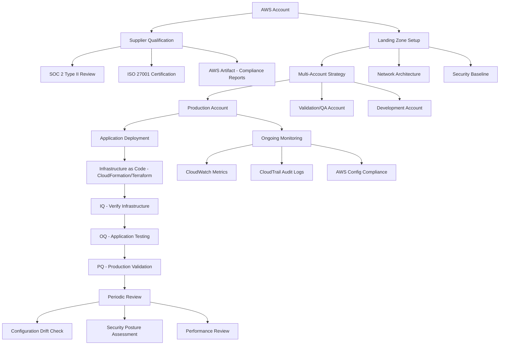

**AWS Shared Responsibility Model:**

```
┌─────────────────────────────────────────────────────────┐
│                    CUSTOMER RESPONSIBILITY               │
│  (Your validation scope)                                 │
├─────────────────────────────────────────────────────────┤
│ • Application Code & Configuration                       │
│ • User Access Management (IAM policies)                  │
│ • Data Encryption (in-transit and at-rest)              │
│ • Network Configuration (VPC, Security Groups)           │
│ • Operating System Patching (EC2)                        │
│ • Backup & Disaster Recovery Procedures                  │
│ • GxP Controls & Audit Trails                           │
├─────────────────────────────────────────────────────────┤
│                     AWS RESPONSIBILITY                    │
│  (Leverage AWS compliance documentation)                 │
├─────────────────────────────────────────────────────────┤
│ • Physical Infrastructure & Data Centers                 │
│ • Hardware & Network Infrastructure                      │
│ • Hypervisor & Virtualization Layer                     │
│ • Managed Service Infrastructure (RDS, Lambda, etc.)    │
│ • Physical Security & Environmental Controls             │
│ • Infrastructure Redundancy & Availability              │
└─────────────────────────────────────────────────────────┘
```

**AWS Validation Testing Strategy:**

**IQ (Installation Qualification):**
- Verify AWS account setup per design
- Confirm network architecture (VPC, subnets, security groups)
- Validate IAM roles and policies
- Verify encryption settings (KMS keys, S3 bucket encryption)
- Confirm CloudTrail logging enabled
- Document infrastructure as code templates

**OQ (Operational Qualification):**
- Test application functionality in AWS environment
- Verify backup and restore procedures
- Test failover and high availability configurations
- Validate monitoring and alerting (CloudWatch)
- Test disaster recovery procedures
- Verify access controls and authentication
- Audit trail completeness testing

**PQ (Performance Qualification):**
- Load testing under production-like conditions
- Verify performance meets requirements
- Test auto-scaling functionality
- Validate data integrity under load
- End-to-end business process validation
- User acceptance testing in production environment

**On-Premise to AWS Migration Strategy:**

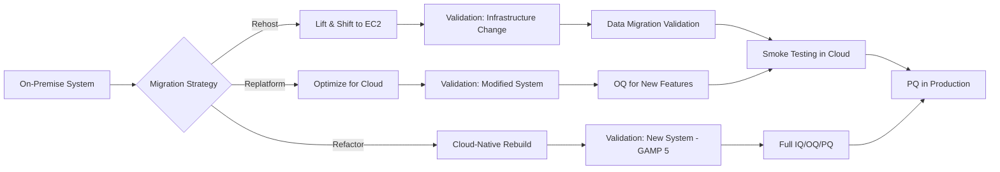

**Migration Validation Phases:**

**Phase 1: Pre-Migration (Weeks 1-4)**
- Document current validated state
- Create migration validation plan
- Establish acceptance criteria
- Set up AWS validation environment
- Conduct dry run migrations

**Phase 2: Migration Execution (Weeks 5-8)**
- Execute infrastructure as code
- Migrate data with checksums
- Perform data reconciliation
- Execute OQ testing in cloud
- Document any deviations

**Phase 3: Post-Migration (Weeks 9-12)**
- Conduct PQ in production
- Parallel operations if feasible
- Monitor performance and stability
- Complete validation report
- Obtain QA approval

**AWS GxP Control Implementation:**

| Control | AWS Service | Validation Requirement |
|---------|-------------|----------------------|
| **Audit Trail** | CloudTrail | Enable on all accounts, validate log completeness, test tamper-proofing |
| **Data Encryption** | KMS + S3/EBS encryption | Verify encryption at-rest and in-transit, test key rotation |
| **Access Control** | IAM + MFA | Validate least privilege, test MFA enforcement, review permissions |
| **Backup/Recovery** | AWS Backup | Test backup schedules, validate restore procedures, verify RPO/RTO |
| **High Availability** | Multi-AZ deployment | Test failover, verify automatic recovery, validate data consistency |
| **Change Control** | CloudFormation + Git | Version control infrastructure code, test rollback procedures |
| **Monitoring** | CloudWatch + SNS | Validate alerting, test notification procedures, verify log retention |

---

### 8.2 Microsoft Azure Validation Strategy

#### Azure Core Services and GxP Relevance

**Compute Services:**

| Service | Description | GxP Use Cases | Validation Approach |
|---------|-------------|---------------|---------------------|
| **Azure VMs** | Virtual machines | Application hosting | Configuration validation, patching procedures |
| **Azure Functions** | Serverless compute | Event processing, integrations | Function-level validation and testing |
| **Azure Kubernetes Service (AKS)** | Container orchestration | Microservices architecture | Container validation, orchestration testing |
| **Azure App Service** | PaaS for web apps | Web applications, APIs | Deployment validation, scaling testing |

**Storage Services:**

| Service | Description | GxP Use Cases | Validation Approach |
|---------|-------------|---------------|---------------------|
| **Azure Blob Storage** | Object storage | Documents, backups, archives | Access policy validation, encryption verification |
| **Azure Files** | Managed file shares | Shared data | SMB protocol testing, access control validation |
| **Azure Disk Storage** | Block storage | VM disks, databases | Snapshot testing, performance validation |

**Database Services:**

| Service | Description | GxP Use Cases | Validation Approach |
|---------|-------------|---------------|---------------------|
| **Azure SQL Database** | Managed SQL | Relational data | Backup/restore validation, geo-replication testing |
| **Cosmos DB** | Multi-model NoSQL | Global distribution, high scale | Consistency level validation, multi-region testing |
| **Azure Database for PostgreSQL/MySQL** | Managed open-source DBs | Application databases | Failover testing, backup validation |

**Security & Identity:**

| Service | Description | GxP Use Cases | Validation Approach |
|---------|-------------|---------------|---------------------|
| **Azure Active Directory** | Identity management | SSO, user authentication | MFA testing, conditional access validation |
| **Azure Key Vault** | Secrets management | Credentials, certificates, keys | Access policy validation, rotation testing |
| **Azure Security Center** | Security monitoring | Threat detection, compliance | Alert validation, compliance assessment |

**Azure Integration with Microsoft 365:**

For pharmaceutical companies using Microsoft ecosystem:

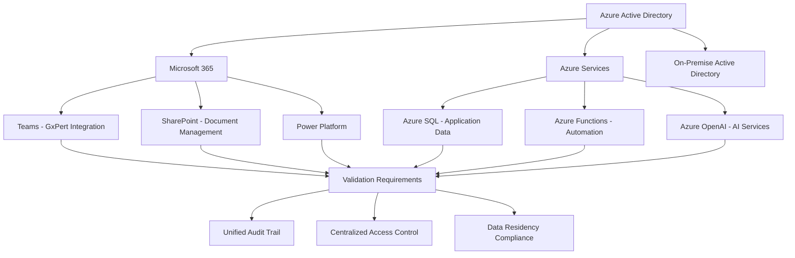

**Azure Compliance Framework:**

Azure provides extensive compliance certifications relevant to pharma:
- **FDA 21 CFR Part 11**: Azure supports electronic records and signatures
- **GxP**: Azure has been validated for GxP workloads
- **ISO 27001**: Information security management
- **ISO 27018**: Privacy in cloud computing
- **SOC 1/2/3**: Service organization controls
- **HIPAA/HITECH**: Healthcare data protection

**Azure Validation for Your GxPert-Style AI Agent:**

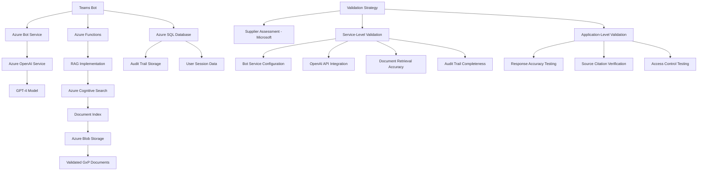

**Azure DevOps for Validated Systems:**

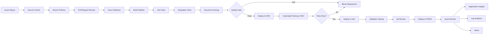

---

### 8.3 Google Cloud Platform (GCP) Validation Strategy

#### GCP Core Services and GxP Relevance

**Compute Services:**

| Service | Description | GxP Use Cases | Validation Approach |
|---------|-------------|---------------|---------------------|
| **Compute Engine** | Virtual machines | Application hosting | Instance template validation |
| **Cloud Functions** | Serverless compute | Event-driven processing | Function deployment validation |
| **Google Kubernetes Engine (GKE)** | Managed Kubernetes | Container orchestration | Cluster configuration validation |
| **App Engine** | PaaS platform | Web applications | Deployment validation |

**Storage & Databases:**

| Service | Description | GxP Use Cases | Validation Approach |
|---------|-------------|---------------|---------------------|
| **Cloud Storage** | Object storage | Document storage, backups | Bucket ACL validation, lifecycle policy testing |
| **Cloud SQL** | Managed databases | Relational data | Backup automation validation |
| **Cloud Spanner** | Globally distributed database | Mission-critical applications | Consistency validation, replication testing |
| **Firestore** | NoSQL document database | Real-time applications | Security rules validation |

**Data Analytics:**

| Service | Description | GxP Use Cases | Validation Approach |
|---------|-------------|---------------|---------------------|
| **BigQuery** | Data warehouse | Quality analytics, trending | Query validation, data integrity checks |
| **Dataflow** | Stream/batch processing | ETL pipelines | Pipeline validation, data transformation testing |
| **Dataproc** | Managed Spark/Hadoop | Big data processing | Cluster validation, job execution testing |

**Security:**

| Service | Description | GxP Use Cases | Validation Approach |
|---------|-------------|---------------|---------------------|
| **Cloud IAM** | Identity and access | User authentication, RBAC | Policy validation, access testing |
| **Cloud KMS** | Key management | Encryption keys | Key rotation validation |
| **Security Command Center** | Security management | Threat detection | Alert validation, compliance monitoring |
| **Cloud Audit Logs** | Audit trail | GxP compliance | Log completeness validation |

**GCP Compliance:**

GCP provides compliance documentation for:
- ISO/IEC 27001, 27017, 27018
- SOC 1, 2, 3
- HIPAA compliance
- FDA 21 CFR Part 11 (customer responsibility with GCP controls)

**Multi-Cloud Strategy Validation:**

Many pharmaceutical companies adopt multi-cloud strategies for risk mitigation:

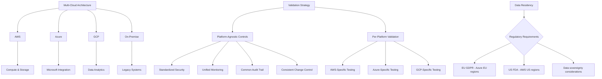

**Cloud Migration Validation Decision Tree:**

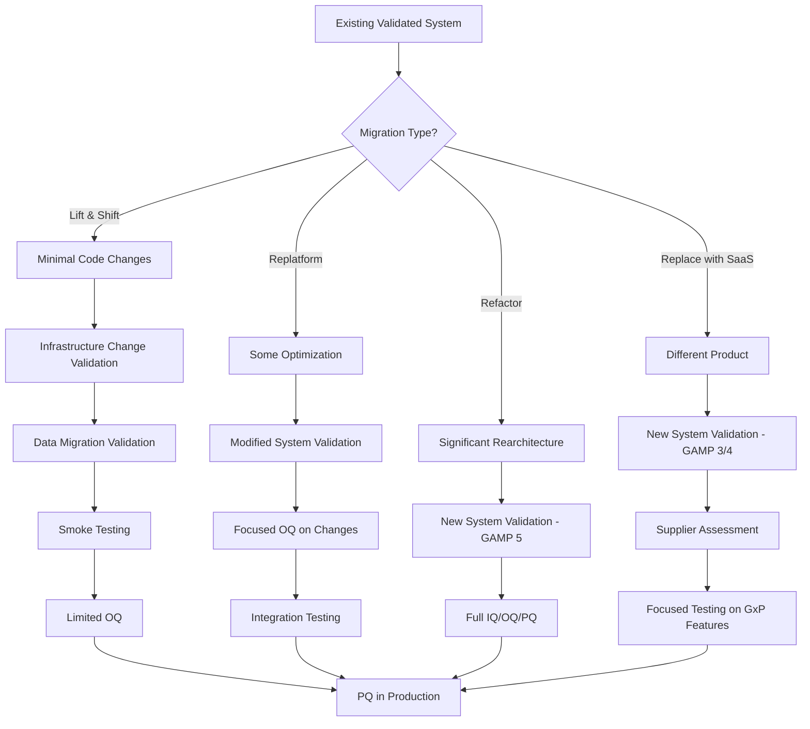

---

## Part 9: SAP Validation (ECC to S/4HANA)

### 9.1 SAP S/4HANA Overview

**What is S/4HANA?**

SAP S/4HANA (SAP Business Suite 4 SAP HANA) is SAP's next-generation ERP system built on the SAP HANA in-memory database platform.

**Key Differences from SAP ECC:**

| Aspect | SAP ECC | SAP S/4HANA |
|--------|---------|-------------|
| **Database** | Any (Oracle, SQL Server, DB2, etc.) | SAP HANA only (in-memory) |
| **Data Model** | Tables with aggregates | Simplified, real-time |
| **User Interface** | SAP GUI, legacy | SAP Fiori (modern, responsive) |
| **Analytics** | Separate BW system often needed | Embedded analytics |
| **Architecture** | Complex, many tables | Simplified (65% fewer tables) |
| **Processing** | Batch-oriented | Real-time processing |

**SAP Modules Relevant to Pharmaceuticals:**

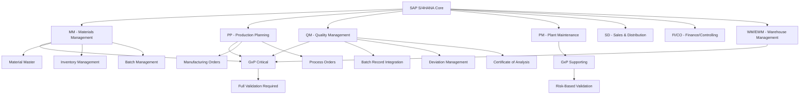

**GxP-Critical SAP Modules:**

**1. MM (Materials Management)**
- Material master data (specifications, approved suppliers)
- Inventory management (lot tracking, expiration dates)
- Purchasing (supplier qualification, COA receipt)
- Batch management (batch genealogy, traceability)

**2. PP (Production Planning)**
- Production orders (batch records, manufacturing instructions)
- Process orders (recipe management, execution tracking)
- Work centers (equipment, personnel qualification)
- Bill of materials (validated formulations)

**3. QM (Quality Management)**
- Inspection planning and execution
- Certificates of Analysis (COA)
- Quality notifications (deviations, CAPAs)
- Batch disposition (release/reject decisions)
- Stability management

**4. EWM (Extended Warehouse Management)**
- Warehouse operations (receiving, putaway, picking)
- Serialization tracking
- Temperature monitoring
- Storage condition management

### 9.2 SAP Validation Strategy

**GAMP 5 Category for SAP:**

SAP S/4HANA is typically **GAMP Category 4** (Configured Product):
- Standard software from established supplier
- Configured to meet business needs
- No source code modification
- Customization through configuration and add-ons

**SAP Validation Approach:**

```mermaid
graph TD
    A[SAP Validation Strategy] --> B[Supplier Assessment]
    A --> C[Core SAP Validation]
    A --> D[Configuration Validation]
    A --> E[Custom Code Validation]
    A --> F[Integration Validation]
    
    B --> G[Review SAP Quality System]
    B --> H[SAP Certifications - ISO 9001]
    B --> I[SAP Security Notes Process]
    
    C --> J[Leverage SAP Standard Testing]
    C --> K[Focus on GxP Processes]
    C --> L[Standard Transactions]
    
    D --> M[Document Configurations]
    D --> N[Test Configured Workflows]
    D --> O[Validate Custom Tables]
    
    E --> P[GAMP Category 5 Approach]
    E --> Q[Code Review]
    E --> R[Unit Testing]
    E --> S[Integration Testing]
    
    F --> T[Interface Testing]
    F --> U[Data Migration Validation]
    F --> V[Third-Party System Integration]
```

**SAP Validation Documentation:**

| Document | Purpose | SAP-Specific Content |
|----------|---------|----------------------|
| **URS** | User requirements | Business process requirements, SAP functionality needs |
| **FDS** | Functional Design | SAP standard functionality, configuration design |
| **CDS** | Configuration Design | Detailed SAP configuration (IMG settings, master data) |
| **IQ** | Installation qualification | SAP installation, transport management, client setup |
| **OQ** | Operational qualification | SAP transaction testing, configuration verification |
| **PQ** | Performance qualification | End-to-end business processes, integration testing |

### 9.3 SAP ECC to S/4HANA Migration Validation

**Migration Approaches:**

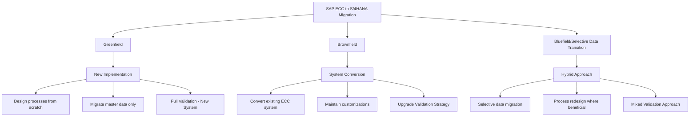

**Brownfield (System Conversion) Validation Strategy:**

This is most common for pharmaceutical companies with extensive ECC customization:

**Phase 1: Pre-Conversion (Months 1-3)**

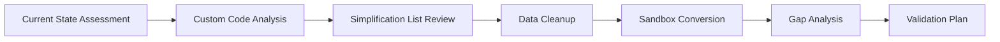

Activities:
- Inventory all custom code (Z* programs, user exits, BADIs)
- Identify incompatible code requiring remediation
- Review SAP simplification list (obsolete functions)
- Clean up inactive custom code and data
- Perform trial conversion in sandbox
- Document gaps and required modifications
- Develop comprehensive validation plan

**Phase 2: Development & Testing (Months 4-8)**

```
DEV Environment: Code Remediation
├── Update custom ABAP code for S/4HANA
├── Test custom programs
├── Remediate incompatibilities
└── Unit testing

QAS Environment: Integration Testing  
├── Execute OQ test scripts
├── Test business processes end-to-end
├── Validate interfaces
└── Performance testing

VAL Environment: Validation Testing
├── Formal validation protocols
├── Documented test execution
├── Deviation management
└── QA review and approval
```

**Phase 3: Conversion & Go-Live (Month 9-12)**

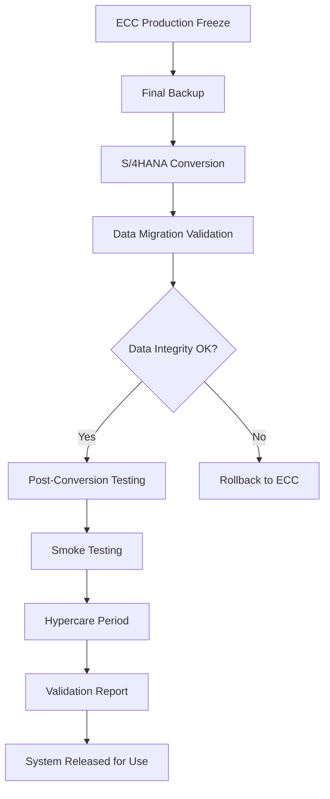

**S/4HANA Conversion Testing Strategy:**

**Pre-Conversion Testing:**

| Test Category | Focus | Example Tests |
|---------------|-------|---------------|
| **Functional Regression** | Core SAP functionality unchanged | Create material master, process production order, perform goods receipt |
| **Custom Code** | Modified Z* programs work correctly | Test all custom reports, interfaces, enhancements |
| **Fiori Apps** | New UI works as expected | Test Fiori launchpad, approve workflows on mobile |
| **Performance** | Response times acceptable | Transaction benchmarking, report execution time |
| **Interfaces** | Third-party integrations functional | LIMS interface, MES integration, EDI connections |

**Post-Conversion Validation:**

| Validation Area | Activities | Success Criteria |
|-----------------|------------|------------------|
| **Data Migration** | Compare pre/post conversion data | 100% record count match, key fields validated, relationships intact |
| **Master Data** | Verify material masters, BOMs, routings | All active materials migrated, BOM structures correct, no data loss |
| **Transactional Data** | Validate open orders, inventory | Open production orders correct, inventory balances match, reservations intact |
| **Historical Data** | Verify batch records, COAs accessible | Historical batch records readable, COAs retrievable, audit trails intact |
| **Customizations** | Test all Z* programs and config | Custom programs execute successfully, configurations preserved |

**S/4HANA Conversion Validation Documentation:**

Required deliverables:
1. **Migration Validation Plan**: Strategy, scope, approach, acceptance criteria
2. **Data Migration Specification**: Extract, transform, load logic, mapping documents
3. **Data Reconciliation Reports**: Pre/post conversion comparison, discrepancy resolution
4. **Conversion Test Protocols**: IQ, OQ, PQ protocols specific to conversion
5. **Traceability Matrix**: Requirements to test cases
6. **Validation Summary Report**: Results, deviations, approval for production use

**SAP Validation Challenges and Solutions:**

| Challenge | Impact | Solution |
|-----------|--------|----------|
| **Continuous SAP Updates** | Quarterly SAP support packages | Establish change control for SAP notes, test patches in QAS before PROD |
| **Complex Integrations** | Multiple third-party systems | Interface testing framework, automated regression testing |
| **Custom Code Volume** | Thousands of Z* programs | Prioritize by GxP criticality, leverage SAP's ATC (ABAP Test Cockpit) |
| **Data Volume** | Terabytes of historical data | Risk-based data validation, sampling strategies for historical records |
| **Fiori Authorizations** | New role model | Complete authorization testing, role design validation |

### 9.4 SAP Technical Concepts for Validation

**SAP Transport Management:**

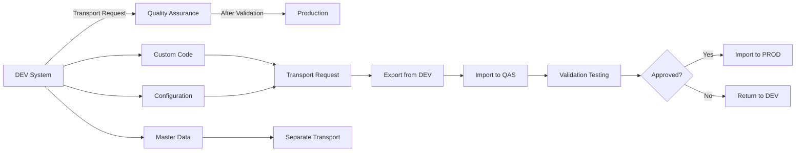

**Key SAP Validation Concepts:**

**1. Client Concept:**
- SAP systems have multiple clients (e.g., client 100=DEV, 200=QAS, 300=PROD)
- Configuration can be client-specific or cross-client
- Validation must consider client settings

**2. Transport Management System (TMS):**
- Changes captured in transport requests
- Transport provides traceability (who, what, when)
- Serves as change control mechanism
- Must validate transport process itself

**3. SAP Change & Transport System (CTS):**
- Manages movement of changes between systems
- Enforces development → quality → production flow
- Import must be validated and documented

**4. SAP Notes:**
- SAP-provided corrections and enhancements
- Security notes require rapid deployment
- Must be evaluated for GxP impact and tested

**5. SAP Fiori:**
- Modern HTML5-based user interface
- Responsive design (works on mobile)
- Apps must be individually validated
- Launchpad configuration is critical

**SAP Audit Trail Capabilities:**

| SAP Table/Tool | Purpose | GxP Usage |
|----------------|---------|-----------|
| **CDHDR/CDPOS** | Change documents | Track changes to master data |
| **DBTABLOG** | Table logging | Audit sensitive table changes |
| **SM20/SM19** | Security audit log | Track user access, authorization changes |
| **ST03N** | Workload statistics | User activity monitoring |
| **SLG1** | Application log | Custom program logging |
| **STAD** | Statistical records | Transaction usage tracking |

**SAP 21 CFR Part 11 Compliance:**

SAP provides features to support 21 CFR Part 11:

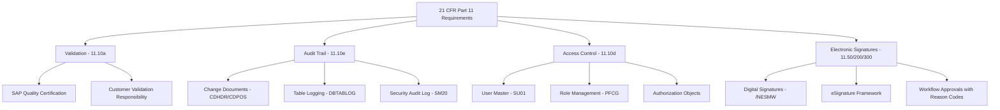

---

## Part 10: MES and LIMS Validation

### 10.1 Manufacturing Execution Systems (MES)

**What is MES?**

Manufacturing Execution System - software that manages and monitors manufacturing operations in real-time on the shop floor.

**MES Core Functions (ISA-95 Model):**

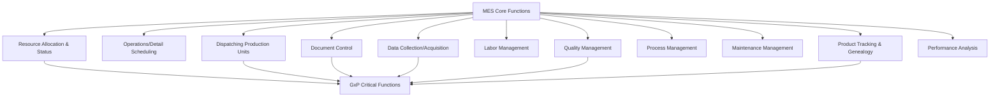

**PASX MES (Werum/Körber Pharma):**

PASX is one of the leading MES platforms specifically designed for pharmaceutical manufacturing.

**PASX Key Modules:**

| Module | Function | GxP Criticality | Validation Focus |
|--------|----------|-----------------|------------------|
| **Recipe Management** | Electronic batch records, procedures | Critical | Recipe accuracy, version control, change control |
| **Production Execution** | Operator guidance, data collection | Critical | Workflow correctness, data integrity, audit trail |
| **Material Management** | Raw material tracking, dispensing | Critical | Traceability, inventory accuracy, batch genealogy |
| **Equipment Management** | Equipment status, cleaning records | High | Status tracking, cleaning validation integration |
| **Quality Integration** | In-process checks, COA generation | Critical | QC integration, deviation management |
| **Genealogy & Traceability** | Complete batch history | Critical | Trace forward/backward, component tracking |
| **Reporting & Analytics** | Batch reports, trend analysis | Medium | Report accuracy, data aggregation correctness |

**PASX Architecture:**

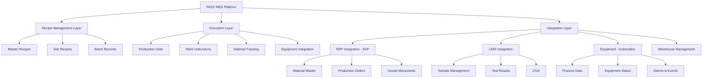

**PASX Validation Strategy:**

**GAMP Category**: Category 4 (Configured Product)

**Validation Phases:**

**1. Infrastructure Qualification (IQ):**
- Server installation verification
- Database configuration
- Network connectivity
- Security settings (user authentication, role-based access)
- Integration interfaces
- Backup and disaster recovery setup

**2. Operational Qualification (OQ):**
- Recipe management functionality
- Production execution workflows
- Material tracking and genealogy
- Equipment integration
- Quality management functions
- User management and access control
- Audit trail completeness
- Electronic signature functionality
- Report generation

**3. Performance Qualification (PQ):**
- End-to-end batch execution (pilot batch or sim batch)
- Complete material traceability exercise
- Deviation and exception handling
- Equipment malfunction scenarios
- Batch record review and approval workflow
- COA generation and release process
- User acceptance testing with actual operators

**PASX-SAP Integration Validation:**

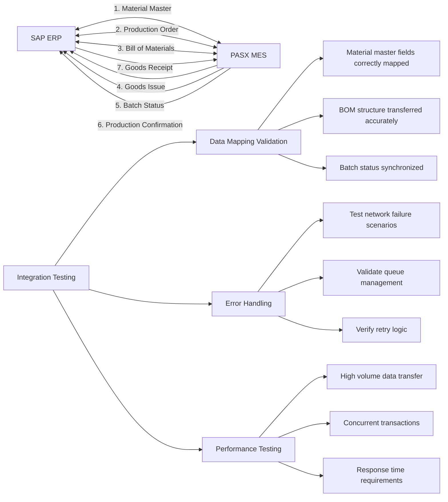

**PASX Electronic Batch Record Validation:**

Critical aspects:
- **Workflow Logic**: Each step in correct sequence, deviations captured
- **Data Integrity**: All entries captured, cannot be overwritten, audit trail complete
- **Calculations**: Yields, consumptions calculated correctly
- **Signatures**: Electronic signatures compliant with 21 CFR Part 11
- **Printability**: Batch records can be printed for archives
- **Traceability**: Raw materials to finished product traceable

### 10.2 Laboratory Information Management Systems (LIMS)

**LabVantage LIMS:**

LabVantage is a leading LIMS platform for pharmaceutical QC laboratories.

**LabVantage Core Modules:**

| Module | Function | Validation Focus |
|--------|----------|------------------|
| **Sample Management** | Sample login, chain of custody | Sample ID assignment, status tracking, traceability |
| **Test Management** | Assign tests, schedule, track | Test assignment logic, scheduling algorithms, SLA monitoring |
| **Results Entry** | Enter results, calculations, spec checking | Calculation verification, out-of-spec handling, result review |
| **Instrument Integration** | Automated data capture | Interface testing, data transformation validation, error handling |
| **Stability Management** | Track stability studies | Protocol management, pull list generation, trending |
| **COA Generation** | Certificate of Analysis | Template accuracy, data population, multi-lingual support |
| **Inventory Management** | Standards, reagents, consumables | Expiry tracking, usage recording, re-order alerts |
| **Method Management** | Analytical methods, SOPs | Version control, method transfer, method validation |

**LabVantage Architecture:**

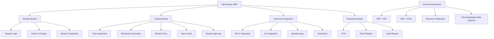

**LabVantage Validation Strategy:**

**Phase 1: Configuration and Customization (Weeks 1-8)**
- Configure product specifications
- Set up test methods and procedures
- Define user roles and permissions
- Configure workflows (sample login → results → approval → COA)
- Customize reports and COA templates
- Develop custom forms if needed

**Phase 2: Integration Development (Weeks 9-16)**
- Instrument interfaces (chromatography systems)
- ERP integration (SAP material master, batch info)
- MES integration (sample requests, test results)
- Data migration from legacy LIMS

**Phase 3: Validation Testing (Weeks 17-24)**

**IQ Testing:**
- Server/database installation
- Application installation and configuration
- Security settings
- Network configuration
- Backup procedures

**OQ Testing:**
```mermaid
graph TD
    A[OQ Test Categories] --> B[Sample Management Tests]
    A --> C[Test Management Tests]
    A --> D[Results & Calculations Tests]
    A --> E[Instrument Interface Tests]
    A --> F[Security & Audit Trail Tests]
    A --> G[Report Generation Tests]
    
    B --> B1[Sample login with various sample types]
    B --> B2[Chain of custody tracking]
    B --> B3[Sample disposition - pass/fail/retrain]
    
    C --> C1[Automatic test assignment based on rules]
    C --> C2[Test scheduling and prioritization]
    C --> C3[Worksheet generation]
    
    D --> D1[Manual result entry]
    D --> D2[Calculated results - formulas]
    D --> D3[Specification checking - OOS handling]
    D --> D4[Results approval workflow]
    
    E --> E1[Instrument data import]
    E --> E2[Peak integration review]
    E --> E3[Error handling - missing files]
    
    F --> F1[User access control]
    F --> F2[Audit trail completeness]
    F --> F3[Electronic signatures]
    F --> F4[Data modification tracking]
    
    G --> G1[COA generation - multiple templates]
    G --> G2[Trend reports - stability]
    G --> G3[Custom report accuracy]
```

**PQ Testing:**
- Complete sample flow: login → testing → approval → COA → archival
- Stability study workflow: protocol setup → sample pulls → testing → trending
- Out-of-specification investigation workflow
- Multi-site testing (if applicable)
- Performance testing with realistic data volumes
- User acceptance testing with actual lab analysts

**LabVantage-Instrument Integration Validation:**

**Chromatography Data System (CDS) Integration:**

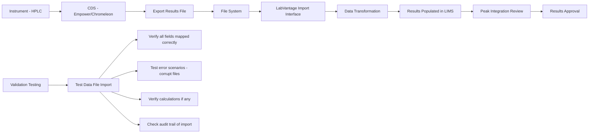

**Integration Test Cases:**
- Successful file import with valid data
- Import with missing required fields (should fail gracefully)
- Import with out-of-spec results (should flag appropriately)
- Import with corrupt/malformed file (error handling)
- Simultaneous imports from multiple instruments
- Large batch imports (performance testing)

**LabVantage Audit Trail Requirements:**

All these actions must be captured in audit trail:
- Sample created, modified, status changed
- Test assigned, started, completed
- Results entered, modified, approved, rejected
- Specifications created, modified
- Users created, roles modified
- Reports generated
- System configuration changes
- Data exports

**LabVantage 21 CFR Part 11 Compliance:**

| Requirement | LabVantage Implementation | Validation Test |
|-------------|--------------------------|-----------------|
| **User Authentication** | Unique user ID, password complexity rules | Test login, password policies, lockout after failed attempts |
| **Electronic Signatures** | Signature on approval, with reason code | Test signature workflow, verify timestamp, test reason codes |
| **Audit Trail** | Comprehensive audit trail on all data | Verify all CRUD operations logged with user/timestamp |
| **Data Integrity** | Database constraints, no deletion | Test that data cannot be deleted, only invalidated |
| **Record Retention** | Archival functionality | Test archival process, verify archived data retrievable |

---

## Part 11: Agile and Scrum in Computer System Validation

### 11.1 Traditional Waterfall vs. Agile for CSV

**Traditional Waterfall CSV:**

```mermaid
graph TD
    A[Requirements Phase - URS] --> B[Design Phase - FS/DS]
    B --> C[Development Phase]
    C --> D[Testing Phase - IQ/OQ/PQ]
    D --> E[Deployment to Production]
    E --> F[Validation Report]
    F --> G[System Released for Use]
    
    H[Challenges] --> I[Long cycle times - 6-18 months]
    H --> J[Late discovery of issues]
    H --> K[Requirements often outdated by end]
    H --> L[Difficult to accommodate changes]
```

**Agile CSV Approach:**

```mermaid
graph TD
    A[Product Backlog] --> B[Sprint Planning]
    B --> C[Sprint 1 - 2 weeks]
    C --> D[Increment 1 - Potentially Shippable]
    D --> E[Sprint Review]
    E --> F[Sprint Retrospective]
    
    F --> G[Sprint 2]
    G --> H[Increment 2]
    H --> I[Sprint Review]
    I --> J[Sprint Retrospective]
    
    J --> K[Continue Sprints]
    K --> L[Release Planning]
    L --> M[Validation Sprint]
    M --> N[Production Release]
    
    O[Benefits] --> P[Faster time to value]
    O --> Q[Early issue detection]
    O --> R[Flexibility for changes]
    O --> S[Continuous stakeholder engagement]
```

### 11.2 Adapting Scrum for GxP Systems

**Scrum Framework Adapted for CSV:**

**Roles:**

| Scrum Role | CSV Context | Responsibilities |
|------------|-------------|------------------|
| **Product Owner** | Business SME + QA Representative | Prioritize features, ensure GxP requirements included, acceptance criteria |
| **Scrum Master** | Agile Coach | Facilitate ceremonies, remove impediments, coach team on agile |
| **Development Team** | Developers + Validators + QA | Cross-functional, includes validation expertise from start |

**Scrum Events:**

**1. Sprint Planning:**
- **Input**: Prioritized backlog including GxP requirements
- **Output**: Sprint backlog with validation tasks included
- **GxP Adaptation**: Ensure validation representative participates, validation tasks estimated and included

**2. Daily Standup:**
- **Standard**: What did I do? What will I do? Any blockers?
- **GxP Adaptation**: Include validation progress, raise testing/compliance concerns early

**3. Sprint Review:**
- **Standard**: Demo working software to stakeholders
- **GxP Adaptation**: Include QA in review, demonstrate compliance features (audit trail, electronic signatures), review test results

**4. Sprint Retrospective:**
- **Standard**: What went well? What can improve?
- **GxP Adaptation**: Review validation efficiency, compliance with validation procedures, identify process improvements

**5. Backlog Refinement:**
- **Standard**: Break down user stories, estimate effort
- **GxP Adaptation**: Ensure GxP requirements defined, validation acceptance criteria clear, risk assessment performed

**Agile User Stories with GxP Requirements:**

**Standard User Story Format:**
```
As a [user role],
I want [feature],
So that [business value].
```

**GxP-Enhanced User Story:**
```
As a Quality Control Analyst,
I want to enter sample test results with automatic specification checking,
So that I can quickly identify out-of-spec results and initiate investigations.

GxP Requirements:
- Results entry must be captured in audit trail (who, when, what)
- Spec check calculations must be validated and documented
- Out-of-spec results must trigger electronic workflow for investigation
- Electronic signature required for result approval
- System must prevent modification of approved results

Acceptance Criteria:
- Result entry logged in audit trail with timestamp and user ID
- Specification checking calculates correctly per validated formula
- OOS results automatically create investigation record
- Electronic signature prompts for approval with reason code
- Attempt to modify approved result results in error message

Definition of Done:
- Code complete and peer reviewed
- Unit tests passing
- Integration tests passing
- Validation test cases executed and passed
- QA review completed
- Documentation updated (if required)
```

**Agile Estimation with Validation Effort:**

Traditional story points should include validation effort:

| Activity | Effort Without Validation | Effort With Validation | Factor |
|----------|--------------------------|------------------------|--------|
| Simple feature (e.g., new field on form) | 2 points | 3 points | 1.5x |
| Medium feature (e.g., new workflow) | 5 points | 8 points | 1.6x |
| Complex feature (e.g., calculation engine) | 13 points | 21 points | 1.6x |

**Include in estimates:**
- Test case writing
- Test execution
- Documentation updates
- QA review time

### 11.3 Validation Documentation in Agile

**Challenge**: Traditional validation produces large documents upfront. Agile delivers incrementally.

**Solution**: Living Documentation Approach

```mermaid
graph TD
    A[Traditional Validation Docs] --> B[Large Upfront Documents]
    B --> C[Validation Plan - 50 pages]
    B --> D[Test Protocols - 200 pages]
    B --> E[Validation Report - 100 pages]
    
    F[Agile Validation Docs] --> G[Living Documentation]
    G --> H[Master Validation Plan - 20 pages, rarely changes]
    G --> I[Requirements Traceability Matrix - Updated each sprint]
    G --> J[Automated Test Results - Generated each sprint]
    G --> K[Sprint Validation Summary - 5 pages per sprint]
    
    K --> L[Aggregate at Release]
    L --> M[Validation Summary Report]
```

**Living Documents:**

**1. Master Validation Plan (MVP):**
- Written once, updated rarely
- Describes overall validation approach
- Defines roles and responsibilities
- Explains agile adaptation for GxP
- Approved by QA upfront

**2. Requirements Specification:**
- Product backlog serves as living URS
- User stories with GxP requirements
- Traceability to test cases maintained
- Updated each sprint as requirements evolve

**3. Design Specification:**
- Architecture documentation (updated as needed)
- Interface specifications
- Data model
- Security design

**4. Test Cases:**
- Automated where possible (unit, integration, regression)
- Manual test cases for validation-critical features
- Linked to user stories in traceability matrix
- Executed each sprint

**5. Sprint Validation Summary:**
- What was built this sprint
- What was tested
- Test results summary
- Deviations identified and resolved
- QA review and approval

**6. Release Validation Report:**
- Aggregates sprint validation summaries
- Overall traceability matrix
- Complete test results
- Risk assessment
- Recommendation for production use

**Traceability Matrix in Agile:**

Maintain electronically (e.g., in Jira, Azure DevOps):

| Requirement ID | User Story | Test Case(s) | Test Result | Sprint | Status |
|----------------|------------|--------------|-------------|--------|--------|
| REQ-001 | As QC Analyst, enter results | TC-001, TC-002, TC-003 | Pass | Sprint 5 | Complete |
| REQ-002 | As QA Manager, approve COA | TC-010, TC-011 | Pass | Sprint 7 | Complete |
| REQ-003 | System captures audit trail | TC-020-025 | Pass | Sprints 3-8 | Complete |

### 11.4 Agile Validation Ceremonies

**Sprint 0: Validation Foundation**

Before starting feature sprints:
- Write Master Validation Plan
- Conduct risk assessment
- Define validation strategy
- Set up environments (DEV, TEST, VAL, PROD)
- Establish traceability tools
- Create validation templates
- Train team on GxP requirements

**During Development Sprints:**

**Each Sprint Includes:**
- Development of features
- Automated testing (unit, integration)
- Manual validation testing of critical features
- Documentation updates
- QA spot checks
- Sprint validation summary

**Validation Sprint (Hardening Sprint):**

Before production release, dedicate 1-2 sprints to validation activities:
- Execute full regression testing
- Performance testing
- Security testing
- User acceptance testing (PQ equivalent)
- Complete validation documentation
- QA review and approval
- Generate release validation report

```mermaid
graph LR
    A[Sprint 1-8: Feature Development] --> B[Sprint 9: Validation Sprint]
    B --> C[Regression Testing]
    B --> D[Performance Testing]
    B --> E[Security Testing]
    B --> F[UAT - PQ]
    B --> G[Documentation Review]
    C --> H[QA Approval Gate]
    D --> H
    E --> H
    F --> H
    G --> H
    H --> I{Approved?}
    I -->|Yes| J[Release to Production]
    I -->|No| K[Additional Sprint for Fixes]
    K --> B
```

### 11.5 Continuous Validation in DevOps

**Integration of Validation into CI/CD Pipeline:**

```mermaid
graph TD
    A[Developer Commits Code] --> B[Git Repository]
    B --> C[CI Pipeline Triggered]
    C --> D[Automated Build]
    D --> E[Static Code Analysis]
    E --> F[Unit Tests]
    F --> G[Integration Tests]
    G --> H{All Tests Pass?}
    H -->|No| I[Notify Developer]
    H -->|Yes| J[Deploy to DEV]
    
    J --> K[Smoke Tests in DEV]
    K --> L[Deploy to TEST]
    L --> M[Automated Regression Tests]
    M --> N[Deploy to VAL]
    N --> O[Validation Test Execution]
    O --> P[Generate Test Report]
    P --> Q{QA Review}
    Q -->|Approved| R[Deploy to PROD]
    Q -->|Issues| I
    
    R --> S[Post-Deployment Smoke Tests]
    S --> T[Update Validation Documentation]
```

**Automated Validation Testing:**

**Benefits:**
- Consistent, repeatable testing
- Faster feedback
- Better test coverage
- Reduced human error
- Continuous regression testing

**What Can Be Automated:**
- API functional testing
- UI functional testing (Selenium, Cypress)
- Performance testing (JMeter, LoadRunner)
- Security scanning
- Audit trail verification
- Data integrity checks

**What Requires Manual Testing:**
- Usability testing
- Complex workflows requiring judgment
- Visual verification
- Some security testing
- Validation of printable outputs

**Example: Automated Audit Trail Testing**

```python
# Pseudocode for automated audit trail validation
def test_audit_trail_on_record_creation():
    # Create test record
    record = create_sample_record()
    
    # Retrieve audit trail
    audit_entry = get_audit_trail_for_record(record.id)
    
    # Assertions
    assert audit_entry.action == "CREATE"
    assert audit_entry.user == current_user()
    assert audit_entry.timestamp is not None
    assert audit_entry.record_id == record.id
    assert audit_entry.data_snapshot == record.to_json()
    
def test_audit_trail_on_record_modification():
    # Create and modify record
    record = create_sample_record()
    original_value = record.field1
    record.field1 = "new_value"
    record.save()
    
    # Retrieve audit trail
    audit_entries = get_audit_trail_for_record(record.id)
    modify_entry = [e for e in audit_entries if e.action == "UPDATE"][0]
    
    # Assertions
    assert modify_entry.old_value == original_value
    assert modify_entry.new_value == "new_value"
    assert modify_entry.user == current_user()
```

---

## Part 12: Computer Software Assurance (CSA)

### 12.1 What is CSA?

**Computer Software Assurance (CSA)** is FDA's modern, risk-based approach to software validation emphasizing:
- **Critical thinking** over comprehensive documentation
- **Testing** over documentation
- **Risk-based approach** focusing on patient safety and product quality
- **Leveraging** modern software development practices

**FDA's CSA Guidance (October 2023):**

FDA published draft guidance "Computer Software Assurance for Production and Quality System Software" providing alternative to traditional CSV.

**Key CSA Principles:**

```mermaid
graph TD
    A[CSA Principles] --> B[Risk-Based Approach]
    A --> C[Focus on Intended Use]
    A --> D[Leverage Unscripted Testing]
    A --> E[Reduce Documentation Burden]
    A --> F[Critical Thinking Over Coverage]
    
    B --> G[Categorize by Risk]
    G --> H[High Risk - Patient Safety]
    G --> I[Medium Risk - Product Quality]
    G --> J[Low Risk - Indirect Impact]
    
    C --> K[What is system supposed to do?]
    K --> L[What could go wrong?]
    L --> M[How do we know it works?]
    
    D --> N[Exploratory Testing]
    D --> O[User-Based Testing]
    D --> P[Don't Need Protocol for Everything]
    
    E --> Q[Less Protocol Documentation]
    E --> R[More Evidence-Based Records]
    E --> S[Simplified Reports]
```

### 12.2 CSA vs. Traditional CSV

**Comparison:**

| Aspect | Traditional CSV | CSA Approach |
|--------|----------------|--------------|
| **Philosophy** | Document everything, test everything | Risk-based, test what matters |
| **Documentation** | Extensive protocols (100s of pages) | Streamlined, focused records |
| **Testing** | Scripted testing with step-by-step protocols | Combination of scripted and unscripted testing |
| **Focus** | Comprehensive coverage | Critical functionality based on risk |
| **Timeline** | Often 6-12 months | Can be 50% faster |
| **Regulatory Basis** | 21 CFR Part 11, industry practice | FDA CSA Guidance (2023), risk-based |
| **Applicability** | All GxP systems | Particularly good for COTS, SaaS, low-risk systems |

**When to Use CSA:**

```mermaid
graph TD
    A[System Type?] --> B{COTS/SaaS?}
    B -->|Yes| C[CSA Excellent Fit]
    B -->|No| D{Custom Developed?}
    
    D -->|Simple| C
    D -->|Complex| E[Traditional CSV May Be Better]
    
    A --> F{Risk Level?}
    F -->|Low-Medium| C
    F -->|High - Direct Patient Impact| G[CSA Possible, More Documentation]
    
    A --> H{Regulatory History?}
    H -->|Recent Inspections Clean| C
    H -->|Recent 483s/Warning Letters| I[Be Conservative, Traditional CSV Safer]
```

### 12.3 CSA Risk Categorization

**FDA's Risk Categories:**

**Category 1 - Basic:**
- **Minimal risk** if software fails
- **Examples**: Calendars, time tracking, word processors
- **Assurance**: Basic IT controls, no validation documentation

**Category 2 - Supplemental:**
- **Indirect impact** on product quality/patient safety
- **Examples**: Training management, document management, inventory systems
- **Assurance**: Documented supplier assessment, basic functional testing, periodic review

**Category 3 - Critical:**
- **Direct impact** on product quality or patient safety
- **Examples**: LIMS, MES, electronic batch records, QMS
- **Assurance**: Comprehensive risk assessment, documented testing, robust change control

**CSA Risk Assessment Process:**

```mermaid
graph TD
    A[Software System] --> B{Intended Use}
    B --> C{Could failure impact product quality?}
    C -->|Yes| D{Direct or Indirect?}
    C -->|No| E[Basic Category]
    
    D -->|Direct| F[Critical Category]
    D -->|Indirect| G[Supplemental Category]
    
    F --> H[Comprehensive Assurance]
    H --> I[Detailed Risk Assessment]
    H --> J[Extensive Testing]
    H --> K[Validation Documentation]
    
    G --> L[Moderate Assurance]
    L --> M[Supplier Assessment]
    L --> N[Focused Testing on Critical Features]
    L --> O[Streamlined Documentation]
    
    E --> P[Minimal Assurance]
    P --> Q[IT Standard Controls]
    P --> R[No Validation Documentation]
```

### 12.4 From V-Model to CSA

**Traditional V-Model:**

```mermaid
graph TD
    A[User Requirements] --> B[Functional Specification]
    B --> C[Design Specification]
    C --> D[Code Development]
    D --> E[Unit Testing]
    E --> F[Integration Testing - OQ]
    F --> G[System Testing - PQ]
    G --> H[User Acceptance Testing]
    
    I[Heavy Documentation at Each Stage]
    J[Formal Protocols for All Testing]
    K[Extensive Traceability Matrix]
```

**CSA Approach:**

```mermaid
graph TD
    A[Intended Use Definition] --> B[Risk Assessment]
    B --> C{Risk Category?}
    
    C -->|Critical| D[Detailed Requirements for Critical Functions]
    C -->|Supplemental| E[High-Level Requirements]
    C -->|Basic| F[Minimal Documentation]
    
    D --> G[Combination Testing Approach]
    G --> H[Scripted Testing - Critical Functions]
    G --> I[Unscripted Testing - Exploratory]
    G --> J[User-Based Testing]
    
    H --> K[Document Results, Not Detailed Steps]
    I --> K
    J --> K
    
    K --> L[Assurance Report]
    L --> M[Risk-Based, Focused on What Matters]
```

**Key Differences:**

**V-Model:**
- Requirements → Design → Code → Test (mirror image)
- Each phase has deliverable
- Extensive documentation at each stage
- Formal traceability

**CSA:**
- Risk → Critical Functions → Test → Evidence
- Documentation proportional to risk
- Flexibility in testing approach
- Focus on critical thinking over documentation

### 12.5 CSA Testing Strategies

**Unscripted Testing:**

Traditional validation requires every test step documented:
```
Step 1: Click "New Sample" button
Expected: Sample creation form appears
Actual: Sample creation form appeared
Result: PASS
```

CSA allows unscripted testing:
```
Test Objective: Verify sample creation workflow
Tester: Jane Smith
Duration: 30 minutes
Approach: Created multiple samples with various attributes, 
tested error handling, verified audit trail
Results: All tests successful. Identified one usability issue 
(dropdown not alphabetized) - logged as enhancement.
Evidence: Screenshots attached, audit trail reviewed
```

**CSA Testing Mix:**

```mermaid
graph TD
    A[CSA Testing Strategy] --> B[Scripted Testing 30-40%]
    A --> C[Unscripted Testing 30-40%]
    A --> D[User-Based Testing 20-30%]
    A --> E[Automated Testing Where Possible]
    
    B --> F[Critical GxP Functions]
    B --> G[Audit Trail Verification]
    B --> H[Calculations & Algorithms]
    B --> I[Security Controls]
    
    C --> J[User Experience]
    C --> K[Workflow Navigation]
    C --> L[Error Handling]
    C --> M[Edge Cases]
    
    D --> N[Actual End Users]
    D --> O[Real-World Scenarios]
    D --> P[Usability Feedback]
```

**Testing Documentation in CSA:**

**What to Document:**
- **Intended use** and risk assessment
- **Critical functions** identified
- **Testing approach** for each risk category
- **Test results** and evidence
- **Issues found** and resolution
- **Conclusion** on fitness for use

**What's No Longer Required:**
- Step-by-step test scripts for everything
- Screenshots of every test step
- Extensive pre-written protocols
- Tests of non-critical functions

**CSA Assurance Report Structure:**

```
1. System Overview
   - Intended use
   - GAMP category
   - Deployment model (cloud/on-prem)

2. Risk Assessment
   - CSA risk category (Basic/Supplemental/Critical)
   - Critical functions identified
   - Risk mitigation approach

3. Supplier Assessment (if applicable)
   - Vendor quality system
   - Vendor certifications
   - Vendor validation documentation reviewed

4. Testing Summary
   - Critical functions tested (list)
   - Testing approach (scripted/unscripted/user-based)
   - Test results summary
   - Issues identified and resolved

5. Infrastructure Verification
   - Installation verified
   - Security controls confirmed
   - Backup/recovery tested

6. Conclusion
   - System fit for intended use? Yes/No
   - Limitations or caveats
   - Recommendation for production use

Appendices:
- Test evidence
- Risk assessment details
- Supplier assessment
```

### 12.6 CSA Implementation Strategy

**Adopting CSA in Your Organization:**

**Phase 1: Pilot Project (3-6 months)**
- Select low-medium risk system
- Develop CSA approach document
- Train team on CSA principles
- Execute pilot validation using CSA
- Lessons learned

**Phase 2: Procedure Update (1-2 months)**
- Update validation procedures to include CSA option
- Define criteria for CSA vs. traditional
- Create CSA templates
- Train broader organization

**Phase 3: Gradual Rollout (6-12 months)**
- Apply CSA to new systems
- Consider re-evaluating existing validated systems
- Build confidence with inspectors
- Refine approach based on experience

**CSA Procedure Requirements:**

Your validation procedure should address:
- When CSA may be used (risk-based criteria)
- Risk categorization methodology
- Documentation requirements by category
- Testing approach by category
- Roles and responsibilities
- QA review and approval process

**Example Decision Tree for CSV vs. CSA:**

```mermaid
graph TD
    A[New System Validation] --> B{System Type?}
    
    B -->|COTS/SaaS - No Customization| C[CSA Candidate]
    B -->|COTS - Heavily Configured| D[CSA or Traditional]
    B -->|Custom Developed| E{Complexity?}
    
    E -->|Simple| C
    E -->|Complex| F[Traditional Likely Better]
    
    C --> G{Risk Category?}
    G -->|Basic| H[CSA - Minimal Documentation]
    G -->|Supplemental| I[CSA - Moderate Documentation]
    G -->|Critical| J[CSA - More Documentation, or Traditional]
    
    D --> K{Organization Mature with CSA?}
    K -->|Yes| I
    K -->|No| F
    
    F --> L[Traditional CSV Approach]
    H --> M[CSA Approach]
    I --> M
    J --> N{Inspector Comfort?}
    N -->|Established Relationship| M
    N -->|Recent Issues| L
```

### 12.7 CSA for Common Systems

**CSA Examples by System Type:**

**LIMS (LabVantage) - Critical Category:**

**CSA Approach:**
- **Risk Assessment**: Identify critical functions (sample tracking, result entry/approval, COA generation, audit trail)
- **Supplier Assessment**: Review LabVantage quality system, certifications, validation documentation
- **Critical Testing**: 
  - Scripted: Sample ID assignment, calculations, specifications checking, COA accuracy
  - Unscripted: Workflow navigation, error handling
  - User-based: Actual analysts perform testing
- **Documentation**: CSA Assurance Report (~20-30 pages vs. 200+ page traditional protocols)

**Document Management (SharePoint) - Supplemental Category:**

**CSA Approach:**
- **Risk Assessment**: Document version control, access control, audit trail
- **Supplier Assessment**: Microsoft's SOC 2, FDA usage
- **Focused Testing**:
  - Scripted: Version control works, permissions enforced
  - Unscripted: User experience, search functionality
- **Documentation**: Brief assurance report (~10 pages)

**Training LMS (Basic Internal Tool) - Basic Category:**

**CSA Approach:**
- **Minimal Documentation**: Simple statement that IT controls apply
- **No Formal Validation**: Standard IT change control sufficient

### 12.8 CSA Interview Questions

**Q: "What's your understanding of FDA's Computer Software Assurance approach?"**

**Good Answer**: 
"CSA represents FDA's modernization of software validation, acknowledging that traditional approaches created documentation burden without always improving quality. The core principle is applying critical thinking and focusing resources on what truly affects patient safety and product quality. CSA emphasizes risk-based categorization, allows unscripted testing, and reduces documentation for lower-risk systems. 

At BMS, I've been following FDA's draft guidance and piloting CSA on [specific example]. The key insight is that CSA isn't about lowering standards—it's about being smarter about where we apply rigor. For a critical system like LIMS, we still do extensive testing, but we can use unscripted exploratory testing alongside traditional protocols. For supplemental systems, we significantly streamline documentation while maintaining assurance.

I see CSA as the future of pharmaceutical software validation, particularly for cloud/SaaS systems where traditional approaches are cumbersome."

**Q: "How would you convince a traditional QA organization to adopt CSA?"**

**Good Answer**:
"I'd start with education—many QA professionals assume CSA means less rigor, when it actually means more focused rigor. I'd propose a pilot project on a lower-risk system to demonstrate the approach. Key selling points:

1. **FDA Endorsed**: This isn't cutting corners—it's FDA's recommended approach
2. **Faster**: Can reduce validation timelines 30-50% for appropriate systems
3. **Better Quality**: More time testing, less time documenting test steps
4. **Industry Trend**: Leading pharma companies adopting CSA
5. **Inspector-Friendly**: Clear risk assessment and critical thinking appeal to inspectors

I'd also acknowledge concerns: ensure our procedures clearly define when CSA is appropriate, maintain rigor for high-risk systems, and build confidence gradually."

---

*This supplement significantly expands your interview preparation with deep technical content on ITSM, Cloud Platforms, SAP, MES/LIMS, Agile/Scrum, and CSA methodologies.*
