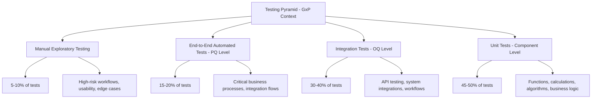
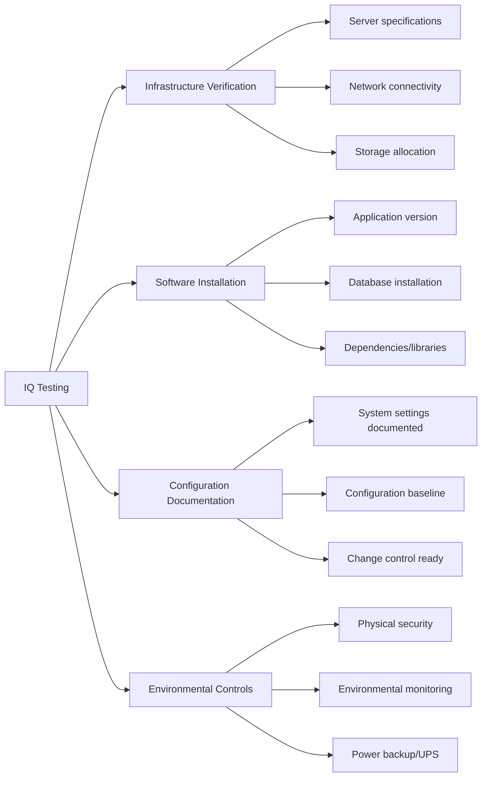
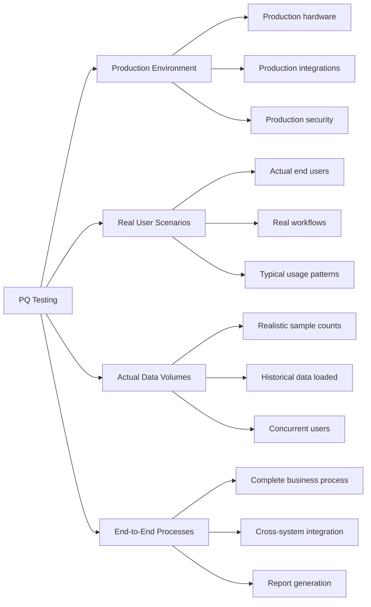
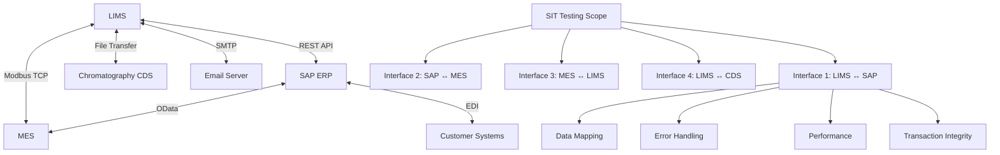
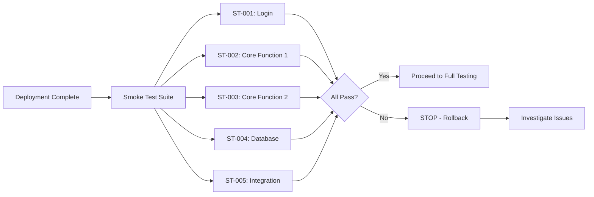
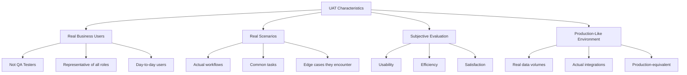
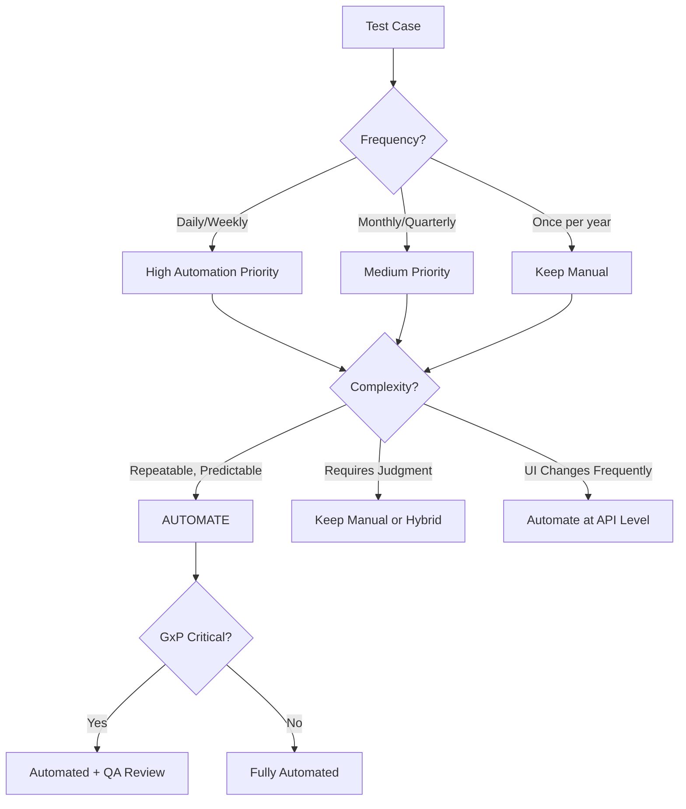
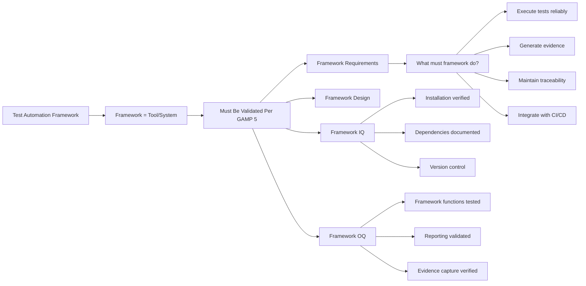

# Comprehensive GxP Testing & Test Automation Guide for CSV

## Complete Guide to Testing Strategies, Automation Frameworks, and CI/CD Integration in Validated Environments

**Part 1: Fundamentals, Test Types, and Selenium Framework**

---

## Table of Contents

- [Part 1: GxP Testing Fundamentals](#part-1-gxp-testing-fundamentals)
- [Part 2: Test Types Deep Dive (IQ/OQ/PQ, SIT, ST, UAT)](#part-2-test-types-deep-dive)
- [Part 3: Test Automation Strategy for CSV](#part-3-test-automation-strategy-for-csv)
- [Part 4: Selenium Framework for GxP](#part-4-selenium-framework-for-gxp)

---

## Part 1: GxP Testing Fundamentals

### 1.1 Testing Hierarchy in Computer System Validation

**Testing Pyramid for GxP Systems:**



**Test Coverage Requirements by GAMP Category:**

| GAMP Category | Unit Tests | Integration Tests | E2E Tests | Manual Tests | Total Coverage Target |
|---------------|-----------|-------------------|-----------|--------------|----------------------|
| **Category 5 (Custom)** | 80%+ | 60%+ | 40%+ | High-risk scenarios | 85%+ code coverage |
| **Category 4 (Configured)** | N/A (vendor) | 70%+ | 50%+ | Configuration testing | 70%+ feature coverage |
| **Category 3 (COTS)** | N/A (vendor) | Integration points | 30%+ | GxP-critical features | 60%+ GxP coverage |

### 1.2 GxP Testing Principles

**Critical GxP Testing Requirements:**

```mermaid
graph TD
    A[GxP Testing Principles] --> B[Traceability]
    A --> C[Evidence]
    A --> D[Risk-Based]
    A --> E[Reproducibility]
    A --> F[Independence]
    
    B --> G[Requirements → Test Cases]
    B --> H[Test Cases → Test Results]
    B --> I[Defects → Resolutions]
    
    C --> J[Screenshots/Videos]
    C --> K[Log Files]
    C --> L[Test Execution Records]
    C --> M[Pass/Fail Evidence]
    
    D --> N[High Risk = More Testing]
    D --> O[Low Risk = Lighter Testing]
    D --> P[Focus on GxP-Critical Functions]
    
    E --> Q[Same Test = Same Result]
    E --> R[Documented Test Data]
    E --> S[Controlled Environment]
    
    F --> T[Tester ≠ Developer]
    F --> U[QA Review]
    F --> V[Independent Validation Team]
```



**21 CFR Part 11 Requirements for Testing:**

| Requirement | Testing Implication | Test Cases Needed |
|-------------|--------------------|--------------------|
| **11.10(a) Validation** | System must be validated | IQ/OQ/PQ protocols with documented results |
| **11.10(e) Audit Trail** | All actions logged | Test audit trail captures all CRUD operations |
| **11.10(d) Access Control** | Authorized users only | Test authentication, authorization, role-based access |
| **11.10(f) Operational Checks** | System prevents errors | Test validation rules, sequential operations, device checks |
| **11.50 Electronic Signatures** | Legally binding signatures | Test signature workflow, user ID linkage, manifestation |
| **11.10(c) Record Retention** | Records retained | Test backup, restore, archival, retrieval |

---

## Part 2: Test Types Deep Dive

### 2.1 Installation Qualification (IQ)

**Purpose**: Verify that the system is installed correctly according to manufacturer and internal specifications.

**IQ Test Categories:**



**IQ Test Protocol Example:**

```
TEST CASE: IQ-001 - Server Specification Verification
Objective: Verify production server meets design specifications

Prerequisites:
- Design Specification document DS-LIMS-2024-001
- Server procurement records
- Physical access to data center

Test Steps:
1. Log into server: lims-prod-01.pharma.com
2. Execute command: cat /proc/cpuinfo | grep "model name"
   Expected: Intel Xeon Gold 6248R @ 3.00GHz or equivalent
   Actual: [Document during test]
   
3. Execute command: free -h
   Expected: 128GB RAM minimum
   Actual: [Document during test]
   
4. Execute command: df -h
   Expected: 2TB storage minimum on /data mount
   Actual: [Document during test]
   
5. Execute command: ip addr show
   Expected: Static IP 10.50.100.25, VLAN 100 (GxP Network)
   Actual: [Document during test]

Acceptance Criteria:
- All specifications meet or exceed design requirements
- Server is on designated GxP network
- Documentation matches actual configuration

Results: [PASS/FAIL]
Evidence: [Attach screenshots]
Tested By: _______________ Date: _______________
Reviewed By: _______________ Date: _______________
```

### 2.2 Operational Qualification (OQ)

**Purpose**: Verify that the system functions correctly across its full operating range.

**OQ Test Categories:**

```mermaid
graph TD
    A[OQ Testing] --> B[Functional Testing]
    A --> C[Security Testing]
    A --> D[Data Integrity Testing]
    A --> E[Integration Testing]
    A --> F[Performance Testing]
    
    B --> G[All features work as specified]
    B --> H[Calculations correct]
    B --> I[Workflows execute properly]
    
    C --> J[Authentication works]
    C --> K[Authorization enforced]
    C --> L[Password policies]
    C --> M[Session management]
    
    D --> N[Audit trail captures all actions]
    D --> O[Data cannot be deleted]
    D --> P[Backup/restore works]
    D --> Q[Data validation rules]
    
    E --> R[API integrations function]
    E --> S[Data exchange accurate]
    E --> T[Error handling]
    
    F --> U[Response times acceptable]
    F --> V[Concurrent users supported]
    F --> W[System stable under load]
```



**OQ Test Case Example - Role-Based Access Control:**

```
TEST CASE: OQ-SEC-015 - Role-Based Access Control
Objective: Verify users can only access features authorized by their role
Test ID: Mapped to REQ-SEC-015
Priority: Critical (GxP)

Prerequisites:
- Test users created:
  * test_analyst (QC Analyst role)
  * test_manager (QC Manager role)
  * test_admin (System Administrator role)
- LIMS accessible at https://lims-val.pharma.com
- Test sample SAM-2024-001 with results entered but not approved

Test Data:
Sample ID: SAM-2024-001
Test: HPLC Assay
Result: 99.5% (entered, pending approval)

Test Steps:

Step 1: Test QC Analyst Permissions
1.1 Log in as test_analyst / Password123!
    Expected: Login successful
    Actual: ________________
    Result: [PASS/FAIL]

1.2 Navigate to Sample Management
    Expected: Menu accessible
    Actual: ________________

1.3 Open sample SAM-2024-001
    Expected: Sample details displayed
    Actual: ________________

1.4 Attempt to enter test results
    Expected: Results entry form accessible
    Actual: ________________
    Result: [PASS/FAIL]

1.5 Attempt to approve test results
    Expected: "Approve" button NOT visible OR disabled
             Error message: "Insufficient permissions to approve results"
    Actual: ________________
    Result: [PASS/FAIL]
    Evidence: [Screenshot showing no approve button or error]

1.6 Attempt to access System Configuration
    Expected: Menu item not visible or access denied
    Actual: ________________
    Result: [PASS/FAIL]

Step 2: Test QC Manager Permissions
2.1 Log out, log in as test_manager / Password123!
    Expected: Login successful
    Actual: ________________

2.2 Navigate to Sample Management, open SAM-2024-001
    Expected: Sample accessible
    Actual: ________________

2.3 Click "Approve Results" button
    Expected: Approval dialog appears with:
             - Result value displayed
             - Specification range shown
             - Comment field (optional)
             - Reason code dropdown (required)
             - Electronic signature prompt
    Actual: ________________
    Result: [PASS/FAIL]
    Evidence: [Screenshot of approval dialog]

2.4 Enter reason code: "Results meet specifications"
2.5 Enter electronic signature credentials
2.6 Click "Approve"
    Expected: Results approved successfully
             Status changed to "Approved"
             Approval timestamp visible
    Actual: ________________
    Result: [PASS/FAIL]

2.7 Attempt to modify system configuration
    Expected: Configuration menu not accessible
             Error: "Administrator privileges required"
    Actual: ________________
    Result: [PASS/FAIL]

Step 3: Test System Administrator Permissions
3.1 Log in as test_admin
3.2 Navigate to System Configuration → User Management
    Expected: Full access to configuration screens
    Actual: ________________
    Result: [PASS/FAIL]

3.3 Navigate to Sample Management
    Expected: Can view samples but cannot approve results
             (Admin should not have QC privileges)
    Actual: ________________
    Result: [PASS/FAIL]

Step 4: Verify Audit Trail
4.1 Log in as test_admin
4.2 Navigate to Audit Trail
4.3 Filter for Sample ID: SAM-2024-001
4.4 Verify the following entries exist:

Entry 1:
- Action: "Result entered"
- User: test_analyst
- Timestamp: [Record actual]
- Field Changed: Result
- Old Value: NULL
- New Value: 99.5
Expected: Entry exists with all details
Actual: ________________
Result: [PASS/FAIL]

Entry 2:
- Action: "Approval attempted - DENIED"
- User: test_analyst
- Timestamp: [Record actual]
- Reason: "Insufficient permissions"
Expected: Entry exists showing failed approval attempt
Actual: ________________
Result: [PASS/FAIL]

Entry 3:
- Action: "Result approved"
- User: test_manager
- Timestamp: [Record actual]
- Reason Code: "Results meet specifications"
- Electronic Signature: Captured
Expected: Entry exists with complete approval details
Actual: ________________
Result: [PASS/FAIL]
Evidence: [Screenshot of complete audit trail]

Acceptance Criteria:
✓ QC Analyst can enter results but cannot approve
✓ QC Analyst cannot access configuration
✓ QC Manager can approve results with reason code and signature
✓ QC Manager cannot access configuration
✓ System Administrator can access configuration
✓ System Administrator cannot approve QC results
✓ All actions logged in audit trail with:
  - User ID
  - Action performed
  - Timestamp
  - Before/after values
  - Reason codes (where applicable)
✓ Failed permission attempts logged

Overall Result: [PASS/FAIL]
Deviations: [Document any deviations from expected results]
Comments: ____________________________________

Tested By: _______________ Date: _______________
Reviewed By: _______________ Date: _______________
QA Approved By: _______________ Date: _______________
```

**OQ Test Coverage Matrix:**

| Function Category | Test Cases Needed | Priority | Automation Candidate? |
|------------------|------------------|----------|-----------------------|
| **User Management** | Create, modify, deactivate users, role assignment | High | Yes - API/UI |
| **Authentication** | Login, logout, password reset, MFA, session timeout | Critical | Yes - UI |
| **Authorization** | Role-based access, permission checks per function | Critical | Yes - API/UI |
| **Data Entry** | Create, read, update (no delete), field validation | High | Yes - UI |
| **Calculations** | All formulas, aggregations, conversions, rounding | Critical | Yes - API |
| **Workflows** | Sample login → testing → approval → COA release | Critical | Yes - E2E |
| **Audit Trail** | All CRUD operations logged with metadata | Critical | Yes - API/DB |
| **Electronic Signatures** | Signature capture, manifestation, binding to record | Critical | Partial - UI |
| **Reports** | Data accuracy, formatting, calculations, exports | High | Yes - API |
| **Integrations** | ERP, LIMS, MES, CDS data exchange | High | Yes - API |
| **Backup/Restore** | Backup execution, restore validation, data integrity | Medium | Partial - Manual |
| **Error Handling** | Invalid inputs, system errors, network failures | Medium | Yes - API/UI |
| **Performance** | Response time, concurrent users, data volume | Medium | Yes - JMeter/k6 |
| **Security** | SQL injection, XSS, CSRF, brute force protection | High | Yes - OWASP ZAP |

### 2.3 Performance Qualification (PQ)

**Purpose**: Demonstrate that the system consistently performs as intended in the actual production environment with real users and data.

**PQ Characteristics:**



**PQ End-to-End Scenario Example:**

```
TEST SCENARIO: PQ-E2E-001 - Complete Sample Testing Workflow
Objective: Validate complete process from sample receipt through COA release
Test ID: Maps to REQ-PROC-001 through REQ-PROC-025
Priority: Critical (GxP)

Duration: 3 business days
Environment: Production
Participants: 
- QC Technician: Jane Smith (Receiving)
- QC Analyst: John Doe (Testing)
- QC Manager: Mary Johnson (Approval)
- QA Reviewer: Bob Williams (COA Release)

Test Materials:
- Finished Product Batch: FP-2024-12345
- Material Code: ASPIRIN-100MG-TAB
- Batch Size: 100,000 tablets
- 10 samples received for testing

Expected Tests per Specification:
- Identification (FTIR)
- Assay (HPLC)
- Dissolution (USP Method)
- Related Substances (HPLC)
- Uniformity of Dosage Units
- Physical Characteristics (Weight, Hardness, Friability)

---

DAY 1 - SAMPLE RECEIPT AND LOGIN

Time: 8:00 AM
Location: QC Receiving Area
Performer: Jane Smith (QC Technician)

Step 1.1: Sample Receipt
Action: Receive 10 samples from manufacturing
Expected Results:
✓ Samples arrive in sealed containers
✓ Chain of custody form attached
✓ Samples properly labeled with batch number

Actual Results: ________________
Evidence: [Photo of samples, chain of custody form]
Result: [PASS/FAIL]

Step 1.2: Sample Login to LIMS
Action: Log into LIMS, create sample records

1.2.1 Navigate to Sample Management → New Sample
1.2.2 Enter sample details:
      - Material: ASPIRIN-100MG-TAB
      - Batch: FP-2024-12345
      - Quantity: 10 samples
      - Sample Type: Finished Product
      - Priority: Routine
      - Due Date: [Current Date + 3 days]

Expected System Behavior:
✓ LIMS automatically assigns 10 unique sample IDs (SAM-YYYY-XXXX format)
✓ Test plan automatically assigned based on material code:
  - ID-001: Identification (FTIR)
  - ASSAY-001: Assay by HPLC
  - DISS-001: Dissolution
  - RS-001: Related Substances
  - UDU-001: Uniformity of Dosage Units
  - PHYS-001: Physical Characteristics
✓ Worksheets generated for each test method
✓ Due dates calculated based on test turnaround times
✓ Batch genealogy automatically linked to manufacturing system
✓ Notification sent to assigned analysts

Actual Results:
Sample IDs Generated: ________________
Test Plan Assigned: [Y/N] ________________
Worksheets Available: [Y/N] ________________
Notifications Sent: [Y/N] ________________

Audit Trail Verification:
✓ Action: "Sample created"
✓ User: jsmith (Jane Smith)
✓ Timestamp: [Record actual]
✓ All sample details captured
Evidence: [Screenshot of sample record, audit trail]

Result: [PASS/FAIL]

Step 1.3: Sample Distribution
Action: Print sample labels and worksheets, distribute to testing areas

Expected:
✓ Labels print with barcode for tracking
✓ Worksheets contain all test parameters and specifications
✓ Samples delivered to appropriate testing areas

Actual: ________________
Result: [PASS/FAIL]

---

DAY 2 - TESTING AND RESULTS ENTRY

Time: 9:00 AM - 5:00 PM
Location: QC Analytical Laboratory
Performer: John Doe (QC Analyst)

Step 2.1: HPLC Assay Testing
Action: Perform HPLC analysis for assay determination

2.1.1 Review worksheet for Sample SAM-2024-5001
2.1.2 Prepare samples according to method SOP-HPLC-001
2.1.3 Run samples on HPLC Instrument #5
2.1.4 Instrument generates data file: HPLC_20241202_assay.dat

Step 2.2: Import Chromatogram Data
Action: Import instrument data into LIMS

2.2.1 Navigate to Sample SAM-2024-5001 → Assay Test
2.2.2 Click "Import Data File"
2.2.3 Select file: HPLC_20241202_assay.dat
2.2.4 System imports chromatogram

Expected System Behavior:
✓ Chromatogram displays in LIMS viewer
✓ Peaks automatically integrated using method parameters
✓ System calculates assay result using validated formula:
  Assay (%) = (Sample Area / Standard Area) × (Standard Concentration / Sample Concentration) × 100
✓ Specification check performed automatically:
  Specification: 95.0% - 105.0%

Actual Results:
Import Successful: [Y/N] ________________
Chromatogram Displayed: [Y/N] ________________
Peaks Integrated: [Y/N] ________________
Calculated Result: _______ % 
Specification Status: [IN SPEC / OUT OF SPEC]

Step 2.3: Peak Integration Review
Action: Analyst reviews and adjusts integration if needed

Expected:
✓ Analyst can view integration parameters
✓ Analyst can manually adjust baseline if needed
✓ System recalculates result if integration changed
✓ Reason required if integration adjusted
✓ Original integration retained in audit trail

Actual:
Integration Adjusted: [Y/N]
If Yes, Reason: ________________
Recalculated Result: _______ %

Evidence: [Screenshot of chromatogram with integration]

Step 2.4: Save Results
Action: Click "Save Results"

Expected:
✓ Result saved to database
✓ Specification check displays: "IN SPEC" (green) or "OUT OF SPEC" (red)
✓ Audit trail entry created
✓ Result status: "Entered, Pending Review"

Actual: ________________
Result: [PASS/FAIL]

Step 2.5: Complete Remaining Tests
Action: Enter results for all other tests

Test Results Summary:
| Test | Result | Specification | Status |
|------|--------|---------------|--------|
| Identification | Matches Reference | Must Match | [IN/OUT] |
| Assay | ___% | 95.0-105.0% | [IN/OUT] |
| Dissolution | ___% @ 30 min | >80% | [IN/OUT] |
| Related Substances | ___% total | <2.0% | [IN/OUT] |
| Uniformity | Passes | Per USP <905> | [IN/OUT] |
| Weight | ___mg avg | 95-105mg | [IN/OUT] |

All Results Entered: [Y/N]
Any OOS Results: [Y/N]
If OOS, proceed to OOS Investigation (Step 2.6)

Step 2.6: OOS Investigation (If Applicable)
If Dissolution result is 68% (below 80% specification):

2.6.1 System automatically flags OOS
2.6.2 OOS Investigation workflow triggered
2.6.3 Investigation assigned to analyst
2.6.4 Analyst documents initial observations
2.6.5 Supervisor reviews and determines:
       - Laboratory error? → Re-test
       - Manufacturing issue? → Escalate

For this test: Assume laboratory error found (wrong time point measured)

2.6.7 Re-test performed
2.6.8 Re-test result: 82% (within spec)
2.6.9 Original result invalidated (retained in audit trail, marked INVALID)
2.6.10 Deviation opened: DEV-2024-5678
2.6.11 Investigation report approved

Expected System Behavior:
✓ OOS automatically detected and flagged
✓ Investigation workflow automated
✓ Original result cannot be deleted, only invalidated
✓ Deviation automatically linked to sample
✓ Re-test result linked to original test
✓ Complete audit trail maintained

Actual: ________________
Deviation Number: ________________
Result: [PASS/FAIL]

---

DAY 3 - REVIEW, APPROVAL, AND COA RELEASE

Time: 8:00 AM - 12:00 PM
Performers: Mary Johnson (QC Manager), Bob Williams (QA Reviewer)

Step 3.1: Results Review by QC Manager
Action: Manager reviews all test results

3.1.1 Log in as QC Manager
3.1.2 Navigate to "Pending Approvals" worklist
3.1.3 Select Batch FP-2024-12345
3.1.4 Review all 10 samples, all tests

Expected:
✓ All results visible in summary view
✓ Specification status clearly indicated
✓ Any OOS investigations resolved and linked
✓ Statistical summary displayed (avg, std dev, %RSD)

Step 3.2: Approve Results
Action: Manager approves results with electronic signature

3.2.1 Click "Approve All Results"
3.2.2 Electronic signature dialog appears:
       - Displays: "Approving results for Batch FP-2024-12345"
       - User ID: mjohnson
       - Password: ******** (enters password)
       - Reason Code: "Results meet specifications"
       - Manifestation: "Signed by Mary Johnson, 2024-12-02 10:30:15 EST"

3.2.3 Click "Confirm"

Expected System Behavior:
✓ Electronic signature captured and bound to records
✓ Signature manifestation displayed on results
✓ Results status changed to "APPROVED"
✓ Audit trail entry: "Results approved by mjohnson"
✓ Notification sent to QA for COA generation
✓ Cannot modify approved results

Actual:
Approval Successful: [Y/N]
Electronic Signature Captured: [Y/N]
Manifestation Displayed: [Y/N]
Audit Trail Updated: [Y/N]

Evidence: [Screenshot showing approved results with signature]
Result: [PASS/FAIL]

Step 3.3: LIMS-to-ERP Interface
Action: System transmits approved results to SAP

Expected:
✓ Interface triggered automatically upon approval
✓ Data transmitted via REST API to SAP
✓ Payload includes:
  - Batch number
  - Material code
  - All test results
  - Approval status
  - QC Manager signature details
✓ SAP confirms receipt with HTTP 200 response
✓ Transmission logged in interface log

Actual:
Interface Triggered: [Y/N]
Data Transmitted: [Y/N]
SAP Acknowledgment: [Y/N]
Transmission Time: _____ seconds (Target: <5 sec)

Evidence: [Interface log screenshot]
Result: [PASS/FAIL]

Step 3.4: Certificate of Analysis (COA) Generation
Action: QA Reviewer generates COA

3.4.1 QA Reviewer logs in
3.4.2 Navigate to COA Generation
3.4.3 Select Batch FP-2024-12345
3.4.4 Select COA Template: "Finished Product - Standard"
3.4.5 Click "Generate COA"

Expected COA Contents:
✓ Company name and logo
✓ Product name and batch number
✓ Manufacturing date and expiry date
✓ All test parameters and results
✓ Specifications for each test
✓ Pass/Fail status
✓ Electronic signatures:
  - QC Manager (Results Approval)
  - QA Reviewer (COA Release)
✓ Statement: "This batch meets all specifications"
✓ Document number and version
✓ Page numbers (Page X of Y)

System Generates:
✓ PDF document
✓ Unique document number assigned: COA-2024-12345
✓ Document stored in DMS with 21 CFR Part 11 controls
✓ Archived copy retained for GxP retention period

Actual:
COA Generated: [Y/N]
All Required Elements Present: [Y/N]
Electronic Signatures Valid: [Y/N]
Document Number: ________________
PDF File Size: _____ KB
Generation Time: _____ seconds (Target: <10 sec)

Evidence: [COA PDF attached]
Result: [PASS/FAIL]

Step 3.5: COA Release
Action: QA Reviewer releases COA

3.5.1 Review COA for accuracy
3.5.2 Click "Release COA"
3.5.3 Electronic signature:
       User: bwilliams
       Password: ******
       Reason: "COA reviewed and approved for release"

Expected:
✓ COA status changed to "RELEASED"
✓ COA transmitted to customer (if external)
✓ Batch disposition updated in ERP
✓ Batch available for shipment

Actual: ________________
Result: [PASS/FAIL]

---

OVERALL PERFORMANCE QUALIFICATION ASSESSMENT

Performance Metrics:
| Metric | Target | Actual | Pass/Fail |
|--------|--------|--------|-----------|
| Time: Sample Login → Results Approval | <48 hours | _____ hours | |
| System Response Time (Sample Login) | <3 seconds | _____ sec | |
| HPLC Data Import Time | <10 seconds | _____ sec | |
| Report Generation Time | <10 seconds | _____ sec | |
| ERP Interface Transmission | <5 seconds | _____ sec | |
| COA Generation Time | <15 seconds | _____ sec | |
| System Availability During PQ | 99.9% | _____% | |
| Number of System Errors | 0 | _____ | |

Functional Assessment:
✓ All workflows executed successfully
✓ Data integrity maintained throughout process
✓ Audit trail complete and accurate
✓ Electronic signatures compliant with 21 CFR Part 11
✓ Integration with ERP functioning
✓ Reports accurate and formatted correctly
✓ OOS investigation workflow functional
✓ Users able to perform jobs effectively
✓ No data loss or corruption
✓ System stable under normal load

User Feedback:
QC Technician: _________________________________
QC Analyst: ____________________________________
QC Manager: ____________________________________
QA Reviewer: ___________________________________

Issues Identified:
[List any issues, even minor ones]
1. ________________
2. ________________
3. ________________

Overall PQ Result: □ PASS  □ FAIL

If PASS:
✓ System meets all performance requirements
✓ System suitable for intended use
✓ Recommend approval for production use

If FAIL:
✗ Issues identified require resolution
✗ Additional testing required after fixes

Recommendation: _________________________________

Tested By: _______________ Date: _______________
Witnessed By: _______________ Date: _______________
QA Manager Approved: _______________ Date: _______________
```

### 2.4 System Integration Testing (SIT)

**Purpose**: Verify that multiple systems work together correctly, focusing on interfaces and data exchange.

**SIT Architecture Example:**



**SIT Test Case Example:**

```
TEST CASE: SIT-001 - LIMS to SAP Material Master Synchronization
Test ID: Maps to REQ-INT-001, REQ-INT-002
Priority: Critical (GxP)
Interface: SAP ERP → LIMS (Material Master Data)
Protocol: REST API (JSON over HTTPS)
Frequency: Real-time (triggered on SAP material master change)

Objective: Verify material master data synchronizes correctly from SAP to LIMS

Prerequisites:
- SAP Development system accessible
- LIMS Validation environment accessible
- Test material FG-TEST-001 does NOT exist in either system
- Interface monitoring enabled
- API credentials configured and tested

Test Environment:
- SAP: DEV client 100
- LIMS: https://lims-val.pharma.com
- Network: Corporate VPN required
- Monitoring: Splunk dashboard for interface logs

---

TEST SCENARIO 1: New Material Creation

Step 1.1: Create Material in SAP
Action: Create new finished good material in SAP

SAP Transaction: MM01 (Create Material)
Material Number: FG-TEST-001
Material Type: FERT (Finished Product)
Industry Sector: Pharmaceutical
Description: Test Product 100mg Tablet (EN)
Description: Producto de Prueba 100mg Tableta (ES)
Base Unit of Measure: EA (Each)
Material Group: TABLETS
Valuation Class: 3000

Specifications (Quality View):
Test 1: Assay
  - Lower Limit: 95.0
  - Upper Limit: 105.0
  - Unit: %
  - Method: HPLC-001

Test 2: Dissolution
  - Lower Limit: 80.0
  - Upper Limit: NULL (no upper limit)
  - Unit: %
  - Method: DISS-001

Step 1.2: Save Material in SAP
Expected: Material saved successfully
SAP displays: "Material FG-TEST-001 created"
Actual: ________________
Result: [PASS/FAIL]

Step 1.3: Verify Interface Triggered
Action: Check interface log in SAP

Transaction: /nSXMB_MONI (SAP PI Monitoring)
OR: Custom interface monitoring transaction

Expected:
✓ Interface message created
✓ Message ID assigned: [Record]
✓ Status: "Sent" or "Delivered"
✓ Timestamp: [Record]
✓ Payload: JSON with material data

Actual Message ID: ________________
Status: ________________
Timestamp: ________________

Step 1.4: Examine API Payload
Action: View the JSON payload sent to LIMS

Expected Payload Structure:
{
  "interface_id": "SAP_MAT_MASTER_CREATE",
  "message_id": "550e8400-e29b-41d4-a716-446655440000",
  "timestamp": "2024-12-02T14:30:00Z",
  "material": {
    "material_number": "FG-TEST-001",
    "material_type": "FERT",
    "description": {
      "en": "Test Product 100mg Tablet",
      "es": "Producto de Prueba 100mg Tableta"
    },
    "base_unit": "EA",
    "material_group": "TABLETS",
    "specifications": [
      {
        "test_code": "ASSAY",
        "test_name": "Assay by HPLC",
        "lower_limit": 95.0,
        "upper_limit": 105.0,
        "unit": "%",
        "method": "HPLC-001",
        "sequence": 1
      },
      {
        "test_code": "DISS",
        "test_name": "Dissolution",
        "lower_limit": 80.0,
        "upper_limit": null,
        "unit": "%",
        "method": "DISS-001",
        "sequence": 2
      }
    ],
    "created_by": "SAP_INTERFACE",
    "created_date": "2024-12-02T14:30:00Z"
  }
}

Actual Payload: [Attach payload from log]
Payload Valid JSON: [Y/N]
All Required Fields Present: [Y/N]
Data Types Correct: [Y/N]
Result: [PASS/FAIL]

Step 1.5: Verify LIMS API Reception
Action: Check LIMS API logs

Log Location: /var/log/lims/api.log
OR: LIMS Admin → Interface Monitoring

Expected Log Entry:
[2024-12-02 14:30:05] INFO: POST /api/v1/materials
[2024-12-02 14:30:05] INFO: Message ID: 550e8400-e29b-41d4-a716-446655440000
[2024-12-02 14:30:05] INFO: Material Number: FG-TEST-001
[2024-12-02 14:30:05] INFO: Validation: PASSED
[2024-12-02 14:30:06] INFO: Material created successfully
[2024-12-02 14:30:06] INFO: Response sent: HTTP 201 Created

Actual Log: ________________
API Received Request: [Y/N]
Validation Passed: [Y/N]
Processing Successful: [Y/N]
Response Time: _____ ms (Target: <1000ms)

Step 1.6: Verify Material in LIMS Database
Action: Query LIMS database directly

SQL Query:
SELECT 
    material_number,
    material_type,
    description_en,
    description_es,
    base_unit,
    material_group,
    created_by,
    created_date
FROM materials
WHERE material_number = 'FG-TEST-001';

Expected Result: 1 row returned with correct data
Actual Result: [Document query result]

material_number: ________________
material_type: ________________
description_en: ________________
base_unit: ________________

Result: [PASS/FAIL]

Step 1.7: Verify Specifications in LIMS
SQL Query:
SELECT 
    test_code,
    test_name,
    lower_limit,
    upper_limit,
    unit,
    method,
    sequence
FROM material_specifications
WHERE material_number = 'FG-TEST-001'
ORDER BY sequence;

Expected: 2 rows (Assay and Dissolution)

Row 1:
test_code: ASSAY
lower_limit: 95.0
upper_limit: 105.0

Row 2:
test_code: DISS
lower_limit: 80.0
upper_limit: NULL

Actual: [Document results]
Both Specifications Present: [Y/N]
Values Correct: [Y/N]
Result: [PASS/FAIL]

Step 1.8: Verify LIMS Audit Trail
Action: Check LIMS audit trail

Navigate to: Admin → Audit Trail
Filter: Entity = "Material", Entity ID = "FG-TEST-001"

Expected Audit Entry:
✓ Action: "Material Created"
✓ User: "SAP_INTERFACE"
✓ Timestamp: [Within 5 seconds of SAP creation]
✓ Source: "SAP Integration"
✓ Message ID: [Matches SAP message ID]
✓ Changes: Full material record as JSON

Actual Audit Trail: ________________
All Fields Captured: [Y/N]
Timestamp Accurate: [Y/N]
Evidence: [Screenshot of audit trail]
Result: [PASS/FAIL]

Step 1.9: Verify LIMS UI Display
Action: View material in LIMS user interface

Navigate to: Material Management → Search
Search for: FG-TEST-001

Expected:
✓ Material found
✓ All details display correctly
✓ Both specifications visible
✓ Both language descriptions available

Actual: ________________
UI Display Correct: [Y/N]
Evidence: [Screenshot]
Result: [PASS/FAIL]

Step 1.10: Verify SAP Acknowledgment
Action: Check that SAP received success response from LIMS

Expected LIMS API Response to SAP:
HTTP Status: 201 Created
Response Body:
{
  "status": "success",
  "message": "Material FG-TEST-001 created successfully",
  "material_id": "12345",
  "timestamp": "2024-12-02T14:30:06Z"
}

Expected in SAP:
✓ Interface status: "Success" or "Completed"
✓ Response code: 201
✓ No error messages

Actual SAP Status: ________________
Response Received: [Y/N]
Result: [PASS/FAIL]

Overall Scenario 1 Result: [PASS/FAIL]

---

TEST SCENARIO 2: Material Update

Step 2.1: Update Material Description in SAP
Action: Change English description

MM02 (Change Material): FG-TEST-001
New Description (EN): "Test Product 100mg Tablet - Reformulated"

Step 2.2: Save and verify interface triggered
Expected: PUT request sent to LIMS API

Step 2.3: Verify LIMS Updated
Expected:
✓ Description updated in LIMS database
✓ Audit trail shows "Material Updated" by SAP_INTERFACE
✓ Old value and new value captured in audit trail

SQL to verify:
SELECT description_en FROM materials WHERE material_number = 'FG-TEST-001';

Expected: "Test Product 100mg Tablet - Reformulated"
Actual: ________________
Result: [PASS/FAIL]

---

TEST SCENARIO 3: Error Handling - Invalid Data

Step 3.1: Create Material with Missing Required Field
Action: Simulate SAP sending material without material_type

Modify interface to send:
{
  "material_number": "FG-TEST-002",
  "description": {"en": "Test Product"},
  // material_type MISSING
  "base_unit": "EA"
}

Step 3.2: Verify LIMS Rejects Request
Expected LIMS Response:
HTTP Status: 400 Bad Request
Body:
{
  "status": "error",
  "code": "VALIDATION_ERROR",
  "message": "Material type is required",
  "field": "material_type"
}

Actual Response: ________________
HTTP Status: ________________
Error Message Clear: [Y/N]
Result: [PASS/FAIL]

Step 3.3: Verify No Partial Data Created
SQL Query:
SELECT * FROM materials WHERE material_number = 'FG-TEST-002';

Expected: 0 rows (no partial data)
Actual: ________________
Result: [PASS/FAIL]

Step 3.4: Verify Error Logged
Expected:
✓ Error logged in LIMS interface log
✓ Error logged in SAP interface monitor
✓ No material created
✓ Transaction rolled back

Actual: ________________
Result: [PASS/FAIL]

---

TEST SCENARIO 4: Error Handling - Network Failure

Step 4.1: Simulate Network Interruption
Action: Temporarily block network access from SAP to LIMS

Method: Firewall rule or disconnect network

Step 4.2: Attempt Material Creation
Create material FG-TEST-003 in SAP

Step 4.3: Verify SAP Retry Logic
Expected:
✓ Initial transmission fails
✓ SAP retries automatically
✓ Retry attempts: 3 times
✓ Backoff: Exponential (5 sec, 15 sec, 45 sec)
✓ After 3 failures, error status set
✓ Alert sent to IT Ops team

Actual:
Retry Attempts: ________________
Backoff Times: ________________
Alert Sent: [Y/N]
Result: [PASS/FAIL]

Step 4.4: Restore Network
Re-enable network connectivity

Step 4.5: Manual Retry or Resubmission
Action: Re-process failed message

Expected:
✓ Message resubmitted successfully
✓ Material created in LIMS
✓ No duplicate created (idempotency)

Actual: ________________
Material Created: [Y/N]
No Duplicates: [Y/N]
Result: [PASS/FAIL]

---

TEST SCENARIO 5: Performance - Bulk Synchronization

Step 5.1: Create 100 Materials in SAP Rapidly
Action: Use SAP batch input or script to create 100 materials

Material Numbers: FG-BULK-001 through FG-BULK-100

Step 5.2: Monitor Interface Performance
Measure:
- Time for all 100 to transmit: _____ minutes (Target: <10 minutes)
- Average transmission time per material: _____ seconds (Target: <3 seconds)
- Peak API throughput: _____ requests/second
- System resource utilization during bulk load:
  - CPU: _____% (Target: <80%)
  - Memory: _____% (Target: <70%)
  - Network: _____ Mbps

Step 5.3: Verify All 100 Materials in LIMS
SQL Query:
SELECT COUNT(*) FROM materials 
WHERE material_number LIKE 'FG-BULK-%';

Expected: 100
Actual: ________________
Result: [PASS/FAIL]

Step 5.4: Verify No Data Loss
Check for:
✓ All 100 materials present
✓ No missing specifications
✓ All audit trail entries present
✓ No error messages in logs

Actual: ________________
Data Integrity: [100% / Other: _____]
Result: [PASS/FAIL]

---

ACCEPTANCE CRITERIA SUMMARY

Data Mapping:
✓ All SAP fields correctly map to LIMS fields
✓ Data transformations accurate (units, formats)
✓ Multi-language support functional
✓ Null values handled correctly

Transaction Integrity:
✓ Transactions atomic (all-or-nothing)
✓ No partial data created on errors
✓ Database rollback on failure
✓ Idempotency maintained (no duplicates on retry)

Error Handling:
✓ Invalid data rejected with clear error messages
✓ Network failures handled gracefully
✓ Retry logic functions correctly
✓ Errors logged in both systems
✓ Alerts sent for persistent failures

Performance:
✓ Individual transactions: <3 seconds average
✓ Bulk load: <10 minutes for 100 materials
✓ System stable under load
✓ No memory leaks or resource exhaustion

Audit Trail:
✓ All interface activities logged
✓ Message IDs tracked end-to-end
✓ User attribution correct (SAP_INTERFACE)
✓ Timestamps accurate
✓ Payload/response captured

Overall SIT Result: [PASS/FAIL]
Issues: [List]
Recommendations: _________________________________

Tested By: _______________ Date: _______________
Reviewed By: _______________ Date: _______________
```

### 2.5 Smoke Testing (ST)

**Purpose**: Quick verification that critical functionality works after deployment. Ensures system is stable enough for detailed testing.

**Smoke Test Characteristics:**

- **Duration**: 15-30 minutes maximum
- **Scope**: Critical path only - "Happy path" scenarios
- **When**: After every deployment, before comprehensive testing
- **Automation**: HIGHLY RECOMMENDED (run automatically)
- **Pass Criteria**: ALL smoke tests must pass to proceed

**Smoke Test Suite Structure:**



**Automated Smoke Test Example:**

```
SMOKE TEST SUITE: LIMS Production Deployment
Version: 1.2.3 → 1.2.4
Deployment Date: 2024-12-02
Executed: Automatically via GitHub Actions
Duration Target: <20 minutes
All Tests Must Pass to Proceed

---

ST-001: Application Accessibility
Priority: Critical
Test what: System URL accessible, no errors

Steps:
1. GET https://lims-prod.pharma.com
2. Verify HTTP 200 response
3. Verify page loads within 3 seconds
4. Verify no JavaScript errors in console
5. Verify login page displays

Expected:
✓ HTTP 200
✓ Load time: <3 seconds
✓ Login form visible
✓ No console errors

Automated Check:
✓ URL reachable
✓ SSL certificate valid
✓ Response time: 1.2 seconds
✓ Status: PASS

---

ST-002: User Authentication
Priority: Critical
Test what: Users can log in

Steps:
1. Navigate to https://lims-prod.pharma.com
2. Enter username: smoke_test_user
3. Enter password: [from secure vault]
4. Click Login
5. Verify redirect to dashboard

Expected:
✓ Login successful
✓ Dashboard loads
✓ User name displayed
✓ Logout button visible

Automated Result:
✓ Login: SUCCESS
✓ Dashboard loaded
✓ User menu present
Status: PASS

---

ST-003: Sample Creation (Critical Path)
Priority: Critical
Test what: Core business function works

Steps:
1. Navigate to Sample Management
2. Click "New Sample"
3. Enter: Material = SM-TEST-001, Batch = SMOKE-001, Qty = 1
4. Click Save
5. Verify sample ID generated
6. Verify sample in sample list

Expected:
✓ Sample created
✓ ID format: SAM-YYYY-NNNNN
✓ Sample searchable

Automated Result:
Sample Created: SAM-2024-50123
Sample Found in List: YES
Status: PASS

---

ST-004: Database Connectivity
Priority: Critical
Test what: Database accessible and responsive

Steps:
1. Execute query: SELECT 1
2. Execute query: SELECT COUNT(*) FROM samples WHERE created_date = CURRENT_DATE
3. Measure response time

Expected:
✓ Queries execute successfully
✓ Response time <1 second
✓ Connection pool healthy

Automated Result:
Query 1: SUCCESS (0.05 sec)
Query 2: SUCCESS, Result: 23 samples today
Connection Pool: 10/50 connections active
Status: PASS

---

ST-005: ERP Interface Connectivity
Priority: Critical
Test what: SAP interface reachable

Steps:
1. Send test ping to SAP API endpoint
2. Verify HTTP 200 response
3. Verify authentication successful

Expected:
✓ SAP API accessible
✓ Authentication works
✓ Response time <2 seconds

Automated Result:
SAP Endpoint: https://sap-prod.pharma.com/api/v1/health
Response: 200 OK
Auth: Valid
Response Time: 0.8 seconds
Status: PASS

---

ST-006: Calculation Engine
Priority: Critical
Test what: Core calculations work

Steps:
1. Execute test calculation: Assay = (100/95) × 98 = 103.16%
2. Verify result correct to 2 decimal places

Expected:
✓ Calculation: 103.16%
✓ Precision: 2 decimals

Automated Result:
Calculated: 103.16%
Expected: 103.16%
Match: YES
Status: PASS

---

ST-007: Report Generation
Priority: High
Test what: Reports generate without error

Steps:
1. Navigate to Reports → Sample Status
2. Select date range: Today
3. Click Generate
4. Verify report displays within 10 seconds

Expected:
✓ Report generated
✓ Time: <10 seconds
✓ Data displays

Automated Result:
Report Generated: YES
Time: 4.2 seconds
Row Count: 23
Status: PASS

---

ST-008: Audit Trail Functionality
Priority: Critical
Test what: Audit trail capturing events

Steps:
1. Check audit trail for smoke test sample creation (ST-003)
2. Verify entry exists with: Action, User, Timestamp

Expected:
✓ Audit entry found
✓ All required fields present

Automated Result:
Audit Entry Found: YES
Action: "Sample Created"
User: smoke_test_user
Timestamp: 2024-12-02 14:35:12
Status: PASS

---

OVERALL SMOKE TEST RESULT

Total Tests: 8
Passed: 8
Failed: 0
Duration: 12 minutes 34 seconds
Status: ✓ ALL PASSED

Recommendation: PROCEED with full validation testing

Next Steps:
1. Execute OQ regression suite
2. Execute PQ scenarios
3. Complete deployment sign-off

---

If Any Test Failed:
✗ STOP all testing
✗ Do NOT proceed to production
✗ Initiate rollback procedure
✗ Investigate root cause
✗ Re-deploy after fix
✗ Re-run smoke tests

Executed: Automated via GitHub Actions
Timestamp: 2024-12-02T14:45:00Z
Build Number: 1234
Commit: a1b2c3d4
```

### 2.6 User Acceptance Testing (UAT)

**Purpose**: Validate that the system meets business requirements and actual users can perform their jobs effectively.

**UAT Key Principles:**



**UAT Test Script Example:**

```
UAT SCRIPT: UAT-QC-001 - Daily QC Analyst Workflow
User Role: QC Analyst (HPLC Specialist)
Actual User: [Name of real QC Analyst]
Date: ________________
Duration: 2-3 hours
Environment: UAT (Production-equivalent)

Objective: 
Validate that a QC Analyst can efficiently perform their typical daily tasks using the new LIMS system.

Background: 
You are a QC Analyst starting your morning shift. You have samples to test, results to enter, and investigations to document. Perform your work as you normally would, but please think out loud and share any difficulties, frustrations, or suggestions.

---

SCENARIO 1: Morning Routine - Check Workload (10 minutes)

Task: Review your assigned work for the day

Instructions:
1. Log into the LIMS
2. Navigate to your worklist or dashboard
3. Review samples assigned to you
4. Identify priorities

Questions (Answer while performing task):

Q1: How easy was it to find your login credentials and access the system?
□ Very Easy  □ Easy  □ Moderate  □ Difficult  □ Very Difficult
Comments: ________________________________________________

Q2: Does the home screen show you the information you need to start your day?
□ Yes, perfect  □ Yes, adequate  □ Missing some things  □ Not useful
What's missing or could be better? _____________________________

Q3: Can you easily see ALL samples assigned to you?
□ Yes, very clear  □ Mostly, with some effort  □ No, confusing
Comments: ________________________________________________

Q4: Is the priority/urgency of samples clear?
□ Very clear  □ Somewhat clear  □ Not clear
How could this be improved? _________________________________

Q5: Compared to the current system, finding your work is:
□ Much easier  □ Easier  □ About the same  □ Harder  □ Much harder

Time to complete this task: _____ minutes
Expected: <5 minutes
Acceptable? □ Yes  □ No

---

SCENARIO 2: Sample Testing - HPLC Assay (45 minutes)

Task: Perform HPLC assay testing for Sample [Provide actual sample ID]

Instructions:
1. Find the sample in your worklist
2. Print the analytical worksheet
3. Prepare samples per the method (you can simulate this)
4. Import chromatogram data file (provided by facilitator)
5. Review and integrate peaks
6. Save results

Questions:

Q6: Did the worksheet contain ALL information you need?
□ Yes, complete  □ Adequate  □ Missing some info  □ Missing critical info
What was missing? __________________________________________

Q7: How easy was it to import the chromatogram data?
□ Very easy  □ Easy  □ Required help  □ Confusing  □ Impossible
Comments: ________________________________________________

Q8: Could you review and adjust peak integration as needed?
□ Yes, very intuitive  □ Yes, but not intuitive  □ Difficult  □ Couldn't do it
Suggestions for improvement: ________________________________

Q9: Did the system calculate the result correctly?
□ Yes, verified correct  □ Appears correct  □ Had to verify manually  □ Incorrect
If incorrect, describe: _____________________________________

Q10: How would you rate the peak integration tools compared to your current system?
□ Much better  □ Better  □ Same  □ Worse  □ Much worse
Why? ____________________________________________________

Q11: Time to complete this workflow (from finding sample to saving result):
Actual: _____ minutes
Compared to current system:
□ Much faster  □ Faster  □ Same  □ Slower  □ Much slower

Issues Encountered:
[User documents any problems, confusion, or errors]
1. ______________________________________________________
2. ______________________________________________________
3. ______________________________________________________

Overall rating for this task:
□ Excellent  □ Good  □ Acceptable  □ Poor  □ Unacceptable

---

SCENARIO 3: Handling Out-of-Specification (OOS) Result (30 minutes)

Task: System has flagged a dissolution test as OOS. Follow the investigation workflow.

Setup: Facilitator will flag sample [ID] Dissolution result as OOS

Instructions:
1. System should alert you to OOS result
2. Follow the OOS investigation workflow
3. Document initial observations
4. Determine if retest is needed
5. Escalate if necessary

Questions:

Q12: How did you become aware of the OOS result?
□ System alert/popup  □ Email notification  □ Saw in worklist  □ Didn't notice
Was this prominent enough? ___________________________________

Q13: Was the OOS investigation workflow easy to follow?
□ Very intuitive  □ Mostly clear  □ Needed guidance  □ Very confusing
What was confusing? ________________________________________

Q14: Could you adequately document your investigation?
□ Yes, sufficient fields  □ Adequate  □ Missing key fields
What fields were missing? ___________________________________

Q15: Was it clear what actions you needed to take?
□ Very clear  □ Somewhat clear  □ Unclear
Comments: ________________________________________________

Q16: Compared to your current OOS process, this system is:
□ Much better  □ Better  □ Same  □ Worse  □ Much worse

Time to complete: _____ minutes
Acceptable? □ Yes  □ No

---

SCENARIO 4: Collaboration - Ask Supervisor a Question (10 minutes)

Task: You have a question about a test method. Message your supervisor through the system.

Instructions:
1. Find messaging or communication feature
2. Send message to supervisor: "Need clarification on HPLC-001 mobile phase preparation"
3. (Supervisor will respond via system)

Questions:

Q17: How easy was it to find the messaging/communication feature?
□ Very easy  □ Easy  □ Had to search  □ Couldn't find it
Comments: ________________________________________________

Q18: Would you use this feature regularly, or would you prefer email/phone?
□ Would use system  □ Would use email  □ Would use phone  □ Mix of all
Why? ____________________________________________________

---

SCENARIO 5: End of Day - Review Work Completed (15 minutes)

Task: Review what you accomplished today and ensure nothing is missing

Instructions:
1. Review all samples you worked on
2. Ensure all results are entered
3. Check for any pending items
4. Log any instrument issues if needed

Questions:

Q19: Can you easily see what you accomplished today?
□ Yes, very clear dashboard  □ Yes, with effort  □ No clear way to see
How could this be improved? _________________________________

Q20: Does the system help you ensure nothing is missed or forgotten?
□ Yes, good reminders/checks  □ Some support  □ No support
Suggestions: ______________________________________________

Q21: How confident are you that all your work is properly documented?
□ Very confident  □ Confident  □ Somewhat concerned  □ Not confident
Concerns: ________________________________________________

---

OVERALL ASSESSMENT

Q22: Overall, how would you rate this system for doing your daily work?
□ Excellent  □ Good  □ Acceptable  □ Poor  □ Unacceptable

Q23: Would this system help you do your job MORE efficiently than your current process?
□ Yes, significantly more efficient
□ Yes, somewhat more efficient
□ About the same efficiency
□ No, less efficient
□ Much less efficient

Q24: After this UAT session, how confident do you feel using this system?
□ Very confident, ready to use in production
□ Confident with minimal additional training
□ Would need significant training
□ Not confident at all

Q25: If you could change ONE thing about this system, what would it be?
[Open text - User's #1 improvement request]
_____________________________________________________________
_____________________________________________________________

Q26: What do you LIKE MOST about this system?
[Open text - User's favorite feature/aspect]
_____________________________________________________________
_____________________________________________________________

Q27: Would you recommend approving this system for production use?
□ Yes, approve now - ready to use
□ Yes, approve with minor improvements noted
□ No, major issues must be fixed first
□ No, system not usable

Explain your recommendation:
_____________________________________________________________
_____________________________________________________________

---

CRITICAL ISSUES (BLOCKING PRODUCTION USE)

List any issues that would prevent you from doing your job:
1. _______________________________________________________
2. _______________________________________________________
3. _______________________________________________________

ENHANCEMENT REQUESTS (NICE TO HAVE)

List improvements that would help but aren't blocking:
1. _______________________________________________________
2. _______________________________________________________
3. _______________________________________________________

POSITIVE FEEDBACK

What works really well:
1. _______________________________________________________
2. _______________________________________________________

---

UAT SESSION COMPLETED

User Name: ______________________ Signature: ______________
Date: ________________ Duration: ______ hours

Facilitator Name: ______________________ Signature: ______________

UAT Result:  
□ PASS - User can perform job effectively
□ PASS WITH RESERVATIONS - Minor issues noted
□ FAIL - Critical issues prevent effective work

Recommendation: _____________________________________________
_____________________________________________________________

Next Steps:
If PASS: Proceed with additional UAT sessions for other roles
If FAIL: Document issues, prioritize fixes, schedule re-test
```

**UAT Success Criteria:**

| Criteria | Target | Measurement | Actual |
|----------|--------|-------------|--------|
| **Task Completion Rate** | >95% | % of tasks completed without assistance | |
| **User Satisfaction** | >4.0/5.0 | Average rating across all users | |
| **Efficiency** | Same or better | Time comparison vs. current system | |
| **Critical Issues** | 0 | Issues that prevent core job functions | |
| **Major Issues** | <3 per user | Issues requiring workarounds | |
| **User Confidence** | >80% | % users feeling confident to use | |
| **Approval Rate** | >80% | % users recommending approval | |
| **Training Needs** | Minimal | Most users need <4 hours training | |

---

## Part 3: Test Automation Strategy for CSV

### 3.1 What to Automate vs. What to Keep Manual

**Automation Decision Matrix:**



**Automation Priority by Test Type:**

| Test Category | Automation Priority | Rationale | Recommended Tools |
|---------------|-------------------|-----------|------------------|
| **Unit Tests (Custom Code)** | ★★★★★ HIGHEST | Fast, reliable, high ROI | JUnit, PyTest, Jest, NUnit |
| **API Integration Tests** | ★★★★★ HIGHEST | Stable, fast, less brittle than UI | REST Assured, Postman, Pytest |
| **Regression Tests** | ★★★★★ HIGHEST | Run after every change | Selenium, Playwright |
| **Smoke Tests** | ★★★★★ HIGHEST | Deployment verification | Selenium, Playwright |
| **Data Validation** | ★★★★★ HIGHEST | Database integrity checks | SQL, Python scripts |
| **Calculation Verification** | ★★★★★ HIGHEST | Mathematical accuracy | Unit tests, Python |
| **Security Scans** | ★★★★ HIGH | Regular vulnerability assessment | OWASP ZAP, Burp Suite |
| **Performance Tests** | ★★★★ HIGH | Baseline and load testing | JMeter, k6, Locust |
| **UI Functional Tests (OQ)** | ★★★ MEDIUM | Can be brittle, maintenance heavy | Selenium, Playwright |
| **Audit Trail Verification** | ★★★ MEDIUM | Repetitive but important | SQL + Selenium hybrid |
| **End-to-End PQ Scenarios** | ★★ LOW | Complex, one-time with users | Manual or hybrid |
| **Exploratory Testing** | ★ VERY LOW | Requires human creativity | Manual only |
| **Usability Testing** | ★ VERY LOW | Subjective evaluation | Manual UAT |

### 3.2 Validation of Test Automation Framework

**Critical GxP Requirement**: The test automation framework itself must be validated!

**Framework Validation Approach:**



**Framework Validation Document:**

```
VALIDATION PLAN: Test Automation Framework
Framework Name: PharmaTestFramework
Version: 1.0.0
Technology: Selenium WebDriver 4.x + Python 3.11 + Pytest
Repository: https://github.com/pharma-company/test-framework
GAMP Category: Category 5 (Custom Application/Tool)

---

1. FRAMEWORK REQUIREMENTS

FR-001: Execute automated test scripts in Chrome and Firefox browsers
FR-002: Capture screenshot on test failure automatically
FR-003: Generate HTML test reports with pass/fail status
FR-004: Log all test execution steps with timestamps
FR-005: Support parallel test execution (up to 5 concurrent)
FR-006: Maintain test data separately from test code
FR-007: Provide requirements traceability matrix
FR-008: Integrate with GitHub Actions CI/CD pipeline
FR-009: Store test results in database with audit trail
FR-010: Support electronic approval workflow for test results

---

2. FRAMEWORK DESIGN SPECIFICATION

Architecture: Page Object Model (POM) + Data-Driven Testing

Components:
- Page Objects: Encapsulate web page interactions
- Test Cases: Business logic using page objects
- Test Data: External JSON/Excel files
- Utilities: Database, API, reporting helpers
- Configuration: Environment-specific settings
- Reporting: Custom HTML + Allure reports

Directory Structure:
/framework
  /pages          # Page Object classes
  /tests          # Test case files
  /data           # Test data (JSON/Excel)
  /utils          # Utilities (DB, API, reporting)
  /reports        # Generated reports
  /screenshots    # Failure screenshots
  /config         # Config files (dev/val/prod)
  /docs           # Framework documentation
  requirements.txt # Python dependencies
  pytest.ini      # Pytest configuration

Technology Stack:
- Language: Python 3.11+
- Web Automation: Selenium WebDriver 4.15+
- Test Framework: Pytest 7.4+
- Reporting: pytest-html, Allure
- Database: psycopg2 (PostgreSQL)
- API Testing: requests library
- CI/CD: GitHub Actions

---

3. FRAMEWORK INSTALLATION QUALIFICATION (IQ)

IQ-001: Verify Python Installation
Command: python --version
Expected: Python 3.11.x or higher
Actual: ________________
Result: [PASS/FAIL]

IQ-002: Verify Pip Installation
Command: pip --version
Expected: pip 23.x or higher
Actual: ________________
Result: [PASS/FAIL]

IQ-003: Install Framework Dependencies
Command: pip install -r requirements.txt
Expected: All packages install without errors
Packages:
  - selenium==4.15.0
  - pytest==7.4.3
  - pytest-html==4.1.1
  - pytest-xdist==3.5.0
  - allure-pytest==2.13.2
  - psycopg2-binary==2.9.9
  - requests==2.31.0
  - pandas==2.1.4
  - openpyxl==3.1.2
Actual: ________________
Result: [PASS/FAIL]

IQ-004: Verify Chrome WebDriver
Command: chromedriver --version
Expected: ChromeDriver 119.x or compatible with Chrome browser
Actual: ________________
Result: [PASS/FAIL]

IQ-005: Verify Firefox WebDriver
Command: geckodriver --version
Expected: geckodriver 0.33.x or compatible
Actual: ________________
Result: [PASS/FAIL]

IQ-006: Verify Framework Code in Version Control
Repository: https://github.com/pharma-company/test-framework
Branch: main
Tag/Release: v1.0.0
Commit Hash: ________________
All Code Reviewed: [Y/N]
Result: [PASS/FAIL]

IQ-007: Verify Directory Structure
Expected directories present:
□ /pages
□ /tests
□ /data
□ /utils
□ /reports
□ /screenshots
□ /config
□ /docs
All Present: [Y/N]
Result: [PASS/FAIL]

IQ-008: Verify Configuration Files
□ config/dev_config.json
□ config/val_config.json
□ config/prod_config.json
□ pytest.ini
□ requirements.txt
All Present: [Y/N]
Result: [PASS/FAIL]

IQ Overall Result: [PASS/FAIL]

---

4. FRAMEWORK OPERATIONAL QUALIFICATION (OQ)

OQ-001: Execute Sample Test in Chrome
Test: tests/framework_validation/test_sample.py
Expected: Test executes and generates result
Command: pytest tests/framework_validation/test_sample.py --browser=chrome
Actual Result: ________________
Test Passed: [Y/N]
Execution Time: _____ seconds
Result: [PASS/FAIL]

OQ-002: Execute Sample Test in Firefox
Command: pytest tests/framework_validation/test_sample.py --browser=firefox
Test Passed: [Y/N]
Result: [PASS/FAIL]

OQ-003: Verify Screenshot Capture on Failure
Test: Intentionally fail a test
Expected: Screenshot saved in /reports/screenshots
Screenshot File: ________________
Screenshot Contains Test Name: [Y/N]
Timestamp in Filename: [Y/N]
Result: [PASS/FAIL]

OQ-004: Verify HTML Report Generation
Command: pytest tests/framework_validation/ --html=reports/oq_report.html
Expected: HTML report generated with:
  - Test name
  - Pass/Fail status
  - Execution time
  - Timestamp
  - Screenshots (if failed)
Report Generated: [Y/N]
All Elements Present: [Y/N]
Result: [PASS/FAIL]

OQ-005: Verify Test Execution Logging
Expected: Log file created in /reports/logs with:
  - Timestamp for each action
  - Test case name
  - Page interactions
  - Pass/Fail results
Log File: ________________
All Elements Present: [Y/N]
Result: [PASS/FAIL]

OQ-006: Verify Parallel Execution
Command: pytest tests/framework_validation/ -n 3
Expected: 3 tests run in parallel
Tests Run: _____
Parallel Execution Successful: [Y/N]
No Interference Between Tests: [Y/N]
Result: [PASS/FAIL]

OQ-007: Verify Test Data Loading
Test: Load test data from data/test_users.json
Expected: Data loads successfully into test
Data Loaded: [Y/N]
Data Correct: [Y/N]
Result: [PASS/FAIL]

OQ-008: Verify Traceability Matrix Generation
Command: python utils/traceability_matrix.py
Expected: Excel file generated mapping:
  - Requirement ID → Test Case → Result
File Generated: ________________
All Mappings Correct: [Y/N]
Result: [PASS/FAIL]

OQ-009: Verify Database Connectivity
Test: Connect to test database and execute query
Expected: Connection successful, query executes
Connection Successful: [Y/N]
Query Executed: [Y/N]
Result: [PASS/FAIL]

OQ-010: Verify API Testing Capability
Test: Execute API test using requests library
Expected: API call successful, response validated
API Call Successful: [Y/N]
Response Validated: [Y/N]
Result: [PASS/FAIL]

OQ Overall Result: [PASS/FAIL]

---

5. FRAMEWORK USAGE VALIDATION

For Each System Using This Framework:
- Document test cases that use framework
- Map test cases to system requirements
- Reference framework version in validation report
- Include this framework validation document

Framework Change Control:
- Any framework change requires:
  1. Change control documentation
  2. Impact assessment on existing tests
  3. Re-execution of framework OQ (regression)
  4. Update framework version number
  5. Update all system validation docs referencing framework

---

6. VALIDATION SUMMARY

Framework Name: PharmaTestFramework v1.0.0
Validation Date: ________________
IQ Result: [PASS/FAIL]
OQ Result: [PASS/FAIL]

Overall Validation Result: [PASS/FAIL]

If PASS:
✓ Framework validated and approved for use
✓ Can be used for validation of GxP systems
✓ All test results using this framework are acceptable evidence

If FAIL:
✗ Framework not approved for GxP validation
✗ Issues must be resolved
✗ Re-validation required

Validated By: __________________ Date: __________
Reviewed By: __________________ Date: __________
QA Approved By: __________________ Date: __________
```

---

**This completes Part 1 of the comprehensive GxP Testing guide.**

**Part 1 Contents:**
✅ GxP Testing Fundamentals & Principles
✅ Complete IQ/OQ/PQ Deep Dives with Examples
✅ SIT (System Integration Testing) 
✅ ST (Smoke Testing)
✅ UAT (User Acceptance Testing)
✅ Test Automation Strategy
✅ Framework Validation Approach

**Next in the Series:**
- Part 2: Selenium Complete Framework (20+ test examples, Page Object Model, data-driven testing)
- Part 3: Playwright Modern Framework
- Part 4: GitHub Actions CI/CD
- Part 5: Reporting & Approval Workflows
- Part 6: Real-World Implementation

Would you like me to continue with Part 2 now?
