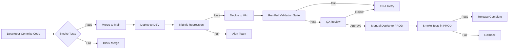

# GxP Testing & Test Automation Guide - Part 4

## GitHub Actions CI/CD for GxP Validation

**Part 4 of 6: Automated Testing Pipeline with Approval Gates**

---

## Table of Contents

- [1. CI/CD for GxP - Overview](#1-cicd-for-gxp---overview)
- [2. GitHub Actions Fundamentals](#2-github-actions-fundamentals)
- [3. Smoke Test Workflow](#3-smoke-test-workflow)
- [4. Nightly Regression Workflow](#4-nightly-regression-workflow)
- [5. Release Validation Workflow](#5-release-validation-workflow)
- [6. Approval Gates for Production](#6-approval-gates-for-production)
- [7. Artifact Management & Evidence](#7-artifact-management--evidence)
- [8. Interview Q&A - CI/CD](#8-interview-qa---cicd)

---

## 1. CI/CD for GxP - Overview

### Interview Question: "How do you implement CI/CD for a validated system?"

**Answer:**
"CI/CD for GxP systems requires **controlled automation with validation checkpoints**. Unlike regular software, we can't just push to production automatically. Here's the approach:

**CONTINUOUS INTEGRATION (CI):**
- ✅ **Smoke tests** on every commit (5-10 min)
- ✅ **Regression tests** nightly (1-2 hours)
- ✅ **Security scans** on every PR
- ✅ **Code quality checks** automated

**CONTINUOUS DELIVERY (CD) - NOT Deployment:**
- ✅ Automated **build and packaging**
- ✅ Automated **deployment to DEV/VAL**
- ⚠️ **MANUAL approval** for PROD deployment
- ✅ Automated **test execution in VAL**
- ⚠️ **QA review** before production release

**Key Point for Interviews:**
'We automate testing and validation, but maintain human oversight for production changes. This satisfies both speed (DevOps) and compliance (GxP).'"

### CI/CD Pipeline Architecture



---

## 2. GitHub Actions Fundamentals

### Basic Workflow Structure

```yaml
# .github/workflows/smoke-tests.yml
name: Smoke Tests

# When to run
on:
  push:
    branches: [ main, develop ]
  pull_request:
    branches: [ main ]

# What to run
jobs:
  smoke-test:
    runs-on: ubuntu-latest
    
    steps:
      - name: Checkout code
        uses: actions/checkout@v3
      
      - name: Setup Python
        uses: actions/setup-python@v4
        with:
          python-version: '3.11'
      
      - name: Install dependencies
        run: |
          pip install -r requirements.txt
      
      - name: Run smoke tests
        run: |
          pytest tests/ -m smoke --html=report.html
      
      - name: Upload report
        if: always()
        uses: actions/upload-artifact@v3
        with:
          name: test-report
          path: report.html
```

### Interview Key Concepts:

**1. Triggers:**
- `on: push` - Run on every commit
- `on: pull_request` - Run on PR creation
- `on: schedule` - Run on schedule (cron)
- `on: workflow_dispatch` - Manual trigger

**2. Runners:**
- `ubuntu-latest` - Linux runner (most common)
- `windows-latest` - Windows runner
- `macos-latest` - Mac runner
- Self-hosted runners for internal networks

**3. Jobs:**
- Can run in parallel
- Can depend on each other
- Can run on different runners

---

## 3. Smoke Test Workflow

### Interview Scenario: "Walk me through your smoke test workflow"

```yaml
# .github/workflows/smoke-tests.yml
name: Smoke Tests on Commit

on:
  push:
    branches: [ develop, main ]
  pull_request:
    branches: [ develop, main ]

env:
  TEST_ENV: val  # Validation environment
  PYTHON_VERSION: '3.11'

jobs:
  smoke-test:
    runs-on: ubuntu-latest
    timeout-minutes: 15  # Kill if takes longer
    
    steps:
      - name: Checkout code
        uses: actions/checkout@v3
      
      - name: Setup Python ${{ env.PYTHON_VERSION }}
        uses: actions/setup-python@v4
        with:
          python-version: ${{ env.PYTHON_VERSION }}
          cache: 'pip'  # Cache dependencies for speed
      
      - name: Install Chrome
        uses: browser-actions/setup-chrome@latest
      
      - name: Install dependencies
        run: |
          pip install -r requirements.txt
          playwright install chromium
      
      - name: Run smoke tests
        env:
          DB_PASSWORD: ${{ secrets.VAL_DB_PASSWORD }}
          API_KEY: ${{ secrets.VAL_API_KEY }}
        run: |
          pytest tests/ -m smoke \
            --html=reports/smoke-report.html \
            --self-contained-html \
            -v
      
      - name: Upload test report
        if: always()  # Upload even if tests fail
        uses: actions/upload-artifact@v3
        with:
          name: smoke-test-report
          path: reports/
      
      - name: Upload screenshots on failure
        if: failure()
        uses: actions/upload-artifact@v3
        with:
          name: failure-screenshots
          path: reports/screenshots/
      
      - name: Notify on failure
        if: failure()
        uses: 8398a7/action-slack@v3
        with:
          status: ${{ job.status }}
          text: 'Smoke tests failed! Check artifacts.'
          webhook_url: ${{ secrets.SLACK_WEBHOOK }}

  # Block PR merge if smoke tests fail
  check-smoke-results:
    needs: smoke-test
    runs-on: ubuntu-latest
    steps:
      - name: Check smoke test status
        if: needs.smoke-test.result != 'success'
        run: |
          echo "Smoke tests failed. Cannot merge."
          exit 1
```

**Interview Talking Points:**
- **Fast feedback**: Results in 5-10 minutes
- **Blocks bad code**: PR can't merge if smoke tests fail
- **Evidence collected**: Reports and screenshots uploaded
- **Team notified**: Slack notification on failure
- **Secrets managed**: Passwords not in code

---

## 4. Nightly Regression Workflow

### Interview Question: "How do you run comprehensive regression tests?"

```yaml
# .github/workflows/nightly-regression.yml
name: Nightly Regression Suite

on:
  schedule:
    # Run at 2 AM UTC every night
    - cron: '0 2 * * *'
  workflow_dispatch:  # Allow manual trigger

env:
  TEST_ENV: val

jobs:
  regression-test:
    runs-on: ubuntu-latest
    timeout-minutes: 120  # 2 hours max
    
    strategy:
      matrix:
        browser: [chromium, firefox]  # Test multiple browsers
        python-version: ['3.10', '3.11']
    
    steps:
      - uses: actions/checkout@v3
      
      - name: Setup Python ${{ matrix.python-version }}
        uses: actions/setup-python@v4
        with:
          python-version: ${{ matrix.python-version }}
      
      - name: Install dependencies
        run: |
          pip install -r requirements.txt
          playwright install ${{ matrix.browser }}
      
      - name: Setup test database
        run: |
          python scripts/setup_test_data.py
      
      - name: Run regression tests
        env:
          DB_PASSWORD: ${{ secrets.VAL_DB_PASSWORD }}
          BROWSER: ${{ matrix.browser }}
        run: |
          pytest tests/ -m regression \
            --browser=${{ matrix.browser }} \
            --html=reports/regression-${{ matrix.browser }}-py${{ matrix.python-version }}.html \
            --junit-xml=reports/junit-${{ matrix.browser }}-py${{ matrix.python-version }}.xml \
            -n auto \
            --reruns 2  # Retry flaky tests
      
      - name: Generate traceability matrix
        if: always()
        run: |
          python utils/traceability_matrix.py \
            --test-results reports/junit*.xml \
            --output reports/traceability-matrix.xlsx
      
      - name: Upload artifacts
        if: always()
        uses: actions/upload-artifact@v3
        with:
          name: regression-results-${{ matrix.browser }}-py${{ matrix.python-version }}
          path: |
            reports/
            screenshots/
      
      - name: Publish test results
        if: always()
        uses: EnricoMi/publish-unit-test-result-action@v2
        with:
          files: reports/junit*.xml
      
      - name: Comment on PR if triggered by PR
        if: github.event_name == 'pull_request'
        uses: actions/github-script@v6
        with:
          script: |
            const fs = require('fs');
            const report = fs.readFileSync('reports/summary.txt', 'utf8');
            github.rest.issues.createComment({
              issue_number: context.issue.number,
              owner: context.repo.owner,
              repo: context.repo.repo,
              body: `## Regression Test Results\n\n${report}`
            });
      
      - name: Send email report
        if: failure()
        uses: dawidd6/action-send-mail@v3
        with:
          server_address: smtp.pharma.com
          server_port: 587
          username: ${{ secrets.SMTP_USERNAME }}
          password: ${{ secrets.SMTP_PASSWORD }}
          to: qa-team@pharma.com
          from: github-actions@pharma.com
          subject: 'FAILED: Nightly Regression Tests'
          body: |
            Nightly regression tests failed.
            Browser: ${{ matrix.browser }}
            Python: ${{ matrix.python-version }}
            View results: ${{ github.server_url }}/${{ github.repository }}/actions/runs/${{ github.run_id }}
          attachments: reports/regression-*.html
```

**Interview Points:**
- **Matrix strategy**: Test multiple browser/Python combinations
- **Scheduled**: Runs nightly automatically
- **Parallel execution**: `-n auto` for speed
- **Retry flaky tests**: `--reruns 2`
- **Traceability**: Generate requirements matrix
- **Email alerts**: QA team notified of failures

---

## 5. Release Validation Workflow

### Interview Question: "How do you validate a release candidate?"

```yaml
# .github/workflows/release-validation.yml
name: Release Candidate Validation

on:
  push:
    tags:
      - 'v*.*.*'  # Trigger on version tags (v1.2.3)

env:
  TEST_ENV: val

jobs:
  validate-release:
    runs-on: ubuntu-latest
    
    steps:
      - uses: actions/checkout@v3
      
      - name: Extract version
        id: version
        run: echo "VERSION=${GITHUB_REF#refs/tags/}" >> $GITHUB_OUTPUT
      
      - name: Setup Python
        uses: actions/setup-python@v4
        with:
          python-version: '3.11'
      
      - name: Install dependencies
        run: |
          pip install -r requirements.txt
          playwright install
      
      - name: Run full validation suite
        run: |
          pytest tests/ -m "critical or high" \
            --html=reports/validation-report-${{ steps.version.outputs.VERSION }}.html \
            --junit-xml=reports/validation-results.xml
      
      - name: Generate validation documentation
        run: |
          python scripts/generate_validation_package.py \
            --version ${{ steps.version.outputs.VERSION }} \
            --test-results reports/validation-results.xml \
            --output validation-package-${{ steps.version.outputs.VERSION }}.zip
      
      - name: Upload validation package
        uses: actions/upload-artifact@v3
        with:
          name: validation-package-${{ steps.version.outputs.VERSION }}
          path: validation-package-${{ steps.version.outputs.VERSION }}.zip
      
      - name: Create GitHub Release
        if: success()
        uses: softprops/action-gh-release@v1
        with:
          files: validation-package-${{ steps.version.outputs.VERSION }}.zip
          body: |
            ## Validation Status: PASSED ✅
            
            All critical and high priority tests passed.
            
            **Next Steps:**
            1. QA Manager review validation package
            2. Approve for production deployment
            3. Schedule deployment window
          draft: true  # Create as draft for QA review
      
      - name: Request QA approval
        uses: trstringer/manual-approval@v1
        with:
          secret: ${{ secrets.GITHUB_TOKEN }}
          approvers: qa-manager,qa-lead
          minimum-approvals: 1
          issue-title: "QA Approval Required: Release ${{ steps.version.outputs.VERSION }}"
          issue-body: |
            Please review validation package and approve for production release.
            
            Validation Results: [View Artifacts](${{ github.server_url }}/${{ github.repository }}/actions/runs/${{ github.run_id }})

  deploy-to-production:
    needs: validate-release
    runs-on: ubuntu-latest
    environment: production  # Requires environment approval
    
    steps:
      - name: Download validation package
        uses: actions/download-artifact@v3
      
      - name: Deploy to production
        run: |
          echo "Deploying to production..."
          # Actual deployment steps
      
      - name: Run production smoke tests
        run: |
          pytest tests/ -m smoke --env=prod
      
      - name: Notify deployment success
        uses: 8398a7/action-slack@v3
        with:
          status: custom
          custom_payload: |
            {
              "text": "🎉 Production Deployment Successful!",
              "blocks": [
                {
                  "type": "section",
                  "text": {
                    "type": "mrkdwn",
                    "text": "*Version:* ${{ steps.version.outputs.VERSION }}\n*Status:* Deployed and Verified"
                  }
                }
              ]
            }
          webhook_url: ${{ secrets.SLACK_WEBHOOK }}
```

**Interview Explanation:**
- **Tag-triggered**: Starts when version tag pushed
- **Full validation**: All critical tests run
- **Documentation**: Generates validation package
- **Manual approval**: QA must approve before prod
- **Environment protection**: GitHub environment with approvers
- **Verification**: Smoke tests in prod after deployment

---

## 6. Approval Gates for Production

### Interview Question: "How do you implement approval gates?"

```yaml
# Using GitHub Environments with protection rules

# Setup (done once in GitHub UI):
# 1. Create "production" environment
# 2. Add required reviewers (QA Manager)
# 3. Set wait timer (e.g., 15 minutes)

# In workflow:
jobs:
  deploy-to-prod:
    environment: production  # This triggers approval
    steps:
      - name: Deploy
        run: echo "Deploying..."
```

**Interview Answer:**
"We use GitHub's Environment Protection Rules:

1. **Required Reviewers**: QA Manager must approve
2. **Wait Timer**: Prevents immediate deployment
3. **Approval Issue**: Creates GitHub issue for review
4. **Audit Trail**: All approvals logged in GitHub

This satisfies 21 CFR Part 11 requirement for electronic signatures on production changes."

### Alternative: Manual Approval Action

```yaml
- name: Wait for QA approval
  uses: trstringer/manual-approval@v1
  with:
    secret: ${{ secrets.GITHUB_TOKEN }}
    approvers: qa-manager
    minimum-approvals: 1
    issue-title: "Production Deployment Approval Required"
    issue-body: |
      **Validation Package:** [Download](${{ github.server_url }})
      **Test Results:** See attached reports
      **Checklist:**
      - [ ] All tests passed
      - [ ] Traceability matrix reviewed
      - [ ] Change control approved
      - [ ] Deployment plan reviewed
```

---

## 7. Artifact Management & Evidence

### Interview Question: "How do you manage test evidence in CI/CD?"

```yaml
jobs:
  test-with-evidence:
    runs-on: ubuntu-latest
    
    steps:
      - name: Run tests
        run: pytest tests/
      
      - name: Collect evidence
        if: always()
        run: |
          # Create evidence package
          mkdir evidence-package
          cp -r reports/ evidence-package/
          cp -r screenshots/ evidence-package/
          cp -r videos/ evidence-package/
          cp requirements-traceability.xlsx evidence-package/
          
          # Add metadata
          cat > evidence-package/metadata.json <<EOF
          {
            "run_id": "${{ github.run_id }}",
            "commit": "${{ github.sha }}",
            "branch": "${{ github.ref_name }}",
            "triggered_by": "${{ github.actor }}",
            "timestamp": "$(date -u +%Y-%m-%dT%H:%M:%SZ)",
            "environment": "${{ env.TEST_ENV }}"
          }
          EOF
          
          # Zip everything
          zip -r evidence-package-${{ github.run_id }}.zip evidence-package/
      
      - name: Upload to artifact storage
        uses: actions/upload-artifact@v3
        with:
          name: evidence-package-${{ github.run_id }}
          path: evidence-package-${{ github.run_id }}.zip
          retention-days: 2555  # 7 years (GxP retention)
      
      - name: Upload to document management system
        run: |
          # Upload to internal DMS
          curl -X POST https://dms.pharma.com/api/upload \
            -H "Authorization: Bearer ${{ secrets.DMS_TOKEN }}" \
            -F "file=@evidence-package-${{ github.run_id }}.zip" \
            -F "document_type=TEST_EVIDENCE" \
            -F "project=LIMS_VALIDATION" \
            -F "retention_period=7_YEARS"
```

**Interview Points:**
- **Complete package**: Reports, screenshots, videos, traceability
- **Metadata**: Run info, commit, timestamp
- **Long retention**: 7 years for GxP
- **DMS integration**: Automatic upload to document system
- **Audit trail**: Who triggered, what was tested

---

## 8. Interview Q&A - CI/CD

### Q1: "What's your branching strategy for validated systems?"

**Answer:**
```
main (production) ← Protected, requires approval
  ↑
develop (integration) ← All features merge here
  ↑
feature/* (development) ← Individual features

Workflow:
1. Feature branch → develop (after smoke tests)
2. develop → val (nightly, after regression)
3. val → main (after full validation + QA approval)

Protection Rules:
- main: Requires QA approval, status checks
- develop: Requires passing smoke tests
- feature: No protection (developer freedom)
```

### Q2: "How do you handle secrets (passwords, API keys)?"

**Answer:**
"GitHub Secrets with environment separation:

```yaml
# In workflow
env:
  DB_PASSWORD: ${{ secrets.VAL_DB_PASSWORD }}  # Validation
  # vs
  DB_PASSWORD: ${{ secrets.PROD_DB_PASSWORD }}  # Production

# Separate secrets for each environment
# Never log secrets
# Rotate regularly
# Use service accounts (not personal accounts)
```

Interview Tip: Mention you understand difference between:
- Repository secrets (all environments)
- Environment secrets (production only)
- Organization secrets (shared across repos)"

### Q3: "How do you prevent deployments during change freezes?"

```yaml
jobs:
  check-freeze:
    runs-on: ubuntu-latest
    steps:
      - name: Check if in change freeze
        run: |
          FREEZE_START="2024-12-20"
          FREEZE_END="2025-01-05"
          TODAY=$(date +%Y-%m-%d)
          
          if [[ "$TODAY" > "$FREEZE_START" && "$TODAY" < "$FREEZE_END" ]]; then
            echo "❌ Change freeze period. No deployments allowed."
            exit 1
          fi
      
      - name: Check change control
        run: |
          # Verify change control ticket exists and approved
          python scripts/verify_change_control.py \
            --ticket ${{ github.event.head_commit.message }}
```

### Q4: "What metrics do you track from CI/CD?"

**Answer:**
```
Key Metrics:
1. Test Pass Rate: Should be >95%
2. Flaky Test Rate: <5%
3. Test Execution Time: Smoke <10min, Regression <2hrs
4. Deployment Frequency: Track for trends
5. Mean Time to Recovery: How fast to fix broken tests
6. Code Coverage: >80% for GxP critical code

Dashboard Example:
- Total Tests: 1,247
- Passing: 1,235 (99.0%)
- Failing: 10 (0.8%)
- Flaky: 2 (0.2%)
- Avg Run Time: 87 minutes
- Trend: ↗️ +15 tests this week
```

### Q5: "How do you handle database changes in CI/CD?"

```yaml
- name: Run database migrations
  run: |
    # Apply migrations
    python manage.py migrate
    
    # Verify migration success
    python manage.py check_migrations
    
    # Test with migrated schema
    pytest tests/

- name: Rollback on failure
  if: failure()
  run: |
    python manage.py migrate <previous_version>
```

---

## Quick Reference - GitHub Actions

### Common Workflow Triggers
```yaml
on:
  push:                    # On every commit
  pull_request:            # On PR
  schedule:                # Cron schedule
    - cron: '0 2 * * *'   # 2 AM daily
  workflow_dispatch:       # Manual trigger
  release:                 # On release creation
```

### Matrix Testing
```yaml
strategy:
  matrix:
    browser: [chrome, firefox]
    python: ['3.10', '3.11']
    # Runs 4 jobs: chrome+3.10, chrome+3.11, firefox+3.10, firefox+3.11
```

### Conditional Steps
```yaml
- name: Run only on main
  if: github.ref == 'refs/heads/main'

- name: Run only on failure
  if: failure()

- name: Run always (even if previous failed)
  if: always()
```

### Secrets Usage
```yaml
env:
  DB_PASS: ${{ secrets.DATABASE_PASSWORD }}
  API_KEY: ${{ secrets.API_KEY }}
```

---

**END OF PART 4 - GITHUB ACTIONS CI/CD**

**Interview Key Takeaways:**
- ✅ Automate testing, but keep manual approval for production
- ✅ Use environment protection rules for approval gates
- ✅ Collect and store complete evidence packages
- ✅ Separate secrets by environment
- ✅ Track metrics: pass rate, flaky tests, execution time
- ✅ Implement change freeze checks
- ✅ Use matrix testing for multiple browsers/versions
- ✅ Always upload artifacts on failure

---

Ready for Part 5: Reporting & QA Electronic Signatures
