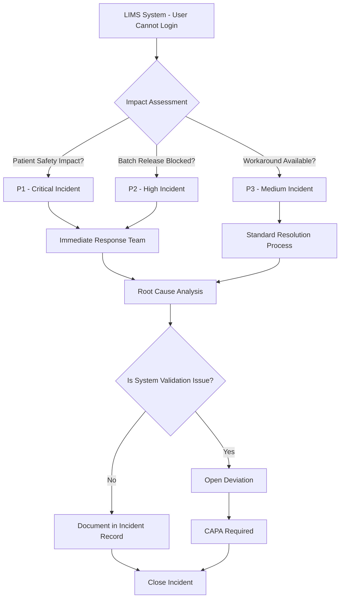
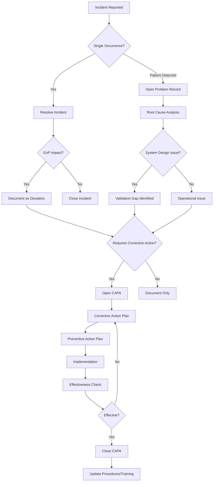
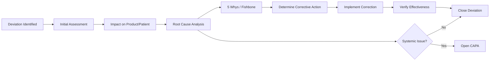
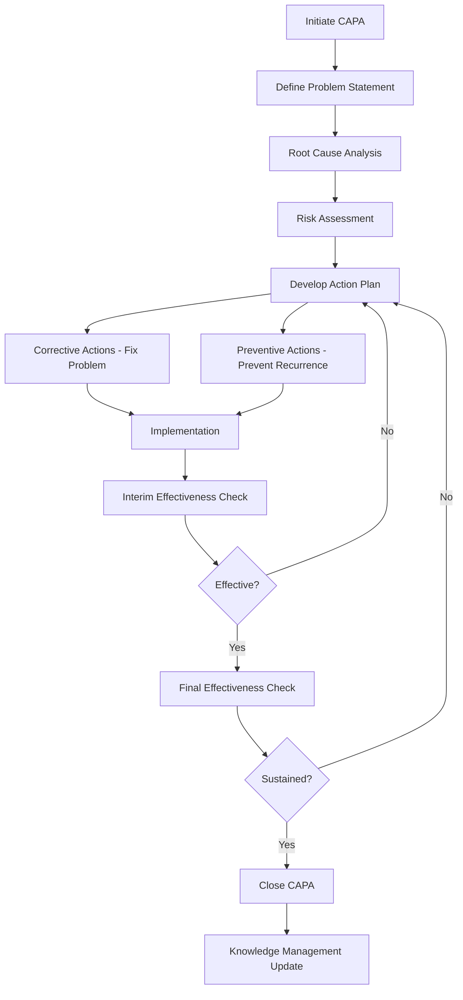

# Quality Architect Level
# Computer System Validation & IT Quality Assurance
# Interview Preparation Guide

**Comprehensive Scenario-Based Preparation**  
**Pharmaceutical & Life Sciences Industry Focus**  
**100+ Pages of Technical Deep Dives, Leadership Scenarios, and Strategic Frameworks**

---

## Table of Contents

- [Executive Summary](#executive-summary)
- [Part 1: Technical Foundation & Regulatory Framework](#part-1-technical-foundation--regulatory-framework)
  - [1.1 Regulatory Framework Mastery](#11-regulatory-framework-mastery)
  - [1.2 Validation Lifecycle & Methodologies](#12-validation-lifecycle--methodologies)
- [Part 2: Technical Scenario Deep Dives](#part-2-technical-scenario-deep-dives)
  - [2.1 Cloud & SaaS Validation Scenarios](#21-cloud--saas-validation-scenarios)
  - [2.2 Data Integrity & Audit Trail Scenarios](#22-data-integrity--audit-trail-scenarios)
  - [2.3 DevOps & Continuous Validation](#23-devops--continuous-validation)
- [Part 3: Leadership & Strategic Scenarios](#part-3-leadership--strategic-scenarios)
  - [3.1 Program Design & Transformation](#31-program-design--transformation)
  - [3.2 Stakeholder Management & Conflict Resolution](#32-stakeholder-management--conflict-resolution)
- [Part 4: Behavioral & Situational Scenarios](#part-4-behavioral--situational-scenarios)
- [Part 5: Questions to Ask Interviewers](#part-5-questions-to-ask-interviewers)
- [Part 6: Your Portfolio - Highlighting BMS Experience](#part-6-your-portfolio---highlighting-bms-experience)
- [Part 7: Industry Trends & Future of CSV](#part-7-industry-trends--future-of-csv)
- [Appendices](#appendices)

---

## Executive Summary

This comprehensive guide prepares you for Quality Architect level interviews in Computer System Validation and IT Quality Assurance roles within the pharmaceutical and life sciences industry. It combines technical depth with strategic leadership scenarios based on real-world challenges.

### What Makes This Guide Different

- **Scenario-Based Learning**: Over 50 detailed scenarios with model answers demonstrating strategic thinking
- **Modern Technology Focus**: Covers AI/ML validation, cloud systems, DevOps integration, and emerging technologies
- **Architect-Level Perspective**: Emphasizes program design, organizational influence, and strategic vision beyond tactical execution
- **Industry-Specific Context**: Tailored for pharmaceutical validation with GxP, 21 CFR Part 11, GAMP 5, and EU Annex 11
- **Real-World Application**: Based on actual challenges from enterprise validation programs

### How to Use This Guide

1. **Read Foundation Sections First**: Start with Part 1 to establish technical baseline and regulatory framework understanding
2. **Practice Scenario-Based Questions**: Work through Parts 2-4, writing out your answers before reviewing the model responses
3. **Customize Your Examples**: Adapt scenarios to your own experience, particularly highlighting automation work, AI implementations, and process improvements
4. **Focus on Strategic Thinking**: For each scenario, think about business impact, risk management, and organizational change
5. **Prepare Questions**: Use Part 5 to develop insightful questions that demonstrate your strategic perspective

### Your Unique Value Proposition

As someone with expertise in both traditional CSV and modern development practices, you bring a rare combination that pharmaceutical companies urgently need as they undergo digital transformation:

- **Technical Depth**: You build production systems (GxPert AI agent, document automation, ServiceNow integrations) not just validate them
- **Modern Stack Expertise**: TypeScript, Python, React, FastAPI, Azure, AWS—you speak the language of modern development teams
- **Automation Vision**: Building workflow automation platforms and AI-powered tools demonstrates forward thinking
- **Regulatory Rigor**: Deep understanding of 21 CFR Part 11, GAMP 5, GxP requirements ensures compliant innovation
- **Bridge Builder**: Can translate between Quality, IT, and business stakeholders effectively

*This guide will help you articulate this value proposition through concrete examples and strategic frameworks.*

---

## Part 1: Technical Foundation & Regulatory Framework

*This section establishes the technical baseline expected of a Quality Architect. While you should demonstrate mastery of these fundamentals, the interview will focus more heavily on how you apply them strategically.*

### 1.0 ITSM, ITOM, and Enterprise Architecture Fundamentals

Before diving into validation specifics, Quality Architects must understand IT Service Management (ITSM) and IT Operations Management (ITOM) frameworks that underpin modern pharmaceutical IT operations.

#### IT Service Management (ITSM) - ITIL Framework

**ITSM Core Principles:**

ITSM is the implementation and management of quality IT services that meet business needs. The ITIL (Information Technology Infrastructure Library) framework is the global standard.

**Key ITSM Processes and GxP Implications:**

**1. Incident Management**

**Definition**: Restore normal service operation as quickly as possible with minimal business impact.

**Incident Lifecycle:**
```
Detection → Logging → Categorization → Prioritization → 
Investigation → Resolution → Closure
```

**GxP Context**:
- **Priority 1 (Critical)**: System down, patient safety impact, batch release blocked
- **Priority 2 (High)**: Major functionality unavailable, audit trail issues
- **Priority 3 (Medium)**: Workaround available, performance degradation
- **Priority 4 (Low)**: Minor issue, cosmetic, documentation

**Validation Linkage**: 
- Incident response must be documented and traceable
- Root cause analysis required for P1/P2 incidents
- Incidents may trigger change control or deviation processes
- Pattern of incidents indicates system validation gaps

**Example GxP Incident Flow:**


**2. Problem Management**

**Definition**: Identify and manage the root cause of incidents to prevent recurrence.

**Key Distinction:**
- **Incident**: Single event affecting service (symptom)
- **Problem**: Underlying cause of one or more incidents (root cause)

**Example Progression:**
```
Incident 1: User A cannot access LIMS (Monday)
Incident 2: User B cannot access LIMS (Tuesday)  
Incident 3: User C cannot access LIMS (Wednesday)
↓
Problem: Active Directory authentication service misconfigured
↓
Root Cause: Configuration change during weekend maintenance
↓
Permanent Fix: Update change control process, enhance testing
```

**Problem Management in GxP:**

| Stage | GxP Requirement |
|-------|-----------------|
| **Problem Identification** | Pattern analysis of incidents, proactive monitoring |
| **Problem Investigation** | Root cause analysis with documented evidence |
| **Workaround** | Temporary solution documented in deviation if needed |
| **Known Error Database** | Maintain searchable database of known issues |
| **Problem Resolution** | Permanent fix via change control process |
| **Problem Closure** | Effectiveness check confirms issue resolved |

**3. Change Management**

**Definition**: Controlled approach to all changes in IT environment to minimize risk and disruption.

**Change Categories in GxP:**

| Change Type | Approval Level | Timeline | Validation |
|-------------|---------------|----------|------------|
| **Emergency** | Post-implementation review | Immediate | Retrospective validation |
| **Standard** | Pre-approved for specific scenarios | 1-3 days | Pre-validated procedure |
| **Normal** | CAB (Change Advisory Board) | 1-4 weeks | Risk-based validation |
| **Major** | Executive approval | 2-12 weeks | Full validation protocol |

**Complete Incident → Problem → Deviation → CAPA Linkage:**



**Detailed Definitions:**

**INCIDENT**
- **Definition**: Unplanned interruption or reduction in quality of IT service
- **Scope**: Single event
- **Focus**: Restore service quickly
- **Owner**: IT Service Desk / Operations
- **Examples**: User cannot log into LIMS, Report not generating, System slow performance

**PROBLEM**
- **Definition**: Underlying cause of one or more incidents
- **Scope**: Root cause affecting multiple instances
- **Focus**: Prevent recurrence
- **Owner**: IT Problem Management / Engineering
- **Examples**: Authentication service misconfiguration, Memory leak in application, Network congestion

**DEVIATION**
- **Definition**: Departure from approved instructions or established standards
- **Scope**: GxP impact assessment
- **Focus**: Document impact, justify, prevent recurrence
- **Owner**: Quality Assurance
- **Examples**: System unavailable during batch release, Audit trail not capturing data, Data integrity issue

**CAPA (Corrective Action / Preventive Action)**
- **Definition**: Systematic approach to eliminate root causes of problems
- **Scope**: Enterprise-wide improvement
- **Focus**: Fix root cause and prevent occurrence elsewhere
- **Owner**: Quality / Cross-functional team
- **Examples**: Update validation procedures, Implement enhanced change control, Retrain administrators, Redesign architecture

**Practical Example - Complete Chain:**

**Scenario**: Multiple users report inability to access electronic batch records (EBR) system on Monday morning.

```
INCIDENT #1 (Monday 8:00 AM):
- User A cannot access EBR system
- Priority: P1 (Critical - Batch release blocked)
- Action: IT investigates, finds network timeout
- Resolution: Restart application server (30 minutes)

INCIDENT #2 (Monday 9:15 AM):
- User B cannot access EBR system
- Same symptoms, restart server again (15 minutes)

INCIDENT #3 (Tuesday 8:00 AM):
- Multiple users cannot access EBR
- Pattern recognized → Escalate to Problem Management

PROBLEM #PR-2024-089:
- Investigation: Root cause = Application server memory leak
- Memory fills overnight, crashes at 8 AM
- Workaround: Restart server daily at 7 AM (temporary)

DEVIATION #DEV-2024-156:
- 3 batch releases delayed by 45 minutes total
- Impact: No patient safety issue (batches not released)
- Root Cause: Validation didn't include stress testing for overnight loads

CAPA #CAPA-2024-045:
- Corrective: Apply vendor patch, enhance testing, implement monitoring
- Preventive: Review all systems for gaps, update templates, implement APM
- Effectiveness Check: Zero incidents for 90 days
```

#### Deviation Management Deep Dive

**Deviation Classification:**

| Type | Definition | Example | Investigation |
|------|------------|---------|---------------|
| **Critical** | Patient safety or product quality impact | Contamination, incorrect dosage, stability failure | Full investigation, regulatory notification may be required |
| **Major** | Significant compliance issue, no immediate patient impact | Missing signatures, audit trail gaps, out-of-spec results | Full investigation, CAPA typically required |
| **Minor** | Documentation error, no quality impact | Typo in SOP, late training completion | Limited investigation, corrective action may not be needed |

**Deviation Investigation Process:**



**5 Whys Example:**

```
Problem: LIMS audit trail not capturing user modifications

Why 1: Why didn't audit trail capture modifications?
→ Audit logging was disabled for that module

Why 2: Why was audit logging disabled?
→ Performance issues during testing, logging was turned off

Why 3: Why wasn't logging re-enabled after testing?
→ No checklist item to verify audit trail status

Why 4: Why wasn't there a checklist item?
→ Validation protocol didn't include post-testing verification steps

Why 5: Why didn't validation protocol include verification steps?
→ Template was outdated and didn't reflect current best practices

Root Cause: Validation template gap
Corrective Action: Update template, re-validate module with logging enabled
Preventive Action: Review all validation templates, implement template change control
```

#### CAPA Management Deep Dive

**CAPA Lifecycle:**



**CAPA Action Types:**

**Corrective Actions (Fix the problem):**
- Apply software patch
- Retrain affected personnel
- Repair equipment
- Update procedures
- Implement additional controls

**Preventive Actions (Prevent elsewhere):**
- Review similar systems for same issue
- Enhance procedures across organization
- Improve training programs
- Strengthen change control
- Implement proactive monitoring

**CAPA Effectiveness Criteria:**

| Timeframe | Check Type | Success Criteria |
|-----------|------------|------------------|
| **30 days** | Interim Check | Actions implemented, no recurrence of original issue |
| **90 days** | Final Check | Sustained improvement, preventive actions verified effective |
| **6-12 months** | Long-term Review | Trend analysis shows improvement, no related deviations |

### 1.1 Regulatory Framework Mastery

#### 21 CFR Part 11 Electronic Records and Electronic Signatures

##### Core Requirements

- **Validation (§11.10(a))**: Systems must be validated to ensure accuracy, reliability, consistent intended performance, and ability to discern invalid or altered records
- **Audit Trail (§11.10(e))**: Must record date, time, operator for all record creation, modification, or deletion. Computer-generated timestamp that cannot be altered by users
- **System Access (§11.10(d))**: Limiting system access to authorized individuals through user authentication and role-based permissions
- **Operational Checks (§11.10(f))**: Authority checks, device checks, sequencing checks to ensure steps are performed in correct sequence
- **Electronic Signatures (§11.50-300)**: Unique user ID/password combinations, tied to individual, not reused or reassigned for two years, two-factor authentication for critical approvals
- **Record Retention (§11.10(c))**: Records must be readily retrievable throughout retention period, including audit trails and metadata

##### Modern Interpretation Challenges

The regulation was written in 1997, before cloud computing, SaaS, and AI/ML systems. Quality Architects must interpret requirements for modern architectures:

- **Cloud Systems**: How does §11.10(d) system access control apply when using OAuth/SAML? How do you demonstrate control over AWS/Azure infrastructure?
- **SaaS Platforms**: When vendor controls infrastructure, how do you satisfy §11.10(a) validation? What's acceptable level of access to vendor audit trails?
- **AI/ML Systems**: How do you validate a system that learns and changes over time? What constitutes an audit trail for model predictions?
- **Microservices Architecture**: When an electronic record spans multiple services, where is the system boundary for validation?

#### GAMP 5 Second Edition: Risk-Based Approach

##### Software Categories

| Category | Description | Validation Approach |
|----------|-------------|---------------------|
| Category 1 | Infrastructure Software (OS, databases, network) | Supplier assessment, no testing typically needed |
| Category 3 | Non-configured products (COTS, SaaS) | Supplier assessment + functional testing of GxP features |
| Category 4 | Configured products (Veeva, Salesforce, ServiceNow) | Supplier assessment + configuration testing + scripted testing of key workflows |
| Category 5 | Custom applications (bespoke code, scripts) | Full SDLC validation: requirements traceability, design review, code review, comprehensive testing |

##### Risk-Based Validation Approach

GAMP 5 emphasizes risk-based approach where validation effort is proportional to:

- **Impact**: Patient safety > Product quality > Data integrity > Business continuity
- **Probability**: Complexity, novelty, maturity of technology, supplier track record
- **Detectability**: Are errors caught before impacting patients/product?

**Example Risk Assessment Matrix:**

| System Function | Impact | Risk | Test Approach |
|-----------------|--------|------|---------------|
| Electronic batch records | High - direct patient impact | **Critical** | Full IQ/OQ/PQ, challenge scenarios |
| Training records | Medium - compliance | **Moderate** | IQ/OQ, smoke testing |
| Email notifications | Low - convenience | **Low** | Documented testing only |

#### EU Annex 11: Computerised Systems

While similar to 21 CFR Part 11, EU Annex 11 has distinct requirements:

- **Risk Management (Principle)**: Explicit requirement for risk management approach proportionate to patient safety, data integrity, and product quality
- **Supplier & Service Provider (Clause 3)**: More detailed requirements for supplier assessment and quality agreements. Must include right to audit suppliers
- **Validation (Clause 4)**: References GAMP guidelines explicitly. Requires documented validation approach
- **Data (Clause 7-8)**: Strong emphasis on data accuracy checks, backup/recovery, and archiving. Specific requirements for electronic signatures linked to audit trail
- **Incident Management (Clause 15)**: Requires procedures for handling system failures and deviations
- **Business Continuity (Clause 16)**: Explicit requirement for business continuity plans for critical systems

##### Key Differences from 21 CFR Part 11

| Aspect | 21 CFR Part 11 | EU Annex 11 |
|--------|----------------|-------------|
| Risk Management | Implied but not explicit | Explicitly required in Principle |
| Supplier Management | General requirement | Detailed requirements, must include audit rights |
| Data Integrity | Focus on audit trails | Broader emphasis on accuracy checks, backups |
| Business Continuity | Not explicitly required | Required for critical systems |

#### Data Integrity: ALCOA+ Principles

Data Integrity has become increasingly important focus for regulators. The ALCOA+ framework defines requirements for reliable data:

| Principle | Definition | System Implementation |
|-----------|------------|----------------------|
| **Attributable** | Who performed action and when | Unique user IDs, timestamped audit trail, cannot use shared accounts |
| **Legible** | Permanent, clear, indelible | Data cannot be overwritten, human-readable format, accessible for retention period |
| **Contemporaneous** | Recorded at time of activity | Automatic timestamps, no backdating allowed, system clock controls |
| **Original** | First recording, not copy | System of record defined, certified copies traceable to original, metadata preserved |
| **Accurate** | Free from errors, true | Validation, calculations verified, no manipulation possible |
| **Complete (+)** | All data captured | All raw data retained, no selective reporting, metadata included |
| **Consistent (+)** | Chronological sequence | Timestamps show sequence, no gaps in audit trail |
| **Enduring (+)** | Available for retention period | Backup procedures, archiving strategy, format migration plan |
| **Available (+)** | Readily retrievable | Search/filter capabilities, audit trail reviewable, can produce for inspections |

### 1.2 Validation Lifecycle & Methodologies

#### V-Model: Requirements Through Testing

The V-Model demonstrates the relationship between development phases and corresponding testing:

```
USER REQUIREMENTS SPECIFICATION (URS)
          ↓                                                ↑
FUNCTIONAL SPECIFICATION (FS)         USER ACCEPTANCE TESTING (UAT/PQ)
          ↓                                                ↑
DESIGN SPECIFICATION (DS)                OPERATIONAL QUALIFICATION (OQ)
          ↓                                                ↑
    DEVELOPMENT                                    INSTALLATION QUALIFICATION (IQ)
```

##### Document Relationships

- **URS → PQ**: Performance Qualification tests verify the system meets user requirements in production environment
- **FS → OQ**: Operational Qualification tests verify system functions work as specified
- **DS → IQ**: Installation Qualification verifies system is installed according to design specifications

##### Traceability Matrix

Critical element of CSV is maintaining traceability from requirements through testing:

| Req ID | User Requirement | Design Spec | Test Script |
|--------|------------------|-------------|-------------|
| URS-001 | System shall prevent unauthorized access | DS-SEC-001, DS-SEC-002 | OQ-SEC-001, OQ-SEC-002, PQ-SEC-001 |
| URS-002 | System shall maintain audit trail | DS-AUD-001 | OQ-AUD-001, PQ-AUD-001 |

#### IQ/OQ/PQ Testing Phases

##### Installation Qualification (IQ)

**Purpose**: Verify system is installed correctly according to vendor and internal specifications

**Typical IQ Tests:**
- Hardware/infrastructure verification (servers, network, storage)
- Software version verification
- Configuration documentation review
- Environmental controls (HVAC, power backup)
- Standard operating procedures in place
- Vendor documentation received

##### Operational Qualification (OQ)

**Purpose**: Verify all system functions operate as designed across full operating range

**Typical OQ Tests:**
- Functional testing of all features
- Security controls (authentication, authorization, password rules)
- Audit trail functionality (create, modify, delete actions captured)
- Calculations and algorithms
- Data backup and recovery
- Interface testing (system-to-system data transfer)
- Boundary testing (maximum/minimum values)
- Error handling

##### Performance Qualification (PQ)

**Purpose**: Demonstrate the system consistently performs as intended in actual production environment with real users and data

**Typical PQ Tests:**
- End-to-end business process scenarios
- User acceptance testing with actual users
- Performance testing (response time, concurrent users)
- Volume/stress testing
- Integration with other production systems
- Report generation and accuracy

#### SaaS Validation Approach

One of the most common interview questions at architect level: **How do you validate SaaS platforms?**

##### Key Principles

1. **Vendor Responsibility**: Vendor is responsible for infrastructure qualification, baseline functionality testing, performance monitoring
2. **Regulated Company Responsibility**: Supplier assessment, functional testing of GxP features, configuration qualification, integration testing
3. **Periodic Review**: Regular review of vendor audit reports, quality metrics, security assessments, disaster recovery tests

##### When Can IQ/OQ Be Modified for SaaS?

This is directly relevant to your BMS experience. The key is distinguishing what the vendor qualifies vs. what you must qualify:

**IQ Can Be Simplified When:**
- Vendor provides SOC 2 Type II reports covering infrastructure
- No on-premise installation required
- Vendor maintains hardware/infrastructure qualification
- ***Instead of IQ***: Perform supplier qualification and document reliance on vendor's infrastructure controls

**OQ Can Be Simplified When:**
- Using standard product without customization
- Vendor provides validation documentation/test evidence
- Product is GAMP Category 3 (non-configured)
- ***Modify OQ to***: Risk-based testing of GxP-critical features only, leverage vendor test scripts, focus on integration points

**PQ Always Required:**
- Must demonstrate system works in your environment with your users
- Test end-to-end business processes
- Verify integration with your other systems
- Cannot be outsourced to vendor

#### Test Environments and Validation Strategy

Another key question from your experience: **Can test environments satisfy validation requirements?**

##### Test Environment Strategy

**Yes, test environments can satisfy most validation requirements when:**

1. **Environment Parity**: Test environment mirrors production in configuration, data structure, integrations, and security controls
2. **Documented Equivalence**: Formal comparison showing test environment represents production
3. **Representative Data**: Test data represents production scenarios without being actual GxP data
4. **Controlled Changes**: Test environment under change control, synchronized with production

**What MUST be done in production:**
- Performance qualification (PQ) - must demonstrate system works with actual production load
- Integration testing with actual production systems
- Smoke testing post-deployment
- Initial production runs/parallel processing

**Example Documentation:**

*"The qualification testing for ServiceNow GRC Module was performed in the TEST instance, which has been documented as equivalent to PROD in Configuration Comparison Report CCR-2024-001. The TEST instance uses the same ServiceNow version (Vancouver), identical security roles and access controls, representative configuration items, and interfaces to the same Azure AD authentication as PROD. This approach is justified under GAMP 5 risk-based validation principles and documented in Validation Plan VP-GRC-2024-001. Performance qualification was executed in PROD environment post-deployment to verify system performance under actual load."*

---

## Part 2: Technical Scenario Deep Dives

*This section presents complex technical scenarios you may encounter in Quality Architect interviews. For each scenario, we provide the situation, key considerations, and a model answer demonstrating architect-level thinking.*

### 2.1 Cloud & SaaS Validation Scenarios

#### Scenario 1: Cloud Migration Strategy

**SCENARIO**: *Your pharmaceutical company is migrating 15 validated on-premise systems to AWS cloud over the next 18 months. As Quality Architect, you're asked to design the validation strategy. The systems include LIMS, QMS, document management, training, and manufacturing execution systems. Some will be lift-and-shift, others are being replaced with SaaS alternatives, and a few require re-architecting as cloud-native applications.*

##### Key Considerations

- Different validation approaches for different migration strategies
- AWS infrastructure qualification
- Shared responsibility model with AWS
- Data migration validation
- Maintaining GxP compliance during transition

##### Model Answer

**Strategic Approach:**

I would develop a tiered validation strategy based on the three migration patterns:

**1. Lift-and-Shift Systems**

For systems moving to AWS without functional changes, I'd implement an Infrastructure Change approach. The application validation remains valid; we validate only the infrastructure change and data migration.

- **AWS Infrastructure Qualification**: Leverage AWS's SOC 2 Type II, ISO 27001, and GxP compliance documentation. Create a supplier qualification dossier documenting our assessment of AWS as a critical supplier
- **Validation Testing**: Focus on installation qualification of cloud instance, network connectivity, disaster recovery, and performance testing under cloud architecture
- **Data Migration**: Execute and verify data migration with reconciliation testing, comparing pre and post-migration data integrity

**2. SaaS Replacements**

These require full validation as new systems following GAMP 5 Category 3 or 4 approach depending on configuration.

- **Supplier Assessment**: Conduct thorough supplier assessment including right to audit, data ownership, exit strategy
- **Risk-Based Testing**: Focus OQ testing on GxP-critical features, leverage vendor's test documentation for infrastructure
- **Legacy Data**: Implement data migration validation and consider long-term retention strategy for historical data

**3. Cloud-Native Re-architecture**

These are essentially new custom applications requiring GAMP Category 5 validation with modern DevOps integration.

- **Continuous Validation**: Implement automated testing in CI/CD pipeline, with validation approval gates before production
- **Microservices Validation**: Define system boundaries and validation scope for microservices architecture
- **API Validation**: Validate inter-service communication and API contracts

**AWS Shared Responsibility Framework:**

I would document our shared responsibility model clearly:

- **AWS Responsibility**: Physical infrastructure, hypervisor, network infrastructure, managed services qualification
- **Our Responsibility**: Application validation, configuration management, access controls, data encryption, backup/recovery, audit trails, business continuity

**Program-Level Elements:**

- **Validation Master Plan**: Create cloud-specific addendum to corporate VMP addressing cloud validation principles
- **Standard Templates**: Develop reusable templates for AWS infrastructure assessment, cloud IQ/OQ protocols
- **Training**: Train validation team on cloud concepts, AWS services, and updated validation approach
- **Change Control**: Update change control procedures to handle cloud auto-scaling, managed service updates

**Risk Mitigation:**

- Implement phased migration starting with lowest-risk systems to build cloud validation expertise
- Maintain parallel operations during transition with rollback capability
- Establish cloud governance framework with security, compliance, and cost controls

*This approach balances regulatory rigor with practical efficiency, recognizing that not all migrations require the same validation depth.*

---

#### Scenario 2: AI/ML System Validation

**SCENARIO**: *You've built an AI agent (similar to your GxPert) that provides GxP guidance to users by querying validated documents and regulations. The system uses Azure OpenAI with retrieval-augmented generation (RAG). During your validation planning meeting, the QA Director asks: "How do we validate a system that uses a model we can't inspect and that might give different answers to the same question?" Design your validation approach.*

*This scenario directly leverages your GxPert experience at BMS.*

##### Key Considerations

- Black box nature of LLM
- Non-deterministic outputs
- Knowledge base as critical component
- Risk of hallucinations or incorrect guidance
- Intended use and risk classification

##### Model Answer

**Risk-Based Classification:**

First, I would clearly define the system's intended use and risk classification:

- **Intended Use**: Decision support tool providing guidance and references to validated source documents. Not a decision-making system itself.
- **Risk Classification**: Medium risk - incorrect guidance could lead to compliance issues, but human review is required before actions
- **Not In Scope**: System does not autonomously make or execute decisions; does not directly create GxP records

**Validation Strategy - System Decomposition:**

Rather than trying to validate the LLM itself, I would decompose the system into validatable components:

**1. Knowledge Base (Highest Risk)**

- **Document Management**: Validate the process for ingesting, indexing, and version-controlling source documents
- **Document Traceability**: Ensure every response can be traced back to specific source document and section
- **Change Control**: Changes to knowledge base must be controlled; old versions archived
- **Test Approach**: Verify document retrieval accuracy, test that updates to knowledge base propagate correctly

**2. Retrieval System (RAG Component)**

- **Semantic Search**: Validate that relevant documents are retrieved for queries
- **Test Approach**: Create test scenarios with expected source documents. Measure retrieval precision and recall. Set acceptance criteria such as "correct primary document retrieved in top 3 results in 95% of test cases"

**3. Azure OpenAI API (Vendor Component)**

- **Supplier Assessment**: Treat Microsoft Azure OpenAI as critical supplier. Review their validation documentation, SOC 2, ISO certifications
- **Model Version Control**: Lock to specific model version (e.g., gpt-4-32k-2024-06-15). Any model update requires revalidation
- **Test Approach**: Verify API connectivity, authentication, rate limiting, error handling. NOT testing the LLM's training

**4. Application Logic & UI**

- **User Authentication**: Validate access controls integrated with Azure AD
- **Audit Trail**: Every query and response logged with user, timestamp, source documents cited
- **User Interface**: Validate that responses clearly indicate "AI-generated guidance" and display source document references
- **Error Handling**: When system cannot answer confidently, it must clearly state limitations

**Handling Non-Determinism:**

To address the concern about different answers to same question:

- **Define Acceptable Variation**: Responses may vary in phrasing but must be factually consistent and cite same primary sources
- **Validation Testing**: Run same test query multiple times (e.g., 10 iterations). Verify all responses cite correct source documents and contain accurate information
- **Temperature Parameter**: Set LLM temperature to 0 or very low value to minimize variability while maintaining natural language
- **Monitoring**: Implement ongoing monitoring of response quality with periodic review of audit trail

**Testing Approach:**

**1. Test Scenario Design**

Create 50-100 test questions spanning:
- Questions with clear answers in single source document
- Questions requiring synthesis across multiple documents
- Ambiguous questions where answer depends on context
- Questions about topics NOT in knowledge base (should return "cannot answer")
- Questions with outdated information (should cite current document)

**2. Acceptance Criteria**
- 95% of responses cite correct primary source document
- 90% of responses contain factually accurate information
- System refuses to answer out-of-scope questions in 100% of test cases
- Zero instances of harmful or inappropriate content

**3. Human Review**

Subject matter experts review test responses for technical accuracy and appropriate guidance

**Operational Controls:**

- **User Training**: Train users that this is guidance tool, not definitive source. Always verify critical information against source documents
- **Feedback Mechanism**: Users can flag incorrect or inappropriate responses
- **Periodic Review**: Monthly review of flagged responses and audit trail to identify patterns or knowledge gaps
- **Revalidation Trigger**: Any change to LLM version, knowledge base structure, or major updates to source documents requires revalidation

**Documentation:**

- Validation Plan clearly defines intended use, system boundaries, what is/isn't being validated
- Risk Assessment documents why we focus validation on knowledge base and retrieval rather than LLM itself
- Traceability Matrix from requirements through test results
- Validation Report including test results, deviation handling, and recommendation for production use

*This approach recognizes we cannot validate the LLM's "thinking" but we can validate the system's fitness for its intended purpose as a guidance tool with appropriate controls.*

---

### 2.2 Data Integrity & Audit Trail Scenarios

#### Scenario 3: Data Integrity Remediation

**SCENARIO**: *During a mock FDA inspection, the inspector identifies that your LIMS system allows users to delete sample test results without requiring justification or maintaining deleted records. The system has been in production for 5 years with hundreds of thousands of records. The inspector states this is a critical data integrity finding. You're asked to develop a remediation plan. What's your approach?*

##### Key Considerations

- System has been used for 5 years - data integrity may already be compromised
- Need to assess scope of potential data integrity issues
- Technical remediation required
- Retrospective validation considerations
- Communication with regulators and senior management

##### Model Answer

**Immediate Actions (Day 1-7):**

- **Issue Identification**: Document the specific data integrity gaps - deletion without justification, no audit trail of deletions, no retention of deleted data
- **Interim Control**: Immediately implement compensating control - issue SOP requiring written justification and management approval before any result deletion, maintain paper log
- **Scope Assessment**: Query database to identify deletion patterns - how many deletions occurred, by whom, for which studies/products
- **Deviation**: Open formal deviation documenting the data integrity gap and investigation plan
- **Communication**: Brief senior management and quality leadership on issue severity and plan

**Investigation Phase (Week 2-4):**

**Data Forensics:**
Work with database team to:
- Check if any deleted data is recoverable from database logs or backups
- Analyze deletion patterns - were deletions legitimate (duplicates) or potentially problematic (failed results)?
- Identify users who performed deletions most frequently
- Correlate deletions with product batches and determine if any released products might be affected

**User Interviews:**
Interview users who performed deletions to understand:
- What was their understanding of deletion capability?
- What business reason justified deletions?
- Were deletions discussed with supervisors?

**Impact Assessment:**
Determine:
- Which products/batches potentially affected
- Whether deletions impacted batch release decisions
- If any data manipulation appears intentional
- Patient safety implications

**Technical Remediation (Week 3-8):**

**System Enhancement Design:**
- Remove delete functionality completely, implement "invalidate" with required reason code
- Invalidated results retained with full audit trail - who, when, why
- Invalidated results excluded from reports but visible in audit trail
- Require supervisor approval for invalidation of results that passed specification
- Implement alerts for patterns of invalidations

**Change Control & Validation:**
- Formal change control for system enhancement
- Develop and execute test protocol verifying:
  - Delete function is removed/disabled
  - Invalidate function requires reason code and approval
  - Audit trail captures all required information
  - Invalidated records retained and visible to auditors
- Deploy to production with appropriate communication and training

**Procedural & Training Remediation (Week 6-10):**

- Update SOPs to clearly define when result invalidation is appropriate
- Provide comprehensive training on data integrity principles and new invalidation workflow
- Emphasize cultural shift - data integrity is everyone's responsibility
- Implement periodic data integrity reviews - QA sampling of invalidations

**Regulatory Strategy:**

- **Voluntary Disclosure**: Consider voluntary disclosure to FDA if investigation reveals impacted commercial batches
- **CAPA**: Document in formal CAPA with:
  - Root cause: system design allowed deletion without controls
  - Corrective action: system enhancement implemented
  - Preventive action: review all other systems for similar gaps
- **Inspection Readiness**: Prepare comprehensive package documenting issue discovery, investigation, remediation, and effectiveness check for future inspections

**Broader Program Improvements:**

- Conduct data integrity assessment across all GxP systems
- Update validation templates to include specific data integrity requirements
- Implement periodic data integrity audits as part of ongoing validation
- Enhance validation reviewer training on data integrity red flags

*This response demonstrates mature understanding of regulatory expectations, practical remediation steps, and strategic thinking about turning a compliance issue into program improvement.*

---

#### Scenario 4: Audit Trail Review Strategy

**SCENARIO**: *You have 12 GxP systems generating millions of audit trail entries monthly. Current practice is to generate audit trail reports quarterly but there's no systematic review. An internal audit flags this as a gap. Design an efficient, risk-based audit trail review program that's sustainable long-term.*

##### Model Answer

**Risk-Based System Tiering:**

First, I would categorize the 12 systems by data integrity risk:

| Tier | Frequency | Criteria | Example Systems |
|------|-----------|----------|-----------------|
| **Critical** | Monthly | Direct patient impact, batch release decisions, regulatory submissions | LIMS, Electronic batch records, stability systems |
| **High** | Quarterly | Product quality impact, compliance records, investigations | QMS, CAPA system, complaint handling, document management |
| **Moderate** | Annually | Supporting systems, indirect impact | Training system, supplier management, calibration system |

**Focused Review Approach:**

Rather than reviewing all audit trail entries, implement targeted reviews focusing on high-risk activities:

- **Administrative Changes**: User additions/deletions, role changes, configuration modifications
- **Record Modifications**: Changes to existing records especially after initial save
- **Deletions/Invalidations**: Any deletion or invalidation of records
- **Off-Hours Activity**: Activity outside normal business hours
- **Failed Access Attempts**: Multiple failed login attempts
- **Critical Approvals**: Batch release, deviation closures, specification changes

**Automated Exception Reporting:**

Implement automated scripts or reports that flag anomalies:

- Users with abnormally high activity levels
- Records modified by someone other than creator
- Same user creating and approving records (segregation of duties)
- Patterns of deletions or invalidations
- Access from unexpected locations or devices
- Dormant accounts that suddenly become active

**Sampling Strategy:**

For routine activities, use statistical sampling:

- Sample size based on volume and risk (e.g., square root of population)
- Stratified sampling ensuring all users and time periods represented
- Document sampling methodology in audit trail review procedure

**Review Documentation Template:**

Create standardized checklist for reviewers:

1. Period covered
2. System reviewed
3. Number of entries reviewed
4. Findings identified
5. Follow-up actions required
6. Reviewer signature and date

**Integration with Other Quality Processes:**

- **Self-Inspection**: Internal audits should review audit trail program effectiveness
- **Training**: Users must understand their actions are auditable and will be reviewed
- **Investigations**: Audit trail review should be part of deviation investigations
- **Annual Product Review**: Summary of audit trail findings included in APR

**Continuous Improvement:**

- Quarterly metrics on findings per system
- Trend analysis to identify problematic systems or users
- Annual review of procedure effectiveness and adjustment of risk tiers

---

### 2.3 DevOps & Continuous Validation

#### Scenario 5: DevOps Integration and Continuous Validation

**SCENARIO**: *Your IT department wants to implement a DevOps pipeline with CI/CD for a GAMP 5 Category 5 custom application (similar to your document generation system). They propose: automated builds on every commit, automated testing in the pipeline, and deployment to production multiple times per week. The traditional CSV team says this violates validation principles requiring formal IQ/OQ/PQ before any production deployment. How do you bridge these perspectives?*

##### Key Considerations

- Traditional validation assumes infrequent, major releases
- DevOps enables rapid, incremental changes
- Need to maintain regulatory compliance and traceability
- Automated testing can be more rigorous than manual testing
- Risk-based approach to validation effort

##### Model Answer

**Reframing the Discussion:**

I would start by aligning both teams on the core validation principles that must be maintained regardless of deployment methodology:

1. **Requirements Traceability**: Every change must trace back to a requirement or defect
2. **Testing Evidence**: All changes must be tested before production
3. **Review and Approval**: Appropriate personnel must review/approve changes
4. **Documentation**: Audit trail of what changed, who changed it, why, and test results
5. **Controlled Environment**: Production environment must be controlled and protected

DevOps can actually strengthen these principles through automation and consistency. The question isn't whether to allow DevOps, but how to implement it in a validated way.

**Continuous Validation Framework:**

**Phase 1: Initial System Validation**

The first production release follows traditional validation:

- Complete URS, FS, DS, test protocols
- IQ: Validate the CI/CD pipeline infrastructure itself
- OQ: Validate initial application functionality
- PQ: Validate end-to-end business processes
- Validation Report approving system for production use

**Phase 2: Validated Change Control via Pipeline**

Subsequent changes go through the validated CI/CD pipeline:

| Pipeline Stage | Validation Control | Documentation |
|----------------|-------------------|---------------|
| **Code Commit** | Linked to Jira ticket (requirement or defect). Code review required. Branch protection enforced. | Git provides audit trail: who, what, when, why |
| **Automated Build** | Build from validated source. No manual intervention. Build scripts under version control. | Build logs archived. Build number provides traceability. |
| **Automated Testing** | Unit tests, integration tests, regression tests execute automatically. Tests are version controlled and validated. | Test results archived with pass/fail status. Coverage reports generated. |
| **Quality Gate** | Pipeline pauses for QA approval. Risk assessment determines approval level needed (standard vs. expedited). | Electronic signature captured in change control system |
| **Deploy to Prod** | Automated deployment using validated scripts. Smoke tests run post-deployment. Rollback capability available. | Deployment log with timestamp. Change record updated automatically. |

**Risk-Based Change Classification:**

Not all changes require the same level of validation effort:

| Change Type | Examples | Validation Approach |
|-------------|----------|---------------------|
| **Critical** | New GxP feature, change to calculation logic, security controls | Full protocol with formal review. May require PQ testing. QA Director approval. |
| **Moderate** | Enhancement to existing feature, new report, workflow change | Automated tests + documented testing. QA reviewer approval. |
| **Low** | Bug fix, UI text change, performance improvement | Automated tests + code review. Expedited QA approval. |

**Pipeline Validation (IQ Equivalent):**

The CI/CD pipeline itself must be validated as infrastructure:

- Pipeline Configuration: Version controlled, reviewed, approved
- Access Controls: Only authorized personnel can modify pipeline or approve deployments
- Audit Trail: Complete logging of all pipeline executions
- Backup/Recovery: Pipeline configuration backed up and recoverable
- Test Evidence: Validate pipeline correctly blocks failed tests, enforces approvals

**Ongoing Validation Maintenance:**

- Periodic Review: Quarterly review of deployment logs, test results, quality metrics
- Test Maintenance: Regression test suite maintained and enhanced as application evolves
- Metrics Monitoring: Track test coverage, deployment frequency, defect rates, rollback frequency
- Annual Re-assessment: Annual review confirming validation state remains current

**Benefits to Highlight:**

- **Better Compliance**: Automated testing is more consistent and comprehensive than manual testing
- **Faster Defect Resolution**: Critical security patches can be deployed rapidly through validated pipeline
- **Better Traceability**: Complete electronic trail from requirement through production
- **Reduced Risk**: Smaller, incremental changes are less risky than large batch releases

*This approach maintains validation principles while enabling modern development practices. The key is treating the pipeline itself as validated infrastructure that enables controlled, traceable changes.*

---

## Part 3: Leadership & Strategic Scenarios

*Quality Architect roles require strong leadership and strategic thinking beyond technical expertise. This section focuses on organizational challenges, stakeholder management, and program-level decision making.*

### 3.1 Program Design & Transformation

#### Scenario 6: Building CSV Program from Scratch

**SCENARIO**: *You join a mid-size biotech that has grown rapidly but has no formal CSV program. They have 25 systems (mix of SaaS, custom apps, and spreadsheets) supporting clinical trials and early-stage manufacturing. FDA inspection expected in 12 months. Build a CSV program from the ground up.*

##### Model Answer

**Phase 1: Assessment & Foundation (Months 1-2)**

**System Inventory:**

- Conduct comprehensive system inventory across all departments
- Document: system name, purpose, vendor, users, GxP applicability, current validation status
- Identify critical gaps - systems in production without any validation

**Risk-Based Prioritization:**

| Priority | Criteria | Timeline | Example Systems |
|----------|----------|----------|-----------------|
| **P1 - Critical** | Patient safety, regulatory submission, batch release | Months 3-5 | CTMS, eTMF, LIMS |
| **P2 - High** | Data integrity, compliance records | Months 6-8 | QMS, Training, Document Management |
| **P3 - Moderate** | Supporting systems, indirect impact | Months 9-12 | Spreadsheets, utilities |

**Foundational Documents (Months 1-3):**

1. **Validation Master Plan**: Company validation philosophy, scope, responsibilities, lifecycle approach
2. **Standard Procedures**: Computer system validation, change control, deviation management, periodic review
3. **Templates**: Validation plan, URS, risk assessment, test protocol, validation report, periodic review
4. **Training Materials**: CSV fundamentals, GAMP 5, data integrity for system owners and users

**Phase 2: Quick Wins & Credibility (Months 3-5)**

Target P1 systems with streamlined approach to demonstrate value:

- **Pragmatic Documentation**: Combined validation documents where appropriate (e.g., single validation plan covering URS, risk assessment, testing strategy)
- **Leverage Vendor Documentation**: For SaaS platforms, leverage vendor validation documentation, focus testing on GxP-critical features
- **Retrospective Validation**: For systems already in production, document current state validation with focus on data integrity controls

**Phase 3: Scale & Sustainability (Months 6-12)**

- **Complete Remaining Systems**: Validate P2 and P3 systems following established templates
- **Periodic Review Program**: Implement annual system reviews to maintain validated state
- **Change Control Integration**: Ensure IT change control process includes validation assessment
- **Self-Inspection**: Conduct internal audit of CSV program effectiveness before FDA inspection

**Stakeholder Management:**

- **Executive Leadership**: Monthly updates on validation progress, risks, resource needs. Frame in terms of inspection readiness
- **IT Department**: Partner, not adversary. Involve in template development. Demonstrate how validation supports IT goals
- **System Owners**: Train on their validation responsibilities. Make process as painless as possible
- **Quality Leadership**: Position CSV as critical enabler of quality culture, not just compliance checkbox

**Resource Plan:**

- Year 1: Quality Architect (me) + 2 validation specialists + contract resources for peak validation activities
- Year 2+: Sustaining team of 2-3 FTEs as company grows
- Consider validation specialist embedded with IT for closer collaboration

**Success Metrics:**

- 100% of P1 systems validated by Month 5
- 100% of systems validated by Month 12
- Zero validation-related inspection observations
- Average validation cycle time <90 days
- Positive feedback from system owners on validation process

---

### 3.2 Stakeholder Management & Conflict Resolution

#### Scenario 7: IT vs QA Timeline Conflict

**SCENARIO**: *IT leadership wants to deploy a new clinical trial management system in 2 weeks to meet business commitments. Your validation team says minimum 3 months needed for proper validation. The CEO is pressuring both sides to "find a way." How do you handle this?*

##### Model Answer

**Immediate Response (Day 1):**

First, I would arrange a joint meeting with IT leadership, QA leadership, and key stakeholders to align on the facts and constraints.

**Understanding the Business Need:**

Before defending a timeline, I need to understand:
- What business driver creates the 2-week deadline?
- What are the consequences of delay (financial, competitive, contractual)?
- Is this truly a hard deadline or aspirational?
- What functionality is absolutely critical vs. nice-to-have?

**Risk-Based Solution Framework:**

Rather than arguing between 2 weeks (impossible) and 3 months (traditional), I would propose a phased approach:

**Phase 1: Minimum Viable Validated System (4-6 weeks)**

- Focus validation on critical GxP functionality only
- Defer non-GxP features to Phase 2
- Use combined validation documents (streamlined paperwork)
- Leverage vendor validation documentation heavily
- Conduct focused testing on GxP-critical workflows
- Deploy with limited user base (controlled rollout)

**Phase 2: Full Functionality (Months 2-3)**

- Complete validation of remaining features
- Expand user base
- Full UAT and performance testing

**Risk Mitigation During Phase 1:**

- Implement enhanced monitoring and review
- Daily validation team support during rollout
- Clear escalation path for issues
- Documented risk assessment acknowledging compressed timeline

**Negotiation Strategy:**

**What I Can Compromise On:**
- Validation documentation can be streamlined (combined protocols)
- Testing can be focused on highest-risk areas
- Some parallelization of activities (vendor assessment while writing protocols)
- Weekend/evening work to accelerate critical path

**What I Cannot Compromise On:**
- Testing evidence before production use
- Review and approval by qualified personnel
- Traceability from requirements to testing
- Documented risk assessment
- System readiness (IQ complete, security controls verified)

**Communication Approach:**

To IT Leadership:
"I understand the business urgency and I'm committed to finding a solution that meets your timeline constraints while protecting the company from regulatory risk. Here's what we can do in 4-6 weeks..."

To QA Leadership:
"The business need is real and we need to demonstrate validation can be an enabler. I'm proposing a risk-based phased approach that maintains our validation principles while meeting business needs..."

To CEO:
"I've worked with both teams to develop a phased deployment approach. We can have critical functionality validated and available in 4-6 weeks, which addresses the immediate business need while completing full validation over the following 6-8 weeks. This approach is compliant with GAMP 5 risk-based validation principles."

**Documentation:**

- Document the business rationale for compressed timeline
- Risk assessment explicitly acknowledging timeline pressure and mitigation
- Get executive approval on phased approach
- Clear success criteria for Phase 1 vs Phase 2

**Building Long-Term Solutions:**

After resolving the immediate crisis:
- Work with IT to improve visibility into upcoming projects (no more surprises)
- Implement early validation involvement in project planning
- Develop validation templates that enable faster cycles
- Train IT on validation requirements during planning phase

*This scenario tests your ability to balance competing priorities, think creatively about risk-based solutions, and maintain relationships while protecting compliance. The key is demonstrating flexibility in approach while maintaining non-negotiable validation principles.*

---

#### Scenario 8: Budget Constraints

**SCENARIO**: *Senior management announces a company-wide cost reduction initiative and cuts the validation budget by 40%. However, they still expect the same number of systems to be validated and maintained. The team is already stretched thin. How do you respond?*

##### Model Answer

**Strategic Response Framework:**

**Step 1: Quantify the Impact (Week 1)**

Before negotiating, I need data:

- Current validation workload and cycle time
- Cost breakdown (personnel, vendors, tools, training)
- Backlog of pending validations
- Required vs. discretionary activities
- Risk if validations are delayed

**Step 2: Identify Efficiency Opportunities**

Present leadership with options to deliver more with less:

**Efficiency Improvements (No Cost):**
- Streamline documentation (combined protocols, eliminate redundant documents)
- Leverage vendor validation packages more aggressively
- Implement risk-based testing (focus on GxP-critical features)
- Create reusable templates and test scripts
- Train system owners to support validation activities

**Automation Investments (Upfront Cost, Long-term Savings):**
- Automated test execution tools
- Document generation automation (leverage your BMS experience!)
- Workflow automation for approvals
- Self-service validation status dashboards

**Risk-Based Prioritization:**
- Defer validation of low-risk systems
- Extend periodic review cycles for stable systems
- Focus on systems with highest regulatory risk

**Step 3: Present Options with Trade-offs**

| Option | Budget Required | Systems Validated/Year | Risk Level |
|--------|----------------|------------------------|------------|
| Status Quo | 100% (original budget) | 20 systems | Low |
| Efficiency Focus | 75% | 18 systems | Low-Medium |
| Proposed Budget Cut | 60% | 12-14 systems | Medium-High |

**What I Can Deliver with 60% Budget:**
- 12-14 system validations per year (vs. 20 previously)
- Prioritized based on regulatory risk
- Maintain all critical systems
- Defer low-risk system validations by 6-12 months

**What Creates Unacceptable Risk:**
- Delaying critical system validations
- Reducing testing rigor on patient-safety impacting systems
- Eliminating periodic reviews on all systems
- No capacity for unplanned validation needs

**Step 4: Formal Risk Communication**

Document the gap between budget and expectations:

"Given the 40% budget reduction, the validation team can complete 12-14 system validations annually versus the required 20. This creates a growing backlog of unvalidated systems and increases risk of inspection findings. Risk mitigation requires either:
1. Restoring $X budget to maintain current capacity, OR
2. Accepting deferred validation of low-risk systems with documented risk, OR  
3. Implementing efficiency improvements that require $Y upfront investment"

**Step 5: Demonstrate Value**

While negotiating budget, I need to demonstrate validation's value beyond compliance:

- "Validation prevented $X in defects that would have impacted production"
- "Streamlined validation reduced system deployment time by Y weeks"
- "Validation identified security vulnerabilities in Z systems before deployment"

**Long-term Strategic Response:**

Build a case for validation as investment, not cost:
- Align validation activities with business priorities
- Quantify cost of validation gaps (re-work, delays, inspection risk)
- Demonstrate how validation enables faster, safer system deployments
- Partner with IT on joint efficiency initiatives

**Personal Approach:**

I would also evaluate whether this budget cut signals a fundamental misalignment between company priorities and my role. If leadership views validation as a cost center to be minimized rather than a quality enabler, that's a cultural red flag. I'd need to either change that perception or consider if this is the right organization for me long-term.

*This scenario tests your ability to navigate difficult resource constraints, communicate risk clearly, and demonstrate validation's value proposition. The key is being flexible on methods while maintaining clear boundaries on acceptable risk.*

---

## Part 4: Behavioral & Situational Scenarios

Quality Architect interviews will include behavioral questions using the STAR method (Situation, Task, Action, Result). Here are common questions with guidance on how to frame your BMS experience.

### Common Behavioral Questions

#### 1. Tell me about a time when you had to influence stakeholders without direct authority

**Guidance**: Use your GxPert or workflow automation platform examples where you had to convince IT, QA, and business stakeholders

**Your STAR Framework:**

**Situation**: At BMS, I identified an opportunity to use AI to provide real-time GxP validation guidance, but this was novel territory requiring buy-in from Quality, IT Security, and Business stakeholders.

**Task**: I needed to demonstrate the feasibility and value of an AI agent in a GxP environment while addressing security and validation concerns from multiple stakeholders who had different priorities and concerns.

**Action**:
- Built a proof-of-concept demonstrating the technology's potential
- Created a validation strategy document showing how AI could be validated in GxP context
- Conducted stakeholder-specific presentations addressing each group's concerns:
  - Quality: Focus on validation approach and regulatory compliance
  - IT Security: Address data security, access controls, audit trails
  - Business: Quantify efficiency gains and user benefits
- Facilitated cross-functional working sessions to collaboratively solve concerns
- Started with limited pilot to build confidence before full rollout

**Result**:
- Gained approval for GxPert implementation
- Deployed to 500+ users with measurable impact (reduced query time from days to seconds)
- Established template for AI validation that enabled future AI initiatives
- Built trust and credibility across organizations

---

#### 2. Describe a situation where you had to make a difficult validation decision with limited information

**Guidance**: Discuss risk-based decisions like determining when IQ/OQ can be modified for SaaS platforms

**Your STAR Framework:**

**Situation**: When validating ServiceNow GRC module at BMS, we needed to determine whether full IQ/OQ was necessary for a SaaS platform, or if a modified approach was acceptable. Traditional guidance was unclear for SaaS, and we needed to make a decision that would impact timeline and set precedent.

**Task**: Make a defensible validation approach decision that balanced regulatory compliance with business needs, without clear regulatory guidance on SaaS validation at the time.

**Action**:
- Researched available guidance (GAMP 5, FDA statements on cloud)
- Analyzed ServiceNow's validation documentation and SOC 2 reports
- Conducted risk assessment identifying which elements vendor qualified vs. what we must qualify
- Consulted with external validation experts and regulatory consultants
- Documented rationale in validation plan with clear risk-based justification
- Proposed hybrid approach: leverage vendor IQ documentation, focus OQ on GxP features, full PQ in our environment

**Result**:
- Validation approach approved by QA leadership
- Reduced validation timeline by 6 weeks while maintaining compliance
- Approach successfully defended in subsequent audit
- Template reused for other SaaS validations

---

#### 3. Give an example of when you had to balance innovation with regulatory compliance

**Guidance**: Your AI agent validation or building custom automation platforms demonstrate this balance

**Your STAR Framework:**

**Situation**: The organization wanted to implement workflow automation to improve efficiency, but commercial tools like n8n raised security concerns in the regulated environment.

**Task**: Find a solution that enabled automation innovation while maintaining GxP compliance and addressing security concerns.

**Action**:
- Rather than simply blocking the innovation, proposed building internal automation platform
- Designed solution addressing specific security concerns (data residency, audit trails, access controls)
- Developed validation strategy treating platform as GAMP Category 5 infrastructure
- Implemented security controls meeting 21 CFR Part 11 requirements
- Created workflow validation template so users could deploy automations rapidly
- Built in version control and change management from the start

**Result**:
- Delivered unlimited automation capability without vendor licensing constraints
- Maintained full control over security and compliance
- Platform validated and approved for production use
- Demonstrated that innovation and compliance aren't mutually exclusive
- Positioned organization as leader in validated automation

---

#### 4. Tell me about a time when you disagreed with a colleague about a validation approach

**Guidance**: Show conflict resolution skills and ability to find common ground

**Your STAR Framework:**

**Situation**: During document generation system validation, a senior validator insisted on creating separate test protocols for each document template (75+ protocols), while I believed a risk-based consolidated approach was more efficient and equally compliant.

**Task**: Resolve the disagreement in a way that maintained our relationship while ensuring appropriate validation rigor.

**Action**:
- Acknowledged their concern about ensuring adequate testing coverage
- Asked questions to understand their rationale and past experiences
- Proposed compromise: consolidated protocol with traceability matrix showing each template tested
- Showed similar approach approved in previous validations at other sites
- Offered to include additional review step to ensure nothing missed
- Documented risk assessment justifying consolidated approach

**Result**:
- Agreed on consolidated approach with enhanced traceability
- Reduced protocol count from 75 to 3 protocols
- Saved 6 weeks of documentation time
- Maintained quality of testing evidence
- Strengthened relationship by demonstrating respect for their concerns

---

#### 5. Describe your biggest validation failure and what you learned

**Guidance**: Show humility and growth mindset

**Your STAR Framework:**

**Situation**: Early in my career, I validated a system without adequately considering the implications of an upcoming vendor upgrade. The upgrade changed core functionality requiring significant revalidation that caught stakeholders by surprise.

**Task**: Manage the revalidation while understanding what went wrong in the original validation planning.

**Action**:
- Immediately assessed scope of revalidation needed
- Took ownership of the gap in original validation planning
- Implemented accelerated revalidation timeline
- Conducted root cause analysis on my validation approach
- Identified that I hadn't adequately assessed vendor roadmap and upgrade implications

**Result**:
- Completed revalidation with minimal business disruption
- Learned to always include vendor roadmap assessment in validation planning
- Now include upgrade impact analysis in all validation plans
- Developed template for evaluating vendor update implications
- Built stronger relationship with vendor management to get early visibility into changes

**What I learned**:
- Validation isn't just about current state - must consider system lifecycle
- Proactive communication about potential future impacts is critical
- Vendor relationship management is part of validation responsibility

---

## Part 5: Questions to Ask Interviewers

Asking insightful questions demonstrates your strategic thinking and genuine interest. Here are questions organized by interview stage and audience.

### Questions for QA Leadership

1. **What are the biggest validation challenges the organization is currently facing?**
   - Listen for: Technology challenges, resource constraints, inspection history, organizational maturity

2. **How is the company approaching validation of cloud-native and AI/ML technologies?**
   - Shows you're thinking about emerging technologies and future needs

3. **What's the current maturity of the CSV program, and what transformation are you envisioning?**
   - Understand if you're building, fixing, or optimizing

4. **How does the Quality Architect role interface with IT leadership and regulatory affairs?**
   - Clarify reporting structure, influence, cross-functional relationships

5. **What does success look like for this role in the first year?**
   - Understand expectations and priorities

6. **How is the company balancing digital transformation initiatives with regulatory compliance?**
   - Gauge organizational philosophy on innovation vs. compliance

7. **Can you describe a recent validation challenge and how it was resolved?**
   - Real example of problem-solving approach and organizational dynamics

8. **What validation tools and systems are currently in place?**
   - Understand technical infrastructure and potential areas for improvement

### Questions for IT Leadership

1. **How does IT currently view validation - as enabler or bottleneck?**
   - Honest answer reveals relationship dynamics you'll need to manage

2. **What's the technology roadmap for the next 2-3 years?**
   - Understand what validation challenges are coming

3. **How mature is your DevOps practice, and how does validation integrate?**
   - Assess need for continuous validation transformation

4. **What's your cloud strategy, and what validation concerns do you have?**
   - Opportunity to demonstrate cloud validation expertise

5. **How do you see the Quality Architect role supporting IT's objectives?**
   - Understand their expectations and pain points

6. **What's your experience working with validation teams in the past?**
   - Uncover historical friction or positive relationships

7. **How are cybersecurity and validation coordinated?**
   - Understand overlap and collaboration points

### Questions for Team Members (Current Validation Team)

1. **What do you enjoy most about working here?**
   - Gauge team morale and culture

2. **What are the biggest pain points in the current validation process?**
   - Understand what needs fixing

3. **How would you describe the relationship between Quality and IT?**
   - Get ground truth on collaboration effectiveness

4. **What resources and support does the validation team have?**
   - Assess adequacy of tools, training, support

5. **What would you want the new Quality Architect to focus on first?**
   - Team priorities may differ from leadership priorities

6. **How has validation evolved here over the past few years?**
   - Understand trajectory and change management history

7. **What validation tools or processes work really well?**
   - Identify what to preserve/build upon

### Questions for Cross-Functional Partners

1. **As a system owner, what has your experience been with validation?**
   - Understand customer satisfaction with current process

2. **What would make validation process easier for you?**
   - Opportunity to demonstrate user-centric thinking

3. **How much visibility do you have into validation status of your systems?**
   - Assess communication and transparency gaps

### Red Flags to Watch For

Listen carefully for these concerning signals:

**Organizational Red Flags:**
- "We do validation because we have to" (compliance checkbox mentality)
- "Validation always says no" (adversarial relationship)
- "We don't have budget for validation" (fundamental misalignment)
- No clear validation roadmap or strategy
- Recent significant inspection findings with no corrective action

**Cultural Red Flags:**
- High turnover in validation or QA roles
- IT and QA don't communicate effectively
- Blame culture when things go wrong
- Resistance to modern validation practices
- "That's how we've always done it" mindset

**Leadership Red Flags:**
- Unclear expectations for the role
- No plan for your first 90 days
- Can't articulate why previous person left
- Defensive about validation challenges
- No investment in validation tools or training

---

## Part 6: Your Portfolio - Highlighting BMS Experience

Your experience at Bristol Myers Squibb provides excellent examples of architect-level work. Here's how to frame your key projects for maximum impact.

### Project 1: GxPert AI Agent

**Executive Summary:**

"Developed an AI-powered Microsoft Teams bot providing GxP validation guidance to 500+ users, reducing validation query response time from days to seconds while maintaining regulatory compliance and establishing template for AI validation in pharmaceutical environment."

**Technical Details:**

- TypeScript-based bot integrated with Azure OpenAI and Microsoft Teams
- Retrieval-augmented generation (RAG) architecture querying validated GxP documents
- Document traceability with source citation for all responses
- Comprehensive audit trail logging all queries and responses with user identification
- Azure AD integration for role-based access control
- Version control for both model and knowledge base

**Validation Approach:**

- Decomposed system into validatable components (knowledge base, retrieval, API, application logic)
- Created 75 test scenarios spanning various query types and edge cases
- Established acceptance criteria: 95% source citation accuracy, 90% content accuracy
- Implemented version control triggers requiring revalidation
- Set LLM temperature to near-zero to minimize response variability
- Monthly review of flagged responses and audit trail

**Business Impact:**

- **Efficiency**: Reduced average validation guidance query time from 2-3 days to under 1 minute
- **Consistency**: Improved consistency of validation guidance across global organization
- **Availability**: Enabled 24/7 access to validation knowledge base
- **Innovation**: Demonstrated feasibility of AI in GxP environment, paving way for future AI initiatives
- **Scalability**: Solution scales to unlimited users without additional headcount

**Strategic Significance:**

This project demonstrates:
- Ability to tackle novel validation challenges (AI/ML in GxP)
- Technical depth in modern development (TypeScript, Azure, RAG architecture)
- Strategic thinking about knowledge management at scale
- Bridge between innovation and compliance
- Leadership in emerging technology validation

**How to Present in Interview:**

Use STAR method focusing on the validation challenge:

**Situation**: Organization had bottleneck in providing GxP validation guidance to growing user base

**Task**: Find scalable solution that could provide instant guidance while ensuring accuracy and regulatory compliance

**Action**: 
- Researched AI validation approaches (limited precedent in pharma)
- Developed validation strategy decomposing system into validatable components
- Built MVP to demonstrate feasibility
- Created comprehensive test strategy with acceptance criteria
- Implemented controls (audit trail, version control, source citation)
- Gained approval from QA leadership and IT security

**Result**: 500+ users, sub-minute response time, established AI validation template for organization

---

### Project 2: Custom Workflow Automation Platform

**Executive Summary:**

"Designed and implemented a custom workflow automation platform for pharmaceutical validated environment, addressing security concerns with third-party tools while providing unlimited automation capability. Platform validated as GAMP Category 5 infrastructure enabling rapid deployment of compliant workflows."

**Strategic Rationale:**

**Problem**: Third-party automation tools (n8n, Zapier, Make) posed security concerns:
- Data residency issues (cloud-based, data leaving organization)
- Limited audit trail capability
- Vendor licensing constraints (cost per workflow)
- Limited control over security updates
- Cannot audit vendor's infrastructure

**Solution**: Build internal platform providing:
- Full control over data residency and security
- Comprehensive audit trail meeting 21 CFR Part 11
- Unlimited workflows without licensing constraints
- Rapid deployment while maintaining GxP compliance
- Platform validated once, individual workflows follow template

**Technical Architecture:**

- Self-hosted workflow engine with graphical interface
- Integration with enterprise systems (ServiceNow, SharePoint, SQL databases)
- Built-in version control and change management
- Comprehensive audit trail for all workflow executions
- Role-based access control integrated with Azure AD
- Encrypted data storage and transmission

**Validation Strategy:**

- **Platform Validation** (GAMP Category 5):
  - Full SDLC validation as custom application
  - Comprehensive IQ/OQ/PQ covering infrastructure and core functionality
  - Security controls validation meeting 21 CFR Part 11
  - Audit trail qualification and testing

- **Workflow Validation** (Streamlined):
  - Risk-based templates for different workflow types
  - Pre-validated building blocks reduce testing burden
  - Focus validation on business logic, not infrastructure
  - Typical workflow validation: 2-3 weeks vs. 3 months for external tool

**Business Impact:**

- **Cost Savings**: Eliminated per-workflow licensing fees
- **Security**: Full control over data and infrastructure
- **Compliance**: Audit-ready with comprehensive traceability
- **Speed**: Workflows deployed 60% faster than previous approach
- **Scalability**: Supports unlimited workflows without additional licensing

**Strategic Significance:**

This project demonstrates:
- Strategic problem-solving (build vs. buy decision)
- Architect-level thinking about platform vs. point solutions
- Understanding of both development and validation
- Ability to deliver innovation within regulatory constraints
- Long-term vision for organizational capability building

**How to Present in Interview:**

**Situation**: Organization needed workflow automation but security concerns prevented use of commercial tools

**Task**: Find solution enabling automation innovation while addressing security and compliance requirements

**Action**:
- Rather than simply blocking innovation, proposed build alternative
- Designed platform addressing specific security concerns
- Created validation strategy treating platform as qualified infrastructure
- Built workflow validation templates enabling rapid deployment
- Implemented security controls and audit trails from ground up

**Result**: Unlimited automation capability, full security control, 60% faster deployment, validated and approved for production

---

### Project 3: ServiceNow Integration & Document Generation Automation

**Executive Summary:**

"Integrated ServiceNow with document generation systems to automate change control workflows, reducing change processing time by 60% while improving compliance, traceability, and audit readiness."

**Technical Details:**

- **ServiceNow API Integration**: REST API integration with ServiceNow change management module
- **Document Generation**: Automated generation of change control documentation using Python and DOCX templates
- **Template Management**: Content control management ensuring consistent document structure
- **FastAPI Backend**: Microservice architecture for document generation
- **Real-time Status**: Integration enabling real-time change status tracking
- **Notifications**: Automated stakeholder notifications at key milestones

**Validation Approach:**

- **Test Environment Strategy**: 
  - Documented equivalence between TEST and PROD environments
  - Performed majority of testing in TEST with documented justification
  - Performance qualification in PROD to verify production load handling

- **API Validation**:
  - Validated data exchange between ServiceNow and document system
  - Tested error handling and rollback scenarios
  - Verified audit trail captured all API transactions

- **Document Generation Validation**:
  - Verified template integrity and content control population
  - Tested with boundary conditions and special characters
  - Confirmed generated documents match specifications

**Business Impact:**

- **Efficiency**: 60% reduction in change processing time (from 5 days to 2 days average)
- **Quality**: Eliminated manual transcription errors
- **Compliance**: Improved traceability from change request through approval
- **Audit Readiness**: Automated documentation generation ensures consistency
- **Scalability**: Handles 3x change volume without additional resources

**Key Challenges Overcome:**

1. **Complex Template Management**: 
   - Challenge: Multiple document types with complex formatting requirements
   - Solution: Content control-based templates with validation logic

2. **ServiceNow API Limitations**:
   - Challenge: Rate limiting and error handling
   - Solution: Queuing system with retry logic and graceful degradation

3. **Testing in Production**:
   - Challenge: Limited test environment access to ServiceNow
   - Solution: Documented equivalence approach with focused production testing

**Strategic Significance:**

This project demonstrates:
- Integration expertise across multiple systems
- Understanding of both technical implementation and validation
- Focus on practical business outcomes (efficiency, quality)
- Problem-solving with API and architectural constraints
- Bridge building between IT and Quality

**How to Present in Interview:**

**Situation**: Manual change control process created bottleneck and quality issues

**Task**: Automate workflow while maintaining GxP compliance and traceability

**Action**:
- Integrated ServiceNow with document generation platform
- Developed validation approach for API integration
- Created automated testing for document generation
- Implemented comprehensive audit trail
- Justified test environment strategy with documented equivalence

**Result**: 60% faster processing, eliminated errors, improved audit readiness, scaled to handle 3x volume

---

### Synthesizing Your Experience

**Your Value Proposition Statement:**

"I bring a unique combination of deep validation expertise and modern technical skills. At BMS, I haven't just validated systems—I've built production systems (AI agents, automation platforms, API integrations) which gives me an insider's understanding of both development and validation. I can bridge Quality and IT effectively because I speak both languages and understand both perspectives. My work demonstrates that innovation and compliance aren't opposing forces—with the right approach, validation can enable faster, safer innovation."

**Key Themes to Emphasize:**

1. **Builder Mindset**: You create solutions, not just documentation
2. **Modern Technical Stack**: TypeScript, Python, React, Azure, AWS
3. **Strategic Thinking**: Platform vs. point solutions, build vs. buy decisions
4. **Bridge Builder**: Effective translation between Quality, IT, and business
5. **Innovation in Compliance**: AI validation, automation platforms, continuous validation

---

## Part 7: Industry Trends & Future of CSV

Quality Architects must understand emerging trends and position their organizations for the future. Here are key trends reshaping pharmaceutical validation.

### Trend 1: AI/ML in GxP Applications

**Current State:**

AI and machine learning are rapidly moving from research applications to GxP-critical systems:
- AI-assisted document review and quality checks
- Predictive analytics for manufacturing process optimization
- AI-powered quality control and defect detection
- Natural language processing for pharmacovigilance
- Machine learning models for formulation optimization

**FDA Guidance:**

FDA's discussion paper on AI/ML in drug development (2023) establishes framework but leaves many questions open:
- Emphasis on "good machine learning practices"
- Focus on model transparency and interpretability
- Requirements for ongoing model performance monitoring
- Risk-based approach to AI/ML validation

**Key Validation Challenges:**

1. **Model Opacity**: How do you validate a system whose decision-making process isn't fully transparent?
2. **Continuous Learning**: How do you handle systems that evolve through use?
3. **Acceptable Non-Determinism**: What level of output variation is acceptable in GxP context?
4. **Model Drift**: How do you detect when model performance degrades over time?
5. **Training Data Quality**: How do you validate the data used to train models?

**Your Perspective (Based on GxPert Experience):**

"At BMS, I've tackled AI validation practically by focusing on three principles:

1. **Intended Use is Key**: Clear definition of what the system does and doesn't do. GxPert is a guidance tool, not a decision-making system, which affects the validation approach significantly.

2. **System Decomposition**: Rather than trying to validate the black box model, decompose the system into validatable components—knowledge base, retrieval mechanism, API integration, application controls.

3. **Risk-Based Controls**: Focus on controls that mitigate risk—source traceability, audit trails, version control, human review where appropriate—rather than trying to prove the model is 'correct.'

I believe the future of AI validation will move toward continuous performance monitoring with defined acceptance criteria, rather than one-time validation events. We'll need to get comfortable with probabilistic systems as long as we have appropriate controls."

---

### Trend 2: Continuous Validation and DevOps

**Current State:**

Traditional validation assumes infrequent releases (quarterly or annually). Modern development practices enable daily or even hourly deployments. This creates fundamental tension:
- Traditional validation: Big bang testing before release
- Modern development: Continuous integration, continuous deployment
- Traditional validation: Extensive documentation per release
- Modern development: Automated testing, minimal documentation

**Industry Evolution:**

Progressive pharmaceutical companies are implementing "continuous validation":
- Validation of CI/CD pipeline as qualified infrastructure
- Risk-based change classification (not all changes need same rigor)
- Automated regression testing as validation evidence
- Quality gates in pipeline replacing paper protocols
- Continuous monitoring replacing periodic review

**Key Principles:**

1. **Validate the Pipeline**: The CI/CD infrastructure itself is validated once, then enables controlled changes
2. **Automated Testing**: Comprehensive automated tests provide better coverage than manual testing
3. **Risk-Based Review**: Not every commit needs QA director approval; risk classification determines review level
4. **Documentation by Design**: Pipeline automatically generates audit trail of what changed, who approved, what was tested

**Regulatory Acceptance:**

Some regulators are more progressive than others:
- **EMA**: Generally receptive to continuous validation if properly controlled
- **FDA**: Case-by-case, but increasingly accepting of automated testing
- **MHRA**: Published guidance supporting agile development with proper controls

**Implementation Challenges:**

- Cultural resistance from traditional validation teams
- Lack of regulatory precedent in many regions
- Need for validation team to understand DevOps practices
- Requires upfront investment in automation infrastructure

**Your Perspective:**

"The future is clearly moving toward continuous validation, but it requires a mindset shift. Validation teams need to stop seeing themselves as gatekeepers and start seeing themselves as enablers. At BMS, I've worked to integrate validation thinking into development from the start rather than treating it as a checkpoint at the end. 

The key insight is that continuous validation, when done right, is actually more rigorous than traditional validation. Automated testing runs every time, unlike manual testing which might cut corners under pressure. The audit trail is complete and tamper-proof, unlike paper documentation. The challenge is helping regulators and traditional validation professionals see that different doesn't mean less compliant."

---

### Trend 3: Cloud and SaaS Dominance

**Current State:**

Cloud adoption in pharma is accelerating rapidly:
- By 2026, majority of new GxP systems will be SaaS
- Even conservative companies moving to cloud for cost and capability
- Hybrid architectures (some cloud, some on-premise) becoming standard
- Multi-cloud strategies for risk mitigation

**Validation Implications:**

**Shift in Responsibility:**
- **Traditional**: Company validates entire stack (infrastructure through application)
- **Cloud**: Vendor validates infrastructure, company validates use of the application

**New Validation Activities:**
- Supplier assessment becomes more critical
- Continuous monitoring of vendor's compliance
- Right-to-audit clauses in contracts
- Business continuity and data portability planning

**Challenges:**

1. **Loss of Control**: Can't physically inspect data centers, rely on vendor attestations
2. **Shared Infrastructure**: Your data on same infrastructure as other customers
3. **Vendor Updates**: Vendor can update platform without your control
4. **Data Residency**: Ensuring data stays in appropriate jurisdictions
5. **Exit Strategy**: How do you migrate if vendor relationship ends?

**Best Practices Emerging:**

- **Vendor Qualification Framework**: Standard approach to assessing cloud vendors
- **Continuous Vendor Monitoring**: Regular review of SOC 2, ISO certifications, vendor audit reports
- **Contractual Controls**: Right to audit, notification of changes, data ownership, termination provisions
- **Layered Security**: Don't rely solely on vendor security; implement additional application-level controls

**Your Perspective:**

"Cloud validation requires a partnership mindset. At BMS, when validating ServiceNow and other SaaS platforms, I've focused on three areas:

1. **Vendor Qualification**: Thorough assessment of vendor's GxP capabilities, security controls, and quality systems. This is no longer optional—it's a critical validation activity.

2. **Configuration Validation**: Focus our validation effort where we have control—how we configure and use the platform, not the platform itself.

3. **Ongoing Assurance**: Validation isn't one-and-done with SaaS. We need periodic review of vendor's continued compliance and our configuration.

The industry needs to mature its thinking about cloud validation. We can't apply on-premise validation approaches to cloud systems—it's a different risk profile requiring different controls."

---

### Trend 4: Data Integrity as Primary Focus

**Current State:**

Data integrity has evolved from a subsection of validation to the primary regulatory concern:
- FDA warning letters increasingly cite data integrity issues
- MHRA Data Integrity Guidance (2018) sets high bar
- WHO Data Integrity Guidance (2021) makes ALCOA+ global standard
- Increased regulatory scrutiny of audit trail review practices

**Common Data Integrity Findings:**

1. Inadequate audit trail functionality or review
2. Ability to manipulate data without detection
3. Shared login credentials
4. Deletion of raw data
5. Insufficient backup and disaster recovery
6. Lack of data lifecycle management

**Validation Focus Shifting:**

**Old Focus**: Does the system do what it's supposed to do?
**New Focus**: Can the system be manipulated? Is there complete, attributable, tamper-proof record of all actions?

**Implications for Validation:**

- Data integrity requirements now front and center in URS
- More emphasis on security testing and negative testing
- Audit trail functionality is critical, not optional
- Need to validate data retention and archiving
- Validation must address insider threat (authorized users manipulating data)

**Technology Solutions:**

- Blockchain for immutable audit trails
- AI/ML for anomaly detection in audit trails
- Automated data integrity checks
- Continuous monitoring vs. periodic audit trail review

**Your Perspective:**

"Data integrity is where validation provides the most value to the business. At BMS, I've shifted from checkbox validation to really questioning: how could someone manipulate this data if they wanted to? What would audit trail show? Could we detect it?

This mindset shift makes validation more effective. Instead of testing that a button works, we're testing that the system genuinely protects data integrity. This is especially important as we implement AI and automation—these systems need robust controls to prevent undetected errors from propagating through the organization."

---

### Trend 5: Validation as a Service and Platform Approach

**Current State:**

Progressive organizations are moving from project-by-project validation to platform-based approaches:
- Validation tools and templates as reusable services
- Qualified infrastructure enabling rapid application deployment
- Validation expertise embedded in development teams
- Self-service validation for low-risk systems

**Platform Validation Approach:**

1. **Infrastructure Qualification**: Cloud environment, CI/CD pipeline, monitoring tools validated once
2. **Application Templates**: Pre-validated patterns for common application types
3. **Reusable Components**: Validated building blocks (authentication, audit trail, etc.)
4. **Streamlined Application Validation**: Focus only on unique business logic

**Benefits:**

- Dramatically faster time-to-market for new systems
- Consistent validation approach across applications
- Better resource utilization
- Scales validation capability without linear headcount growth

**Implementation Challenges:**

- Requires upfront investment in platform development
- Need strong technical skills in validation team
- Cultural change from project-based to product-based mindset
- Ongoing platform maintenance and updates

**Your Perspective:**

"This is exactly what I implemented at BMS with the workflow automation platform. Rather than validating each workflow individually end-to-end, we validated the platform once as GAMP Category 5. Then individual workflows could be deployed much faster using validated building blocks and streamlined templates.

This is the future of validation—moving from cottage industry (bespoke validation for every system) to industrialized approach (platforms and reusable components). Quality Architects need to think like product managers, not just project managers."

---

### Future Skills for Validation Professionals

**Technical Skills Becoming Essential:**

- **Cloud Architecture**: Understanding AWS/Azure/GCP
- **API Integration**: RESTful APIs, authentication, data exchange
- **CI/CD Pipelines**: Jenkins, GitHub Actions, GitLab CI
- **Containerization**: Docker, Kubernetes basics
- **Infrastructure as Code**: Terraform, CloudFormation concepts
- **Data Analytics**: SQL, Python for data analysis
- **Automation**: Scripting, RPA, workflow automation

**Strategic Skills Becoming Critical:**

- **Risk-Based Decision Making**: Moving beyond checkbox compliance
- **Vendor Management**: Assessing and managing SaaS vendors
- **Change Management**: Leading organizational transformation
- **Business Acumen**: Understanding validation impact on business objectives
- **Communication**: Translating technical concepts for non-technical stakeholders

**Your Competitive Advantage:**

You already have many of these skills from your BMS experience:
- Modern tech stack (TypeScript, Python, React, FastAPI)
- Cloud platforms (Azure, AWS)
- API integration (ServiceNow, Azure OpenAI)
- Automation and workflow design
- Bridge-building between technical and non-technical audiences

*This positions you at the forefront of where pharmaceutical validation is heading, not where it's been.*

---

## Appendices

### Appendix A: Regulatory Citations Quick Reference

| Regulation | Topic | Key Requirement |
|------------|-------|-----------------|
| 21 CFR 211.68 | Automatic, mechanical, and electronic equipment | Must be routinely calibrated, inspected, or checked according to a written program |
| 21 CFR Part 11 | Electronic records and signatures | Validation, audit trails, secure access, electronic signatures |
| EU Annex 11 | Computerised Systems | Risk management, supplier assessment, validation, business continuity |
| GAMP 5 | Risk-based validation | Software categorization, scalable lifecycle approach based on risk |
| ICH Q9 | Quality Risk Management | Systematic approach to quality risk management |
| ICH Q10 | Pharmaceutical Quality System | Quality system framework throughout product lifecycle |
| FDA Guidance | Computerized Systems Used in Clinical Investigations | Validation and documentation for clinical trial systems |
| WHO TRS 1033 | Data Integrity | ALCOA+ principles, audit trail requirements |

### Appendix B: Acronym Glossary

| Acronym | Definition |
|---------|------------|
| AI/ML | Artificial Intelligence / Machine Learning |
| ALCOA+ | Attributable, Legible, Contemporaneous, Original, Accurate, Complete, Consistent, Enduring, Available |
| APR | Annual Product Review |
| AWS | Amazon Web Services |
| CAPA | Corrective Action and Preventive Action |
| CFR | Code of Federal Relations |
| CI/CD | Continuous Integration / Continuous Deployment |
| COTS | Commercial Off-The-Shelf |
| CSV | Computer System Validation |
| CTMS | Clinical Trial Management System |
| DevOps | Development and Operations |
| DS | Design Specification |
| eTMF | Electronic Trial Master File |
| FDA | Food and Drug Administration |
| FS | Functional Specification |
| GAMP | Good Automated Manufacturing Practice |
| GCP | Good Clinical Practice |
| GLP | Good Laboratory Practice |
| GMP | Good Manufacturing Practice |
| GxP | Good Practice (umbrella term for GMP, GCP, GLP, etc.) |
| ICH | International Council for Harmonisation |
| IQ | Installation Qualification |
| ISO | International Organization for Standardization |
| IT | Information Technology |
| LIMS | Laboratory Information Management System |
| OQ | Operational Qualification |
| PQ | Performance Qualification |
| QA | Quality Assurance |
| QMS | Quality Management System |
| RAG | Retrieval-Augmented Generation |
| REST | Representational State Transfer (API architecture) |
| SaaS | Software as a Service |
| SDLC | Software Development Life Cycle |
| SOC | System and Organization Controls (audit report) |
| SOP | Standard Operating Procedure |
| UAT | User Acceptance Testing |
| URS | User Requirements Specification |
| VMP | Validation Master Plan |
| WHO | World Health Organization |

### Appendix C: Sample Interview Schedule

Typical Quality Architect interview process spans 3-5 rounds over 2-4 weeks:

**Round 1: Phone Screen (30-45 minutes)**
- **Who**: Recruiter or hiring manager
- **Focus**: Background review, motivation for change, salary expectations, role overview
- **Preparation**: Have elevator pitch ready, know your salary requirements, research company

**Round 2: Technical Interview (60 minutes)**
- **Who**: QA Director or Senior Validation Lead
- **Focus**: Technical scenarios, regulatory knowledge, validation methodology
- **Preparation**: Review this guide's scenario sections, have specific examples ready

**Round 3: Behavioral Interview (60 minutes)**
- **Who**: Cross-functional panel (QA, IT, maybe Regulatory)
- **Focus**: Leadership examples, stakeholder management, cultural fit, conflict resolution
- **Preparation**: STAR examples for 5-7 key situations, questions for each interviewer

**Round 4: IT Partnership Discussion (45 minutes)**
- **Who**: IT Director or VP of IT
- **Focus**: Understanding of technology, ability to bridge Quality and IT, technical depth
- **Preparation**: Emphasize your technical skills, bridge-building experience, partnership mindset

**Round 5: Executive Interview (30 minutes)**
- **Who**: VP Quality, VP Operations, or Site Head
- **Focus**: Strategic thinking, executive presence, vision for validation program
- **Preparation**: Think big picture, frame validation as business enabler, demonstrate leadership maturity

**Optional: Site Visit / Team Meeting**
- **Who**: Would-be peers and team members
- **Focus**: Cultural fit, team dynamics, day-to-day working environment
- **Preparation**: Ask about pain points, be authentic, assess if you'd enjoy working with these people

### Appendix D: Salary Negotiation Guide

**Research First:**

Quality Architect salary ranges (US, 2024):
- **Entry Level (2-5 years)**: $90,000 - $120,000
- **Mid-Level (5-10 years)**: $120,000 - $160,000
- **Senior Level (10+ years)**: $160,000 - $200,000+
- **Director Level**: $180,000 - $250,000+

Factors affecting compensation:
- Geographic location (higher in Boston, SF, NJ/NY, San Diego)
- Company size and stage (large pharma vs. biotech startup)
- Scope of role (individual contributor vs. team leadership)
- Industry demand (CV validation is a hot skill)

**Your Positioning:**

You should target senior-level or director-level compensation because:
- 5+ years validation experience at major pharma (BMS)
- Demonstrated leadership (building programs, not just executing)
- Modern technical skills rare in validation (AI, cloud, DevOps)
- Track record of innovation (GxPert, automation platforms)
- Strategic thinking beyond tactical execution

**Total Compensation Components:**

Base salary is just one component. Consider:
- **Base Salary**: Target $150,000 - $180,000 based on location and scope
- **Bonus**: 15-25% of base typical for this level
- **Equity**: RSUs or options if public/pre-IPO company
- **Sign-On Bonus**: $10,000 - $30,000 to offset unvested equity from BMS
- **Relocation**: If applicable, negotiate comprehensive package

**Negotiation Strategy:**

1. **Let them name number first**: "What's the budget for this role?"
2. **When pressed, give a range**: "Based on my research and experience, I'd expect $X-Y for this level of responsibility"
3. **Emphasize total package**: "I'm interested in the overall opportunity, including base, bonus, and equity"
4. **Negotiate after offer**: Never negotiate before offer. Once you have offer, you have leverage.
5. **Get it in writing**: All verbal commitments should be in written offer letter

**Beyond Salary:**

Don't forget these negotiable items:
- Flexible work arrangements (remote days, hours)
- Additional PTO
- Professional development budget
- Conference attendance
- Certification reimbursement
- Title (Quality Architect vs. Senior Manager vs. Director)
- Reporting relationship
- Team size / resources
- Technology budget

---

## Your Path to Success

You have a strong foundation to excel in Quality Architect interviews. Here's how to leverage your experience effectively.

### Your Competitive Advantages

1. **Builder Mindset**: You don't just validate systems—you build them. GxPert, workflow automation platforms, and document generation systems demonstrate you understand both development and validation. This is rare and valuable.

2. **Modern Tech Stack**: TypeScript, Python, React, FastAPI, Azure, AWS—you speak the language IT departments speak. This enables effective partnership rather than adversarial relationships.

3. **Innovation in Regulated Space**: You've tackled emerging challenges (AI validation, workflow automation security, continuous validation) that most validators haven't encountered yet. You're ahead of the curve.

4. **Strategic Problem Solving**: Building your own n8n alternative rather than accepting limitations shows architectural thinking. You don't just work within constraints—you create solutions.

5. **Enterprise Scale**: Experience at BMS with enterprise validation programs, global systems, and complex stakeholder environments provides credibility. You've operated at scale.

6. **Bridge Builder**: You can translate between Quality, IT, and business stakeholders effectively. This is the core skill of a Quality Architect—influence without authority.

### Final Preparation Checklist

- [ ] **Prepare 5-7 STAR Examples**: Write out full STAR responses for key behavioral questions
- [ ] **Quantify Your Impact**: Add specific metrics to your projects (500 users, 60% reduction, etc.)
- [ ] **Research Each Company**: Understand validation maturity, recent FDA inspections, technology landscape
- [ ] **Prepare Questions**: Have 3-5 questions ready for each type of interviewer
- [ ] **Practice Out Loud**: Record yourself answering 5-10 key scenarios
- [ ] **Review Technical Fundamentals**: Refresh memory on 21 CFR Part 11, GAMP 5, ALCOA+
- [ ] **Update LinkedIn**: Ensure profile reflects your architect-level accomplishments
- [ ] **Professional Appearance**: Plan interview outfit, ensure good lighting/background for video
- [ ] **Follow-Up Plan**: Prepare thank-you email templates
- [ ] **Reference Check**: Line up 2-3 strong references who can speak to your strategic impact

### Remember

**Quality Architect interviews assess three things:**

1. **Can you think strategically?** Beyond tactical execution to program design, business impact, organizational transformation

2. **Can you influence without authority?** Stakeholder management, conflict resolution, building consensus across diverse perspectives

3. **Can you transform validation from bottleneck to enabler?** Modern approaches, business partnership, innovation within compliance

Your technical depth is table stakes—your ability to articulate vision, manage change, and build programs is what sets you apart.

### Final Thoughts

The pharmaceutical industry is at an inflection point. Traditional validation approaches won't work for cloud-native, AI-powered, continuously-deployed systems. Companies need Quality Architects who can bridge traditional regulatory requirements with modern technology practices.

That's you.

Your combination of validation expertise and technical building skills positions you perfectly for this moment. You're not a validator who's afraid of technology, and you're not a technologist who doesn't understand compliance. You're both. And that's increasingly rare and valuable.

Approach these interviews with confidence. You have accomplished things most validation professionals haven't—validating AI agents, building automation platforms, integrating complex systems. You can speak credibly about the future of validation because you're already living it.

The right organization will recognize your value. Find the company that sees validation as strategic enabler, not compliance checkbox. Find the leadership that wants transformation, not status quo. Find the culture that values innovation within compliance.

---

## You've Got This

**Good luck with your interviews!**

Remember: They need you more than you need them. Quality Architects who can enable innovation while maintaining compliance are in short supply. You bring rare skills to the table.

Be yourself. Tell your stories. Show your strategic thinking. Demonstrate your technical depth.

And when they ask why you're interested in the role, tell them the truth: You want to transform validation from a bottleneck into an enabler, and you've proven you can do it.

---

*This guide was specifically tailored to your experience at Bristol Myers Squibb and your unique combination of validation expertise and modern technical skills. Use it to prepare thoroughly, but remember—the best interview is a genuine conversation where your passion for innovative, compliant solutions shines through.*

*Now go show them what a modern Quality Architect looks like.*
