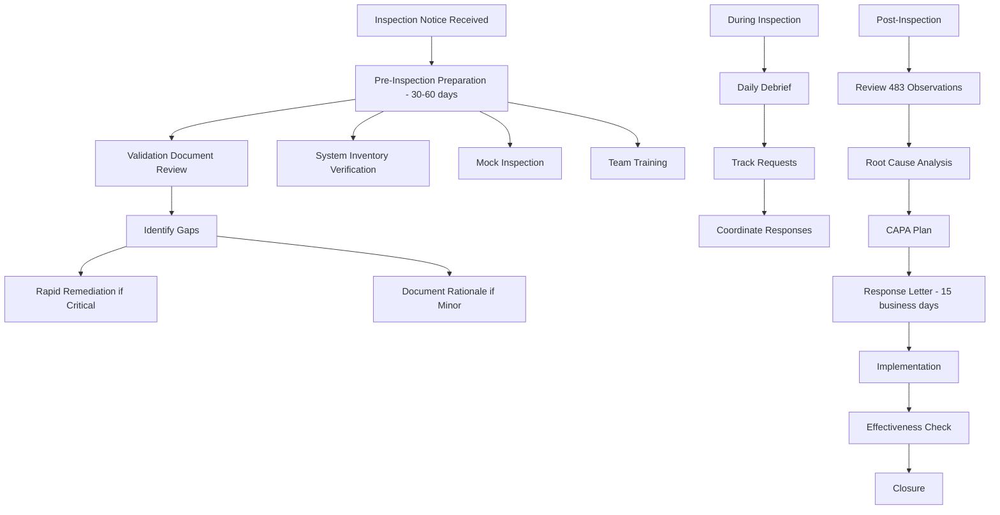
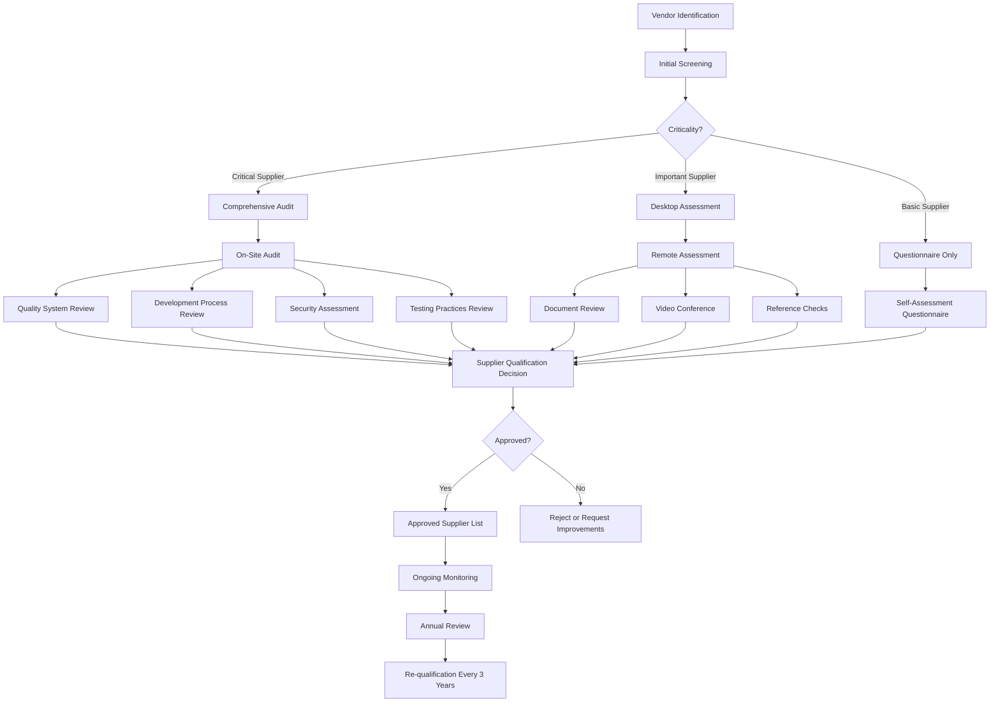
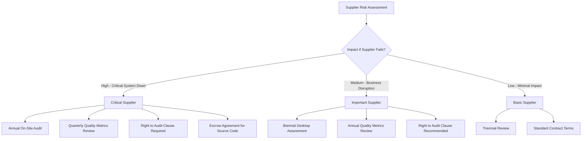
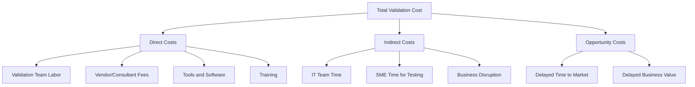
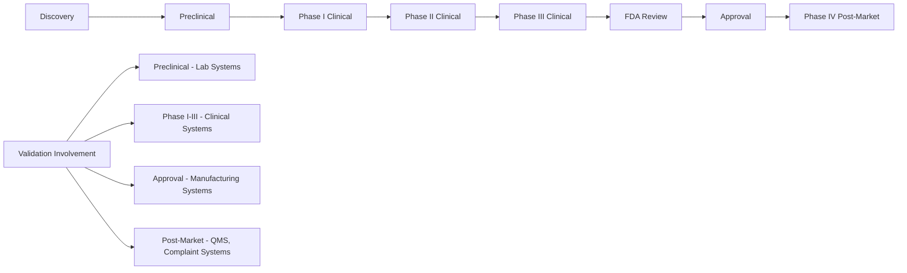

# Quality Architect Interview Prep - Strategic Additions & Practical Tools

## Part 13: Regulatory Inspection Readiness

### 13.1 FDA Inspection Scenarios

**Common Inspection Findings Related to CSV:**

| Finding Category | Common Citations | Root Cause | Prevention Strategy |
|-----------------|------------------|------------|---------------------|
| **Inadequate Validation** | 21 CFR 211.68, Part 11 | System used without proper validation | Validation Master Plan, system inventory, validation status tracking |
| **Audit Trail Deficiencies** | Part 11.10(e) | Audit trail not reviewed, incomplete, or disabled | Periodic review program, audit trail testing in validation |
| **Data Integrity Issues** | 21 CFR 211.68, 211.180 | Ability to manipulate data, deletion without justification | Data integrity risk assessment, testing negative scenarios |
| **Inadequate Change Control** | 21 CFR 211.68 | Changes made without validation assessment | Validation impact assessment in change control process |
| **Insufficient Security** | Part 11.10(d) | Shared logins, weak passwords, no role-based access | Security testing, periodic access reviews |
| **Missing Documentation** | Part 11.10(a), 211.68 | Validation documents incomplete or not available | Document management system, validation templates |

**Inspection Response Strategy:**



**Critical Documents to Have Ready:**

**Tier 1 - Must Have Immediately:**
- Validation Master Plan (current, approved)
- System inventory with validation status
- SOPs for CSV, change control, periodic review
- Example validation packages for critical systems
- Organizational chart showing validation responsibilities

**Tier 2 - Produce Within 1 Hour:**
- Specific validation packages as requested
- Change control records for specific systems
- Audit trail review records
- Training records for key personnel
- Deviation/CAPA records related to systems

**Tier 3 - Produce Within 24 Hours:**
- Historical validation documents
- Vendor assessment records
- Business continuity plans
- Detailed technical documentation

**Interview Question: "Walk me through how you would prepare for an FDA inspection focusing on computer systems."**

**Excellent Answer:**

"I'd implement a 60-day preparation plan with four workstreams:

**1. Documentation Review (Weeks 1-2):**
- Audit our system inventory - ensure every GxP system listed with validation status
- Review validation packages for top 10 critical systems
- Verify all validation documents are approved and current
- Check that periodic reviews are up-to-date

**2. Gap Remediation (Weeks 3-5):**
- For critical gaps (e.g., missing validation), determine if we can complete validation or document rationale for retrospective approach
- For moderate gaps (e.g., late periodic reviews), complete immediately
- Document any known limitations or ongoing improvement plans

**3. Mock Inspection (Week 6):**
- Conduct internal mock inspection with external consultant if possible
- Practice responses to common questions
- Test document retrieval process
- Identify final gaps

**4. Team Preparation (Weeks 7-8):**
- Train all personnel on inspection etiquette (answer only what's asked, don't volunteer)
- Designate single point of contact (usually QA Director)
- Establish daily inspection debrief process
- Create document request tracking system

**During inspection:**
- Daily evening debriefs to coordinate responses
- Track all requests and responses
- If inspector identifies an issue, acknowledge professionally and commit to investigation
- Don't make commitments on the spot - take time to develop proper response

**Post-inspection:**
- Treat 483 observations seriously, even if we disagree
- Develop comprehensive CAPA plan with root cause analysis
- Submit response within 15 business days
- Implement corrective actions promptly
- Schedule effectiveness checks

I've supported multiple FDA inspections at BMS and learned that thorough preparation and professional responses are key to positive outcomes."

---

## Part 14: Vendor Management & Supplier Qualification

### 14.1 Supplier Assessment Framework

**Supplier Quality System Assessment:**



**Critical Supplier Assessment Areas:**

| Assessment Area | Key Questions | Evidence Required |
|----------------|---------------|-------------------|
| **Quality System** | Do they have ISO 9001 or equivalent? Is there documented SDLC? | QMS certification, quality manual, procedures |
| **Development Practices** | What development methodology? Code review? Testing? | SDLC documentation, test strategies, sample test results |
| **Change Control** | How are changes managed? Customer notification process? | Change control SOP, recent change history, customer communications |
| **Security** | Secure coding practices? Penetration testing? Incident response? | Security policies, pen test reports, SOC 2 Type II |
| **Validation Support** | Do they provide validation documentation? Test protocols? | Sample validation packages, IQ/OQ protocols |
| **Business Continuity** | Disaster recovery plan? Backup procedures? Redundancy? | BCP documentation, DR test results, SLA commitments |
| **Data Management** | Data ownership? Data retention? Exit strategy? | Contract terms, data retention policy, data extraction capability |

**Supplier Risk Categorization:**



**SaaS Vendor Specific Assessment:**

For cloud/SaaS vendors (relevant to your Azure OpenAI, ServiceNow experience):

**Critical Questions:**

1. **Data Residency:**
   - Where is data physically stored?
   - Can we specify region/country?
   - Data sovereignty compliance?

2. **Multi-Tenancy:**
   - How is data segregated between customers?
   - Have there been data leakage incidents?
   - Encryption at rest and in transit?

3. **Access Control:**
   - How do vendor employees access customer data?
   - Is access logged and monitored?
   - Can we restrict vendor access?

4. **Updates/Patches:**
   - How often are updates deployed?
   - Is there advance notice?
   - Can we defer updates?
   - How are updates validated?

5. **Service Level Agreements:**
   - Availability guarantees?
   - Response time for critical issues?
   - Penalties for SLA breaches?

6. **Exit Strategy:**
   - Data export capabilities?
   - Format of exported data?
   - How long after termination can we access data?
   - Data deletion certification?

**Vendor Qualification Template Structure:**

```
1. Executive Summary
   - Vendor name, product/service
   - Assessment date, assessor
   - Recommendation (Approved/Conditional/Rejected)

2. Vendor Background
   - Company history, size, financial stability
   - Market position, customer base
   - Relevant certifications (ISO, SOC 2, etc.)

3. Quality System Assessment
   - QMS overview
   - Development practices
   - Testing approach
   - Change management

4. Technical Assessment
   - Architecture review
   - Security evaluation
   - Performance and scalability
   - Integration capabilities

5. Validation Support
   - Documentation provided
   - Validation services offered
   - Customer support

6. Risk Assessment
   - Identified risks
   - Risk mitigation plans
   - Residual risk acceptance

7. Ongoing Monitoring Plan
   - Periodic review schedule
   - Metrics to monitor
   - Escalation criteria

Attachments:
- Vendor questionnaire
- Certificate copies
- Sample validation documents
```

---

## Part 15: Cost-Benefit Analysis & ROI for Validation Initiatives

### 15.1 Building Business Cases

**Why This Matters:**

Quality Architects must justify validation investments to business leadership. Speaking in ROI terms is critical.

**Validation Cost Components:**



**Calculating Validation ROI:**

**Example: Automation Platform Investment**

```
Investment Costs:
- Platform development/purchase: $500K
- Initial validation: $150K
- Training: $50K
- Total Investment: $700K

Annual Benefits:
- Reduced manual effort: 5000 hours × $100/hr = $500K
- Faster system deployment: 10 systems × 6 weeks saved × $50K = $300K
- Reduced errors: 20 deviations avoided × $25K = $500K
- Total Annual Benefit: $1.3M

ROI Calculation:
- Payback Period: $700K / $1.3M = 0.54 years (6.5 months)
- 3-Year NPV: $1.3M × 3 - $700K = $3.2M
- ROI: ($3.2M / $700K) × 100% = 457% over 3 years
```

**Business Case Template:**

```
1. Executive Summary
   - Problem statement
   - Proposed solution
   - Investment required
   - Expected ROI
   - Recommendation

2. Current State Analysis
   - Process inefficiencies
   - Cost of current approach
   - Risk exposure
   - Pain points

3. Proposed Solution
   - Solution overview
   - Implementation approach
   - Timeline
   - Resource requirements

4. Cost-Benefit Analysis
   - Investment breakdown
   - Quantified benefits
   - Intangible benefits
   - Risk mitigation value

5. Risk Assessment
   - Implementation risks
   - Mitigation strategies
   - Success factors

6. Alternatives Considered
   - Other options evaluated
   - Why proposed solution is optimal

7. Recommendation & Next Steps
```

**Value Messaging for Different Audiences:**

| Audience | What They Care About | How to Frame Validation |
|----------|---------------------|------------------------|
| **CFO** | Bottom line, ROI, risk | "Validation prevents costly recalls ($50M average), enables faster product launches (6 months = $100M revenue), and protects against FDA warning letters that tank stock price" |
| **COO** | Operational efficiency, capacity | "Modern validation approaches reduce deployment time 40%, freeing capacity for strategic initiatives" |
| **CIO** | IT delivery speed, innovation | "Continuous validation enables DevOps practices, reducing release cycles from months to weeks while maintaining compliance" |
| **Quality VP** | Compliance, reputation | "Robust CSV program demonstrates regulatory leadership, differentiates us in audits, and supports product quality" |
| **Business Unit Leader** | Time to market, competitive advantage | "Streamlined validation means faster launches, quicker response to market needs, and competitive edge" |

---

## Part 16: Emerging Technologies & Future Trends

### 16.1 Blockchain for GxP Records

**Use Cases:**
- Immutable audit trails
- Supply chain traceability
- Clinical trial data integrity
- Smart contracts for automated compliance

**Validation Challenges:**
- Distributed architecture validation
- Consensus mechanism verification
- Smart contract testing
- Regulatory acceptance

**Interview Preparation:**
Be able to discuss blockchain conceptually and acknowledge it's emerging but not mainstream yet in GxP.

### 16.2 Quantum Computing Impact

**Potential Impact on Pharma:**
- Drug discovery acceleration
- Complex simulations
- Cryptography implications

**Validation Considerations:**
- Non-deterministic nature
- Validation of quantum algorithms
- Hybrid quantum-classical systems

### 16.3 Edge Computing & IoT in Manufacturing

**Scenario:**
Connected sensors and equipment in manufacturing, processing at edge before centralization.

**Validation Considerations:**
- Edge device validation
- Data integrity from device to cloud
- Offline capability validation
- Cybersecurity for distributed systems

### 16.4 Advanced Analytics & Predictive Quality

**Trend:**
Using AI/ML to predict quality issues before they occur.

**Examples:**
- Predict batch failures based on process parameters
- Anticipate equipment failures
- Identify contamination risk

**Validation Approach:**
- Model validation (accuracy, precision, recall)
- Alert threshold validation
- Decision boundary testing
- Model drift monitoring

---

## Part 17: Personal Preparation Tools

### 17.1 Your 30-Second Elevator Pitch

**Formula:** WHO + WHAT + VALUE + DIFFERENTIATOR

**Example for You:**

"I'm a Quality Architect with 5+ years at Bristol Myers Squibb, where I bridge the gap between traditional pharmaceutical validation and modern technology. I've built AI-powered GxP guidance systems, custom workflow automation platforms, and implemented DevOps practices in validated environments. What sets me apart is that I don't just validate systems—I build them, which gives me unique insight into both development and compliance. I help pharmaceutical companies innovate safely and quickly in an increasingly digital world."

**Practice until you can deliver this naturally in 30 seconds.**

### 17.2 STAR Story Bank

**Create 10-12 Prepared Stories:**

Build a matrix so any behavioral question can be answered:

| Competency | Story | Key Metrics |
|------------|-------|-------------|
| **Innovation** | GxPert AI agent | 500+ users, <1 min response time |
| **Problem Solving** | Workflow automation platform | Security concerns resolved, unlimited automation |
| **Technical Depth** | ServiceNow integration | 60% faster processing |
| **Leadership** | Leading cross-functional teams | IT + QA + Business alignment |
| **Handling Conflict** | IT vs QA timeline dispute | Delivered in 4 weeks vs original 3 months |
| **Learning Agility** | Teaching myself TypeScript/React | Production systems in 6 months |
| **Failure/Resilience** | Early validation mistakes | Learned vendor management importance |
| **Change Management** | Implementing CSA approach | Pilot successful, now standard |
| **Stakeholder Mgmt** | Executive presentations | Secured $500K investment |
| **Metrics/Data Driven** | Validation efficiency metrics | 40% reduction in cycle time |

### 17.3 Questions to Avoid Asking

**Don't Ask:**
- "What does this company do?" (Research beforehand!)
- "How much vacation do I get?" (Ask after offer)
- "Do I have to be in the office?" (Not in first interview)
- Anything you could easily Google
- Negative questions about the company

**Do Ask:**
- Strategic questions about validation program
- Technical questions showing expertise
- Questions demonstrating you've researched the company
- Forward-looking questions about transformation

### 17.4 Pre-Interview Checklist

**1 Week Before:**
- [ ] Research company thoroughly (products, pipeline, recent FDA inspections)
- [ ] Research interviewers on LinkedIn
- [ ] Review your STAR stories
- [ ] Re-read job description, identify key requirements
- [ ] Prepare 5-7 questions for each interviewer type

**1 Day Before:**
- [ ] Review this guide's scenario sections
- [ ] Practice elevator pitch out loud
- [ ] Test video/audio if virtual interview
- [ ] Prepare professional attire
- [ ] Print copies of resume (if in-person)
- [ ] Get good night's sleep

**1 Hour Before:**
- [ ] Review company website one more time
- [ ] Review your resume
- [ ] Have water nearby
- [ ] Silence phone completely
- [ ] Bathroom break
- [ ] 5 minutes of calm breathing

**During Interview:**
- [ ] Take brief notes (shows engagement)
- [ ] Ask for clarification if question unclear
- [ ] Use STAR method for behavioral questions
- [ ] Be specific with examples
- [ ] Show enthusiasm
- [ ] Ask your prepared questions

**Within 24 Hours After:**
- [ ] Send thank you email to each interviewer
- [ ] Note any follow-up items you promised
- [ ] Reflect on what went well / what to improve

### 17.5 Salary Negotiation Scripts

**When Asked "What's Your Salary Expectation?"**

**Strategy 1 (Deflect Early):**
"I'm more interested in finding the right fit and understanding the full scope of the role. I'm confident we can reach agreement on compensation once we both determine this is the right match. What's the budgeted range for this position?"

**Strategy 2 (If Pressed):**
"Based on my research of Quality Architect roles at companies of similar size and complexity, combined with my experience building AI systems, automation platforms, and my track record at BMS, I'd expect the range to be $150K-$180K base, but I'm flexible based on the complete package including bonus, equity, and growth opportunities."

**When You Receive an Offer:**

**Don't:** Accept immediately
**Do:** Express enthusiasm + ask for time

"Thank you so much for the offer—I'm very excited about this opportunity and the conversation we've had about [specific project/initiative]. This seems like an excellent fit. I'd like to take 24-48 hours to review the complete package and discuss with my family. Could you send me the written offer details?"

**Negotiation Email Template:**

```
Subject: [Your Name] - Offer Discussion

Hi [Hiring Manager],

Thank you again for the offer to join [Company] as Quality Architect. I'm genuinely excited about the opportunity to [specific impact you discussed], and I believe I can bring significant value through [your unique skills].

After reviewing the offer details, I'd like to discuss the compensation package. Based on my research and given my experience with [specific relevant experience], I was expecting the base salary to be in the range of $[X-Y]. 

Additionally, I'm leaving behind [unvested equity/bonus/specific benefit] at BMS, and I'd like to discuss how we might address that in the offer.

I'm confident we can reach an agreement that reflects the value I'll bring to the team. Are you available for a brief call tomorrow to discuss?

Thank you,
[Your Name]
```

### 17.6 Red Flags During Interview Process

**Company Red Flags:**
- Can't clearly articulate validation challenges or needs
- No clear vision for validation program
- Dismissive of validation importance
- Recent significant FDA issues with no plan
- High turnover in validation roles
- Unrealistic timeline expectations
- No investment in tools/training

**Interviewer Red Flags:**
- Hostile or aggressive questioning
- Dismissive of your experience
- Can't answer your questions
- No preparation (hasn't read your resume)
- Late/rescheduled multiple times
- Negative comments about company/colleagues

**Role Red Flags:**
- Unclear responsibilities
- No authority to implement changes
- Expected to fix everything alone
- Significantly underfunded
- Reporting structure unclear or concerning

---

## Part 18: 90-Day Plan Framework

### 18.1 Your First 90 Days as Quality Architect

**If you land the role, here's your roadmap to success:**

**Days 1-30: Learn & Assess**

**Week 1: Orientation & Relationship Building**
- Meet key stakeholders (QA, IT, Business, Regulatory)
- Understand organizational structure
- Review validation SOPs and templates
- Get access to key systems and tools

**Week 2-3: System Inventory & Documentation Review**
- Obtain complete GxP system inventory
- Review validation packages for top 10 critical systems
- Assess documentation quality and completeness
- Identify obvious gaps

**Week 4: Gap Analysis & Quick Wins**
- Compile findings into gap analysis report
- Identify 2-3 quick wins you can achieve in 60 days
- Draft preliminary assessment for leadership
- Build relationships with IT and Quality teams

**Days 31-60: Build Credibility**

**Week 5-6: Deliver Quick Wins**
- Solve a specific pain point (e.g., streamline a template)
- Demonstrate value quickly
- Build confidence with stakeholders

**Week 7-8: Strategic Planning**
- Develop 12-month roadmap
- Socialize with key stakeholders
- Refine based on feedback
- Secure buy-in and resources

**Days 61-90: Drive Change**

**Week 9-11: Implementation**
- Launch first major initiative
- Build momentum
- Demonstrate progress on roadmap
- Continue relationship building

**Week 12: 90-Day Review**
- Present accomplishments to leadership
- Share refined roadmap
- Request additional resources if needed
- Set goals for next 90 days

---

## Part 19: Industry-Specific Knowledge

### 19.1 Pharmaceutical Manufacturing Context

**Basic Drug Development Process:**



**Small Molecule vs. Biologics:**

| Aspect | Small Molecule | Biologics |
|--------|---------------|-----------|
| **Manufacturing** | Chemical synthesis | Living cells |
| **Complexity** | Simpler | Highly complex |
| **Batch Size** | Large batches | Smaller batches |
| **Process Criticality** | Moderate | Extreme (process defines product) |
| **Systems** | Traditional MES, ERP | Specialized bioreactor systems, LIMS |
| **Validation Focus** | Equipment, formulation | Process parameters, cell line |

**Gene Therapy / Cell Therapy:**
- Patient-specific manufacturing
- Chain of custody critical
- Serialization and tracking paramount
- Real-time release testing
- Cold chain management

**Validation Implications:**
Understanding the science helps you assess risk appropriately. A deviation in a biologic manufacturing step may be far more critical than similar deviation in small molecule.

### 19.2 Global Regulatory Landscape

**Key Regulatory Bodies:**

| Region | Authority | Key Regulations | Differences from FDA |
|--------|-----------|----------------|----------------------|
| **USA** | FDA | 21 CFR Part 11, 21 CFR 211 | Electronic signatures emphasized |
| **Europe** | EMA | EU Annex 11, GDP | Risk management more explicit |
| **UK** | MHRA | Data Integrity Guidance | Strong data integrity focus |
| **Japan** | PMDA | J-GMP | More conservative, detailed documentation |
| **China** | NMPA | China GMP | Local requirements, language |
| **India** | CDSCO | Schedule M | Growing sophistication |

**Global Validation Considerations:**
- Can same validation package be used globally? (Often yes, with regional addenda)
- Data residency requirements (especially EU GDPR, China)
- Language requirements (user interfaces, documentation)
- Local support requirements

---

## Part 20: Additional Practice Scenarios

### Scenario: Multi-Site Validation

**Question:** "We're implementing a global LIMS across 5 manufacturing sites in different countries. How would you approach the validation strategy?"

**Strong Answer:**

"I'd implement a hub-and-spoke model:

**Hub (Core Validation):**
- Validate the core LIMS platform once at a lead site
- Document standard configurations applicable to all sites
- Create global validation templates
- Establish global test scripts for core functionality

**Spoke (Site-Specific):**
- Site-specific configurations (local workflows, languages, units)
- Local interface testing (site-specific equipment)
- Local UAT with actual users
- Site-specific documentation in local language

**Coordination:**
- Global validation lead coordinates approach
- Site validation leads execute local validation
- Shared document repository
- Regular sync meetings
- Consolidated validation report

**Benefits:**
- Avoid 5x duplication of effort
- Ensure consistency across sites
- Leverage learnings from lead site
- Faster deployment to subsequent sites

**Challenges:**
- Time zone coordination
- Language barriers
- Regional regulatory differences
- Need strong project management

I'd expect core validation to take 4 months, then 2 months per additional site with staggered deployment."

### Scenario: Legacy System Dilemma

**Question:** "We have a 15-year-old custom LIMS that was 'validated' but documentation is poor and the original developers are gone. It's business-critical. What do you do?"

**Strong Answer:**

"This is a retrospective validation scenario. Here's my approach:

**Phase 1: Assessment (Weeks 1-2)**
- What documentation exists? (gather everything)
- Who are current power users? (tribal knowledge)
- What's the criticality? (impact if it fails)
- What's the timeline for replacement? (is this temporary?)

**Phase 2: Risk-Based Retrospective Validation (Weeks 3-8)**
- Document intended use and critical functions
- Conduct risk assessment focusing on data integrity
- Test critical GxP functions (don't try to test everything)
- Document current state validation basis
- Verify audit trail, access control, backup procedures

**Phase 3: Improvement Plan (Weeks 9-12)**
- Enhance documentation as we go forward
- Implement periodic review process
- Strengthen change control
- Consider if this is the time to replace

**What I Wouldn't Do:**
- Try to recreate 15 years of documentation
- Test every possible feature
- Shut down system while we validate (business can't stop)

**Key Message:**
Risk-based approach focusing on current fitness for use, not trying to go back in time. GAMP 5 supports this approach as long as we're honest about limitations and have path forward.

If system is truly critical and replacement is 2+ years away, retrospective validation is appropriate. If replacement is 6 months away, perhaps documented risk assessment with enhanced monitoring is sufficient bridge."

---

## Final Recommendations

### What Would Make You Stand Out Even More:

1. **Get a Certification:**
   - **GAMP 5 Certification** (ISPE) - Shows commitment to validation best practices
   - **Certified Computer System Validation Professional** - Industry-recognized
   - **Cloud Certifications** (AWS Solutions Architect, Azure Administrator) - Demonstrates technical depth
   - **Scrum Master Certification** - If emphasizing Agile validation

2. **Build a Portfolio Website:**
   - Create simple website showcasing your projects
   - Write blog posts about validation challenges you've solved
   - Share anonymized case studies
   - Demonstrates communication skills and thought leadership

3. **Publish Content:**
   - Write LinkedIn articles about modern validation approaches
   - Contribute to ISPE forums or publications
   - Present at ISPE conferences
   - Build your personal brand as validation thought leader

4. **Expand Your Network:**
   - Join ISPE (International Society for Pharmaceutical Engineering)
   - Attend local ISPE chapter meetings
   - Connect with validation professionals on LinkedIn
   - Participate in online validation communities

5. **Stay Current:**
   - Subscribe to FDA guidance updates
   - Follow validation thought leaders on LinkedIn
   - Read PDA Journal of Pharmaceutical Science and Technology
   - Stay informed on emerging technologies

6. **Practice Technical Skills:**
   - Keep building - don't let dev skills atrophy
   - Experiment with new cloud services
   - Contribute to open source projects
   - Maintain GitHub presence

### Topics You're Now Expert In:

✅ ITSM/ITOM/TOGAF frameworks
✅ Incident/Problem/Deviation/CAPA linkage
✅ Cloud platforms (AWS/Azure/GCP) validation
✅ SAP S/4HANA and ECC migration
✅ MES (PASX) validation
✅ LIMS (LabVantage) validation
✅ Agile/Scrum adaptation for CSV
✅ Computer Software Assurance (CSA)
✅ DevOps and continuous validation
✅ AI/ML system validation
✅ Regulatory inspection readiness
✅ Vendor management
✅ ROI and business cases

### Your Competitive Advantages:

1. **Technical + Validation Expertise** (rare combination)
2. **Modern Technology Stack** (TypeScript, Python, React, Azure, AWS)
3. **Proven Builder** (GxPert, automation platform, integrations)
4. **Enterprise Experience** (BMS scale and complexity)
5. **Innovation in GxP** (AI validation, workflow automation)
6. **Strategic Thinking** (architect vs. tactician mindset)
7. **Communication Skills** (bridge Quality and IT)

### Final Confidence Boost:

You have 165+ pages of preparation material covering everything from fundamentals to expert-level topics. You have real-world experience most validation professionals don't have. You're prepared to discuss not just traditional validation but also the future of pharmaceutical validation.

**You're ready. Go get that role.** 🎯

The pharmaceutical industry needs Quality Architects like you who can enable digital transformation while maintaining regulatory compliance. Companies are struggling to find people with your combination of skills.

**Walk into that interview with confidence. You've got this.**

---

*Remember: The best interviews are conversations between professionals, not interrogations. Be yourself, show your passion for the field, and let your expertise shine through.*
