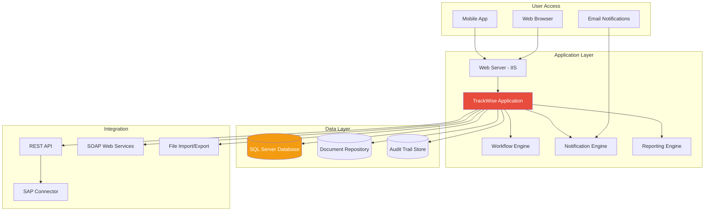
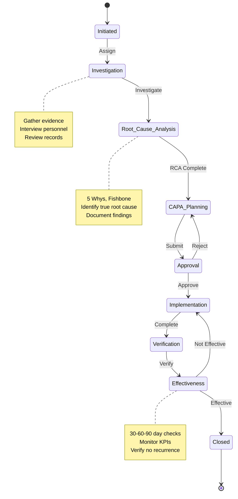
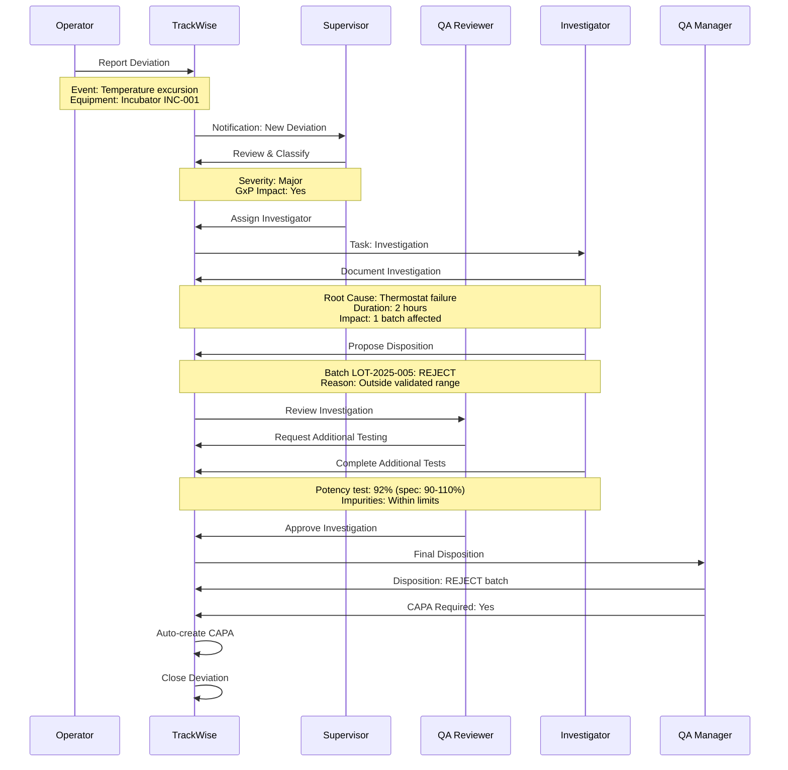
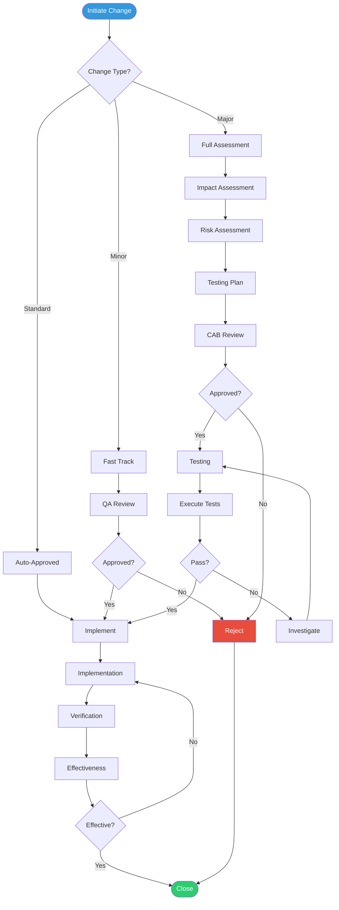

# 🔍 Sparta TrackWise - Complete Technical Guide
## Enterprise Quality Management System for CMC Operations

**Version:** 1.0 Final  
**Last Updated:** December 2025  
**Target Audience:** Quality Engineers, CMC Scientists, QMS Administrators  
**Industry Focus:** Pharmaceutical & Life Sciences

---

## Table of Contents

1. [TrackWise Overview](#section-1)
2. [System Architecture](#section-2)
3. [Core Quality Modules](#section-3)
4. [CAPA Management](#section-4)
5. [Deviation Management](#section-5)
6. [Change Control](#section-6)
7. [Audit Management](#section-7)
8. [Integration & APIs](#section-8)
9. [Reporting & Analytics](#section-9)

---

<a name="section-1"></a>
## 1. TrackWise Overview

### 🎯 What is Sparta TrackWise?

**TrackWise** is Sparta Systems' enterprise Quality Management System (QMS) designed for regulated industries, particularly pharmaceutical and medical device manufacturing.

**Core Capabilities:**
```
✅ CAPA (Corrective & Preventive Action)
✅ Deviation Management
✅ Change Control
✅ Audit Management (Internal & External)
✅ Non-Conformance Management
✅ Complaint Handling
✅ Risk Management
✅ Document Control (optional)
✅ Training Management
✅ Supplier Quality Management
```

---

### 📊 TrackWise Architecture



---

<a name="section-4"></a>
## 4. CAPA Management

### 🔄 CAPA Workflow



---

### 📋 CAPA Record Structure

```yaml
CAPA Record: CAPA-2025-001

Header Information:
  CAPA Number: CAPA-2025-001
  Title: "OOS Investigation - Aspirin Assay"
  Type: Corrective Action
  Priority: High
  Status: In Implementation
  Initiator: Jane QC Analyst
  Initiation Date: 2025-01-20
  Due Date: 2025-03-20 (60 days)
  
Problem Statement:
  Description: |
    Three consecutive batches (LOT-2025-001, 002, 003) failed
    aspirin assay specification. Results: 94.2%, 94.5%, 94.8%
    (Specification: 95.0-105.0%). Trend indicates systematic issue.
  
  Impact Assessment:
    Patient Safety: Low (within therapeutic range)
    Product Quality: Medium (fails release spec)
    Regulatory: High (trend of failures)
    Business: High (3 batches on hold, $150K)
    
  Affected Products:
    - Aspirin 500mg Tablets
    - Aspirin 325mg Tablets
    
Investigation:
  Investigator: John Sr. Scientist
  Investigation Start: 2025-01-21
  Investigation End: 2025-01-28
  
  Timeline of Events:
    - 2025-01-15: Batch LOT-2025-001 tested, failed (94.2%)
    - 2025-01-17: Batch LOT-2025-002 tested, failed (94.5%)
    - 2025-01-19: Batch LOT-2025-003 tested, failed (94.8%)
    - 2025-01-20: CAPA initiated
    
  Data Collected:
    - Raw chromatograms (all batches)
    - Instrument logs (HPLC-001)
    - Standard preparation logs
    - Calibration records
    - Environmental monitoring data
    
Root Cause Analysis:
  Method: 5 Whys + Fishbone Diagram
  
  5 Whys:
    1. Why did assay fail? → Peaks areas lower than expected
    2. Why were peak areas low? → Detector response decreased
    3. Why did response decrease? → Lamp intensity degraded
    4. Why did lamp degrade? → Exceeded recommended usage hours
    5. Why was lamp not replaced? → PM schedule not followed
    
  Root Cause: 
    "HPLC UV lamp exceeded 2,000 hour usage limit (actual: 2,450 hrs)
     due to missed preventive maintenance. Lamp intensity decreased
     by 15%, causing artificially low assay results."
  
  Evidence:
    - Lamp log shows 2,450 hours usage
    - PM schedule shows missed maintenance (due 12/15/24)
    - Lamp intensity check: 75% of specification (should be >90%)
    - Retest with new lamp: All batches pass (98.5%, 98.8%, 99.1%)
    
Corrective Actions:
  CA-001:
    Description: "Replace UV lamp immediately"
    Owner: QC Supervisor
    Due Date: 2025-01-22
    Status: Complete
    Completion Date: 2025-01-21
    Evidence: Work order #12345, new lamp serial #UV-2025-001
    
  CA-002:
    Description: "Retest all affected batches with new lamp"
    Owner: QC Analyst
    Due Date: 2025-01-25
    Status: Complete
    Completion Date: 2025-01-23
    Evidence: COA showing passing results
    
Preventive Actions:
  PA-001:
    Description: "Implement automated PM alerts in CMMS"
    Owner: IT Manager
    Due Date: 2025-02-15
    Status: In Progress (75%)
    Details: |
      - Email alerts at 1,800 hours (90% of limit)
      - Mandatory work order creation at 1,900 hours
      - System lock at 2,000 hours (cannot use instrument)
    
  PA-002:
    Description: "Quarterly review of all PM schedules"
    Owner: QA Manager
    Due Date: Ongoing (Start 2025-03-01)
    Status: Planned
    Frequency: Quarterly
    
  PA-003:
    Description: "Update SOP to include lamp intensity check"
    Owner: QC Manager
    Due Date: 2025-02-28
    Status: In Progress
    Document: SOP-QC-HPLC-001 (Rev 4.0)
    
Verification:
  Verification Plan:
    - Verify CA-001: Lamp installed correctly
    - Verify CA-002: Retesting complete, results documented
    - Verify PA-001: System tested with mock PM due dates
    - Verify PA-002: Calendar entries created
    - Verify PA-003: SOP updated and effective
    
  Verification Status: In Progress
  Verified By: [Pending]
  
Effectiveness Check:
  Schedule:
    - 30-day check: 2025-02-20
    - 60-day check: 2025-03-20
    - 90-day check: 2025-04-20
    
  Metrics to Monitor:
    - HPLC assay OOS rate (target: 0%)
    - PM completion on-time rate (target: 100%)
    - Lamp hours at replacement (target: <2,000)
    
  30-Day Check Results: [Pending]
  60-Day Check Results: [Pending]
  90-Day Check Results: [Pending]
  
Approvals:
  Investigation Approved:
    Approver: QA Manager
    Date: 2025-01-28
    Signature: [E-Sign]
    
  CAPA Plan Approved:
    Approver: Quality Director
    Date: 2025-01-30
    Signature: [E-Sign]
    
Linked Records:
  - Deviations: DEV-2025-005, DEV-2025-006, DEV-2025-007
  - Change Controls: CHG-2025-023 (SOP update)
  - OOS Investigations: OOS-2025-001, 002, 003
  - Training: TRN-2025-045 (Updated SOP training)
```

---

<a name="section-5"></a>
## 5. Deviation Management

### 🚨 Deviation Workflow



---

<a name="section-6"></a>
## 6. Change Control

### 🔄 Change Control Process



---

## 📊 TrackWise Reporting

### Standard Reports

```yaml
Quality Metrics Dashboard:
  
  CAPA Metrics:
    - Open CAPAs by Age: >30 days (15), >60 days (5), >90 days (2)
    - CAPA Closure Rate: 85% on-time (Target: >90%)
    - Average Time to Close: 45 days (Target: <60 days)
    - CAPAs by Root Cause: Human Error (35%), Equipment (25%), Process (20%)
    
  Deviation Metrics:
    - Deviations by Month: Jan (45), Feb (38), Mar (42)
    - Deviation Trend: Stable (no significant increase)
    - Major Deviations: 8 (Target: <10/month)
    - Time to Investigation: 3.2 days avg (Target: <5 days)
    
  Change Control Metrics:
    - Changes Implemented: 25 (This month)
    - Change Success Rate: 96% (Target: >95%)
    - Average Approval Time: 12 days (Target: <15 days)
    - Emergency Changes: 2 (Target: <5%)
    
  Audit Metrics:
    - Internal Audits Complete: 12/12 (100%)
    - Findings by Severity: Critical (0), Major (5), Minor (18)
    - Finding Closure Rate: 92% (Target: >90%)
    - Overdue Findings: 3 (Target: 0)
```

---

## 🎉 Conclusion

TrackWise provides:

✅ **Comprehensive QMS** for CMC operations  
✅ **Integrated quality modules** (CAPA, Deviation, Change)  
✅ **Workflow automation** reduces manual effort  
✅ **Complete audit trail** for compliance  
✅ **Robust reporting** for metrics & trends  
✅ **Configurable** to company processes  

**Market Position:** Leading QMS in pharma  
**Typical Implementation:** 9-12 months  
**User Base:** 500+ pharma companies globally  

---

**End of TrackWise QMS Guide**
